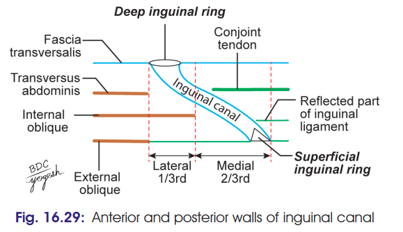
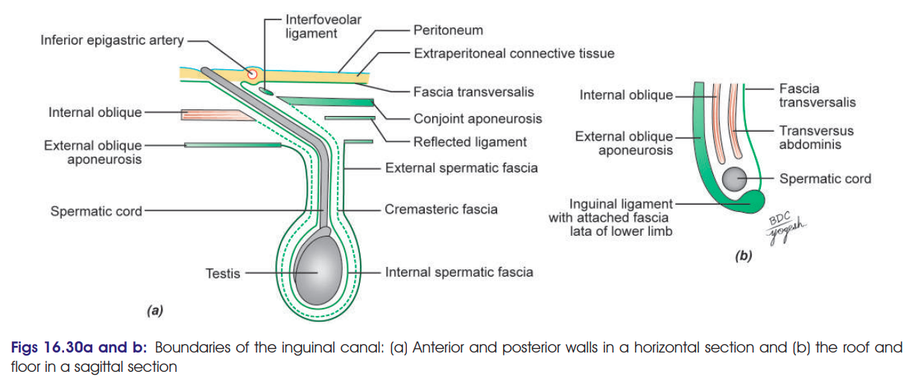

# Inguinal Canal

## Definition

The **inguinal canal** is an **oblique musculoaponeurotic passage** in the lower part of the anterior abdominal wall, situated just above the medial half of the inguinal ligament.

* **Length:** ~4 cm (1.5 inches)
* **Direction:** Downwards, forwards and medially
* **Extent:** From **deep inguinal ring → superficial inguinal ring**
* Larger in males than females.

---

## Inguinal Rings

### 1. Deep inguinal ring

* Oval opening in **fascia transversalis**
* Situated **1.2 cm above the midinguinal point**
* Immediately **lateral to inferior epigastric artery**

### 2. Superficial inguinal ring

* Triangular opening in **external oblique aponeurosis**
* ~2.5 cm long × 1.2 cm broad
* Base formed by **pubic crest**
* Two margins:

  * **Medial/upper crus**
  * **Lateral/lower crus**

> 

---

# Boundaries

> 

| Wall          | Structures                                                                                                                                                       |
| ------------- | ---------------------------------------------------------------------------------------------------------------------------------------------------------------- |
| **Anterior**  | Skin → superficial fascia → **external oblique aponeurosis**; lateral ⅓ additionally reinforced by **internal oblique**                                          |
| **Posterior** | Fascia transversalis → extraperitoneal tissue → parietal peritoneum; medial ⅔ reinforced by **conjoint aponeurosis** and medially by reflected inguinal ligament |
| **Roof**      | Arched fibres of **internal oblique + transversus abdominis**                                                                                                    |
| **Floor**     | Grooved upper surface of **inguinal ligament**; medially **lacunar ligament**                                                                                    |

### Easy recall

**A-R-P-F**

* **A**nterior → External oblique
* **R**oof → Internal oblique + Transversus abdominis
* **P**osterior → Fascia transversalis
* **F**loor → Inguinal ligament

---

# Structures Passing Through

### Male

* **Spermatic cord**
* **Ilioinguinal nerve**

### Female

* **Round ligament of uterus**
* **Ilioinguinal nerve**

> **Ilioinguinal nerve** enters the canal through the interval between internal and external oblique muscles and exits through the superficial inguinal ring.

---

# Spermatic Cord

The **spermatic cord** is a cord-like structure formed by the **ductus deferens and its coverings**, extending from the deep inguinal ring to the testis.

### Contents

1. **Ductus deferens**
2. Arteries:

   * Testicular artery
   * Cremasteric artery
   * Artery of ductus deferens
3. **Pampiniform venous plexus**
4. Lymph vessels from testis
5. **Genital branch of genitofemoral nerve**
6. Sympathetic plexus and visceral afferent fibres
7. Remains of **processus vaginalis**

### Coverings — inside → outside
d
1. **Internal spermatic fascia**
2. **Cremasteric fascia + cremaster muscle**
3. **External spermatic fascia**

**Mnemonic:** **I-C-E**
**I**nternal → **C**remasteric → **E**xternal

---

## Clinical importance

* The inguinal canal is an important site for **inguinal hernias**.
* Weakness of the posterior wall can allow abdominal contents to enter the canal.
* Knowledge of the relation of the **inferior epigastric artery** to the deep ring is important in distinguishing **direct and indirect inguinal hernia**.
