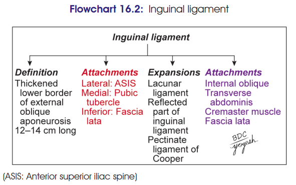

# Inguinal Ligament + Conjoint Tendon

## Inguinal Ligament

### Definition

The **inguinal (Poupart's) ligament** is formed by the **thickened and backward-folded lower border of the external oblique aponeurosis**.

* **Length:** 12–14 cm
* **Extent:** **ASIS → pubic tubercle**
* Lies beneath the **groin fold**.
* Lateral half → rounded and oblique
* Medial half → grooved upwards and more horizontal

### Attachments

* **Lower border:** attached to **fascia lata**
* **Upper surface:**

  * Lateral **2/3** → origin of **internal oblique**
  * Lateral **1/3** → origin of **transversus abdominis**
  * Middle part → origin of **cremaster**

### Relations

* The **upper grooved surface of medial half** forms the **floor of inguinal canal**.
* It lodges:

  * **Spermatic cord** in male
  * **Round ligament of uterus** in female

---

## Extensions of Inguinal Ligament

### 1. Lacunar ligament ⭐

* Triangular extension from **medial end of inguinal ligament**.
* **Anteriorly:** attached to medial end of inguinal ligament
* **Posteriorly:** attached to **pecten pubis**
* **Apex:** pubic tubercle
* Forms the **medial boundary of femoral ring**.

### 2. Pectineal ligament (Ligament of Cooper)

* Extension from the **posterior part of base of lacunar ligament**.
* Attached to **pecten pubis**.

### 3. Reflected part

* Fibres pass **upwards and medially** from the lateral crus of superficial inguinal ring.
* Lies:

  * Behind superficial inguinal ring
  * In front of conjoint tendon
* Interlaces with opposite side at **linea alba**.

### 4. Intercrural fibres

* Arise from middle of inguinal ligament.
* Arch over superficial inguinal ring.
* **Keep the two crura together**.

> 

---

# Conjoint Tendon / Aponeurosis

### Formation

Formed by fusion of the **lowest aponeurotic fibres of internal oblique and transversus abdominis**.

### Attachments

* **Pubic crest**
* **Medial part of pecten pubis**
* Medially → continuous with **anterior wall of rectus sheath**
* Laterally → usually free

### Functions / Clinical importance

* **Strengthens the posterior wall of the inguinal canal** at the site weakened by the superficial inguinal ring.
* Weakness of the conjoint tendon, especially in old age, predisposes to **direct inguinal hernia**.

### 🧠 High-yield distinction

**Inguinal ligament:** external oblique → **ASIS → pubic tubercle**

**Conjoint tendon:** internal oblique + transversus → **pubic crest + pecten pubis**.
