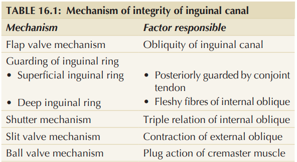

# Mechanism of Inguinal Canal

### Introduction

The inguinal canal is a **weakness in the lower anterior abdominal wall**. Its strength is maintained by several protective mechanisms that prevent herniation, especially when **intra-abdominal pressure rises**.

### 1. Obliquity of the canal — **Flap valve mechanism** ⭐

* The **deep and superficial inguinal rings do not lie opposite each other**.
* When intra-abdominal pressure rises, the **anterior and posterior walls are approximated**.
* This obliterates the canal and prevents herniation.

### 2. Guards of inguinal rings

* **Superficial ring:** guarded posteriorly by:

  * Conjoint tendon
  * Reflected part of inguinal ligament
* **Deep ring:** guarded anteriorly by:

  * Fleshy fibres of **internal oblique**

### 3. Shutter mechanism of internal oblique ⭐

* Internal oblique has a triple relation to the canal:

  * Anterior wall
  * Roof
  * Posterior wall
* On contraction, the **roof is pulled towards the floor**, closing the canal like a **shutter**.
* Arched fibres of **transversus abdominis** also contribute.

### 4. Ball-valve mechanism

* Contraction of the **cremaster muscle** helps the spermatic cord to plug the **superficial inguinal ring**.

### 5. Slit-valve mechanism

* Contraction of the **external oblique** brings the two **crura of the superficial inguinal ring** closer together.
* **Intercrural fibres** strengthen the superficial ring.

### 6. Hormonal mechanism

* Hormones may contribute to maintaining the **tone of inguinal musculature**.

### Clinical significance

During **coughing, sneezing or lifting heavy weights**, increased intra-abdominal pressure activates these mechanisms → **inguinal canal and its rings are closed → herniation is prevented**.

### 🧠 Quick recall

**O-G-S-B-S-H**

**O**bliquity → flap valve
**G**uards → rings protected
**S**hutter → internal oblique
**B**all valve → cremaster
**S**lit valve → external oblique
**H**ormones → muscle tone

