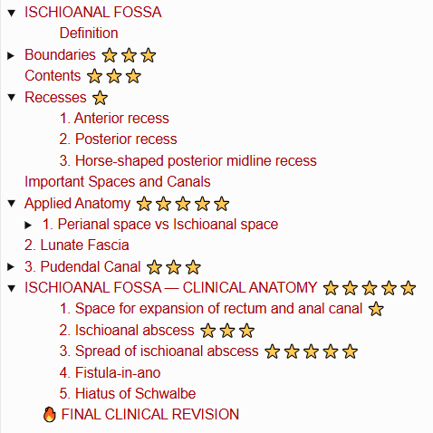
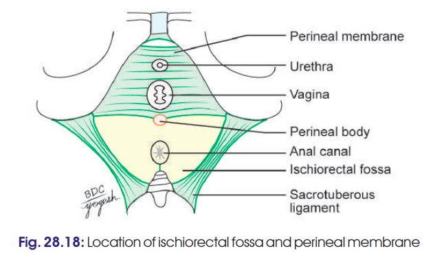
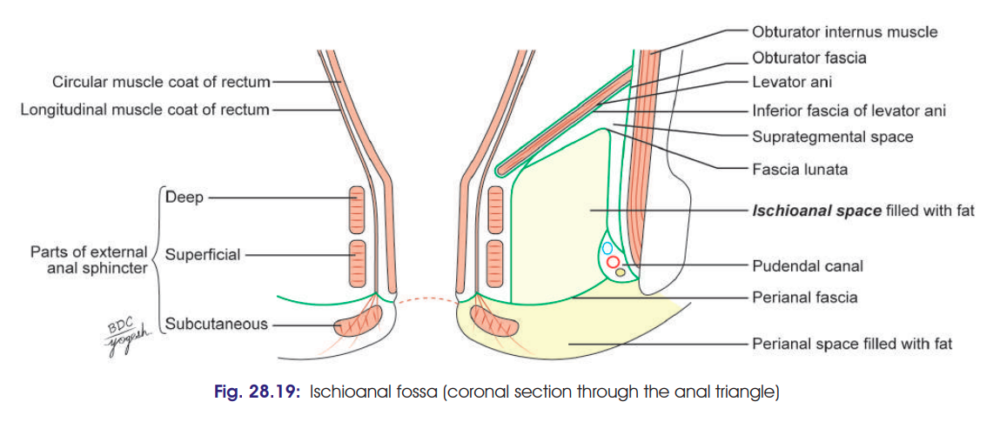
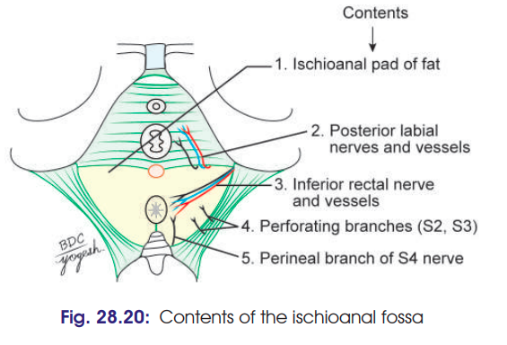
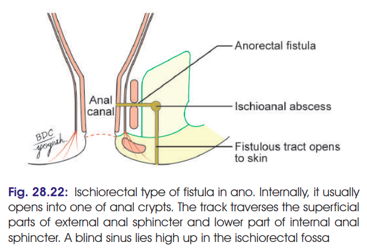

# ISCHIOANAL FOSSA 

> ### Headings
> 

### Definition

* **Ischioanal fossa** is a **wedge-shaped space**, one on each side of the anal canal, situated **below the pelvic diaphragm**.
* **Base** is directed downward towards the skin and **apex** upward.
* Approximate dimensions:

  * **Anteroposterior:** 5 cm
  * **Transverse:** 2.5 cm
  * **Depth:** 5 cm or slightly more.

> 

---

# Boundaries ⭐⭐⭐

> 

| Part             | Boundary                                                              |
| ---------------- | --------------------------------------------------------------------- |
| **Base/Floor**   | Skin of perineum                                                      |
| **Anteriorly**   | Posterior border of perineal membrane                                 |
| **Posteriorly**  | Sacrotuberous ligament                                                |
| **Lateral wall** | Obturator internus fascia + medial surface of ischial tuberosity      |
| **Medial wall**  | Fascia covering levator ani + external anal sphincter                 |
| **Apex**         | Junction of obturator fascia with inferior fascia of pelvic diaphragm |

### 🧠 Easy boundary picture

**Lateral → Obturator internus**
**Medial → Levator ani + external sphincter**
**Bottom → Skin**
**Top → Fascia meeting point**

---

# Contents ⭐⭐⭐

> 

1. **Ischioanal fat pad**
2. **Inferior rectal nerve and vessels**

   * Cross the fossa **lateral → medial**.
   * Supply **anal mucosa, external anal sphincter and perianal skin**.
3. **Pudendal canal and its contents**

   * Lies along the **lateral wall**.
4. **Posterior scrotal nerves and vessels**

   * Posterior labial nerves and vessels in females.
5. **Perineal branch of S4 nerve**

   * Enters posterior angle and runs over levator ani to external anal sphincter.
6. **Perforating cutaneous branches of S2, S3**

   * Appear near lower border of gluteus maximus.

---

# Recesses ⭐

These are extensions of the fossa beyond its usual boundaries:

### 1. Anterior recess

* Extends forward **above the perineal membrane**.
* Reaches the **body of pubis**.

### 2. Posterior recess

* Extends **deep to the sacrotuberous ligament**.

### 3. Horse-shaped posterior midline recess

* Connects the **right and left ischioanal fossae** behind the anal canal.

---

# Important Spaces and Canals

The fascial arrangement produces:

1. **Perianal space**
2. **Pudendal canal**
3. **Ischioanal space**

   * **Suprategmental space**
   * **Tegmental space**

---

# Applied Anatomy ⭐⭐⭐⭐⭐

## 1. Perianal space vs Ischioanal space

| Feature   | Perianal space                     | Ischioanal space                        |
| --------- | ---------------------------------- | --------------------------------------- |
| Size      | Small & shallow                    | Large & deep                            |
| Fat       | Tightly arranged                   | Loosely arranged                        |
| Loculi    | Small, formed by complete septa    | Large, formed by incomplete septa       |
| Infection | **Very painful**                   | **Least painful**                       |
| Reason    | Swelling produces **high tension** | Swelling occurs with **little tension** |

### 🔥 Why this matters

**Perianal infection → tight compartments → ↑ pressure → severe pain**

**Ischioanal infection → loose fat + large loculi → little pressure → less pain**

---

# 2. Lunate Fascia

* Arches over the **ischioanal fat**.
* Extends from the **pudendal canal laterally** and merges medially with fascia covering the deep part of external anal sphincter.
* Divides the ischioanal space into:

  * **Suprategmental space** — above lunate fascia.
  * **Tegmental space** — below lunate fascia.

---

# 3. Pudendal Canal ⭐⭐⭐

* A **fascial canal in the lateral wall** of ischioanal fossa.
* Contains:

  * **Pudendal nerve**
  * **Internal pudendal vessels**

### Relations of its fascia

* **Laterally:** lower part of obturator fascia
* **Above:** lunate fascia
* **Medially:** perianal fascia
* **Below:** falciform process of sacrotuberous ligament

---

## 🔥 Last-minute 5M version

If you're short on time, memorize this sequence:

**Ischioanal fossa**
↓
**Wedge-shaped, below pelvic diaphragm**
↓

### Boundaries

**Skin — base**
**Obturator internus — lateral**
**Levator ani + EAS — medial**
**Sacrotuberous ligament — posterior**
**Perineal membrane — anterior**
**Obturator fascia + pelvic diaphragm fascia — apex**

↓

### Contents

**Fat + inferior rectal N/V + pudendal canal + posterior scrotal/labial N/V + S4 + S2,3 cutaneous branches**

↓

### Recesses

**Anterior + Posterior + Horse-shaped**

↓

### Applied ⭐

**Perianal infection = very painful**
**Ischioanal infection = less painful**
**Pudendal canal = pudendal N + internal pudendal vessels**

# ISCHIOANAL FOSSA — CLINICAL ANATOMY ⭐⭐⭐⭐⭐

These are **very high-yield** for the applied part of the 5-marker.

### 1. Space for expansion of rectum and anal canal ⭐

* Fat in the ischioanal fossa provides **cushion-like support**.
* It also provides space for **expansion of the rectum and anal canal during defecation**.
* **Loss of fat** may result in **diarrhoea or rectal prolapse**.

### 2. Ischioanal abscess ⭐⭐⭐

* Infection of the ischioanal fossa produces an **ischioanal (ischiorectal) abscess**.
* **Sources of infection:**

  * Boils/lesions of perineal skin
  * Lesions of anal canal
  * Occasionally spread through blood.
* Infection of the fat of the fossa → **ischioanal abscess**.

### 3. Spread of ischioanal abscess ⭐⭐⭐⭐⭐

* The two ischioanal fossae communicate through the **horse-shoe-shaped posterior recess**.
* Therefore, infection can spread from one fossa to the opposite side.
* This produces a **horseshoe-shaped abscess**.

> 🧠 **Key concept:**
> **One fossa → posterior horseshoe recess → opposite fossa → horseshoe abscess**

### 4. Fistula-in-ano

* May develop when an **ischioanal abscess bursts into the anal canal**.
* The **most common internal opening** is in the **floor of the anal crypts**.

> 

### 5. Hiatus of Schwalbe

* An occasional gap between the **tendinous origin of levator ani** and **obturator fascia**.
* Pelvic organs may herniate through this gap.
* This is called **ischioanal hernia**.

---

## 🔥 FINAL CLINICAL REVISION

**Ischioanal fat**
→ Cushion + expansion during defecation
→ Loss → **rectal prolapse/diarrhoea**

**Infection**
→ Ischioanal abscess

**Posterior horseshoe communication**
→ Spread to opposite fossa
→ **Horseshoe abscess**

**Abscess bursts into anal canal**
→ **Fistula-in-ano**

**Hiatus of Schwalbe**
→ Pelvic organ herniation
→ **Ischioanal hernia**

