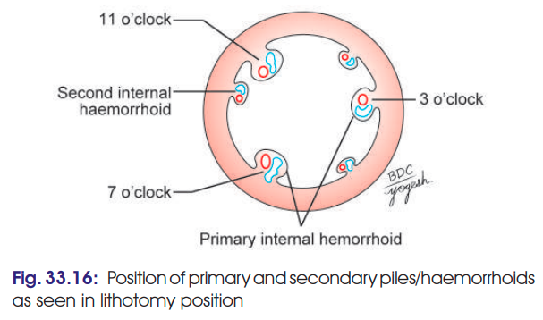

# HAEMORRHOIDS / PILES — 5 MARKS ⭐⭐⭐

### Definition

* **Haemorrhoids (piles)** are **dilated veins of the lower part of the anal canal**.
* They are classified according to their relation to the **pectinate line** into:

  1. **Internal/true piles**
  2. **External/false piles**

---

## 1. Internal Haemorrhoids / True Piles ⭐⭐⭐

* Due to **saccular dilatation of the internal rectal venous plexus**.
* Occur **above the pectinate line**.
* Therefore, they are **painless** because the mucosa above the pectinate line has visceral sensory innervation.
* **Bleed profusely during straining at stool.**
* Formed by enlargement of the main radicles of the **superior rectal vein**.

### Primary piles ⭐

Classically occur at **3, 7 and 11 o'clock positions** when viewed in lithotomy position.

> 

They correspond to the three main radicles of the superior rectal vein:

* **Left lateral**
* **Right posterior**
* **Right anterior**

### Secondary piles

* Varicosities occurring at **other positions** of the anal canal.

---

## 2. External Haemorrhoids / False Piles

* Occur **below the pectinate line**.
* Therefore, they are **very painful** because the region has somatic sensory innervation.
* **Usually do not bleed on straining at stool.**

---

## Anatomical Structure of a Pile

Each pile consists of:

**Fold of mucosa + submucosa**
↓
containing
**Dilated tributary/radicle of superior rectal vein**
+
**Branch of superior rectal artery**

---

# 🔥 HIGH-YIELD DIFFERENCE

| Feature         | Internal / True               | External / False              |
| --------------- | ----------------------------- | ----------------------------- |
| Location        | **Above pectinate line**      | **Below pectinate line**      |
| Vein            | Internal rectal venous plexus | External rectal venous plexus |
| Sensation       | **Painless**                  | **Painful**                   |
| Bleeding        | **Profuse on straining**      | Usually absent                |
| Classical sites | **3, 7, 11 o'clock**          | No characteristic sites       |

### 🧠 One-liner to remember

**Above pectinate = Internal = painless + bleeding**
**Below pectinate = External = painful**

