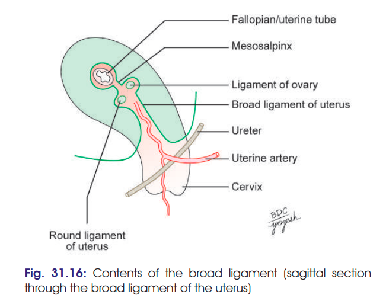

# BROAD LIGAMENT OF UTERUS — 5 MARKS

### 1. Definition

* **Broad ligaments** are paired folds of **peritoneum** extending from the **lateral borders of uterus to the lateral walls of pelvis** on either side.

> ⭐ **Important:** They are **peritoneal folds**, not true supporting ligaments.

---

## 2. External Features

Each broad ligament has:

### Two surfaces

* **Superior & inferior** — when bladder is empty.
* **Anterior & posterior** — when bladder is full.

### Two borders

* When bladder is empty:

  * **Anterior free border**
  * **Posterior attached border**
* When bladder is full:

  * **Upper free border**
  * **Inferior attached border**

---

# 3. Parts of Broad Ligament ⭐⭐⭐

There are **4 parts**:

### 1. Mesosalpinx

* Part of broad ligament **between uterine tube and ovarian ligament**.

### 2. Mesometrium

* Largest part.
* Extends from **pelvic floor** to the **ovary, ovarian ligament and body of uterus**.

### 3. Mesovarium

* Fold of peritoneum extending **posteriorly from broad ligament to the ovary**.

### 4. Infundibulopelvic ligament

* Also called **suspensory ligament of ovary**.
* Extends from **infundibulum of uterine tube to upper pole of lateral pelvic wall**.
* Contains the **ovarian vessels and nerves**.

---

# 4. Contents ⭐⭐⭐

> 

### A. Reproductive structures

1. **Uterine tube**
2. **Round ligament of uterus**
3. **Ligament of ovary**

### B. Vessels

4. **Uterine arteries**
5. **Ovarian arteries**

### C. Nerves

6. **Uterovaginal plexus**
7. **Ovarian plexus**

### D. Embryological remnants

8. **Epoophoron**
9. **Paroophoron**
10. **Gartner's duct**
11. **Vesicular appendices**

### E. Lymphatics

12. **Lymphatic vessels and lymph nodes**

### F. Connective tissue

13. **Fibrofatty tissue — parametrium**

---

## 🔥 Quick diagram-style revision

**BROAD LIGAMENT**

→ **Parts:**
**Mesosalpinx + Mesometrium + Mesovarium + Infundibulopelvic ligament**

→ **Contents:**
**Tube + 2 ligaments + arteries + nerve plexuses + embryological remnants + lymphatics + parametrium**

### ⭐ Highest-yield points

* **Broad ligament = peritoneal fold**
* **4 parts:** Mesosalpinx, Mesometrium, Mesovarium, Infundibulopelvic ligament
* **Infundibulopelvic = suspensory ligament of ovary**
* Contains **uterine & ovarian vessels**
* Contains **parametrium** and important embryological remnants.
