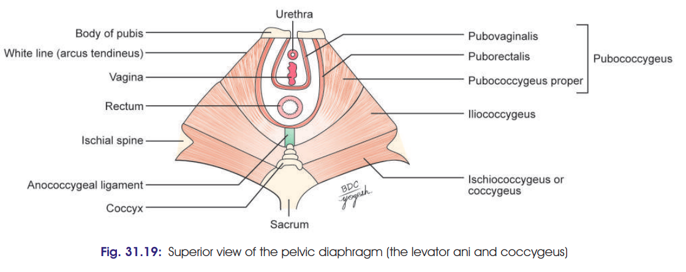

# SUPPORTS OF UTERUS 

The uterus is a **mobile organ** that changes considerably in size and shape during reproductive life. It is prevented from sagging/prolapsing mainly by **muscular and fibromuscular supports**.

## 1. Primary Supports ⭐⭐⭐

### A. Muscular / Active supports

1. **Pelvic diaphragm**
2. **Perineal body**
3. **Distal urethral sphincter mechanism**

### B. Fibromuscular / Mechanical supports

1. **Uterine axis**
2. **Pubocervical ligaments**
3. **Transverse cervical (Mackenrodt/cardinal) ligaments**
4. **Uterosacral ligaments**
5. **Round ligaments of uterus**

---

## 2. Secondary Supports

> **Of doubtful supporting value; mainly peritoneal folds.**

1. **Broad ligaments**
2. **Vesicouterine pouch and peritoneal fold**
3. **Rectouterine/rectovaginal pouch and peritoneal fold**

---

# Role of Individual Supports ⭐

### 1. Pelvic diaphragm

* Supports pelvic viscera.
* Resists raised intra-abdominal pressure.
* **Pubococcygeus** forms a sling around vagina and supports it.
* Damage during childbirth may lead to **vaginal prolapse**.

> 

### 2. Perineal body

* Fibromuscular node between **vagina and rectum**.
* Provides attachment to perineal muscles and pelvic diaphragm.
* Maintains integrity of pelvic floor.

### 3. Distal urethral sphincter mechanism

* **Compressor urethrae** and **sphincter urethrovaginalis** are inserted into vagina.
* Help support the **vagina and uterus**.

### 4. Uterine axis ⭐

* Normal **anteversion and anteflexion** prevent downward sagging through vagina.
* Increased intra-abdominal pressure further accentuates anteversion and helps prevent prolapse.

### 5. Pubocervical ligaments

* Pair of fibrous bands from **cervix to posterior surface of pubic bone**.
* Derived from **endopelvic fascia**.
* Support the cervix.

### 6. Transverse cervical ligaments ⭐⭐⭐

* Also called **cardinal/Mackenrodt ligaments**.
* Fan-shaped fibrous bands derived from endopelvic fascia.
* Connect **cervix and upper vagina → lateral pelvic wall**.
* Form a **hammock-like support** and prevent uterine prolapse.

### 7. Uterosacral ligaments

* Fibrous bands derived from endopelvic fascia.
* Connect **cervix → S2 and S3 vertebrae**.
* Help maintain position of uterus.

### 8. Round ligaments ⭐

* Fibromuscular bands extending from **lateral angle of uterus**.
* Pass through **deep inguinal ring → inguinal canal → labia majora**.
* Pull the **fundus forward**.
* Help maintain **anteversion and anteflexion**.

---

## 🔥 Very important clinical points

* **Mackenrodt's ligaments:** surgical tightening may be done in **uterine prolapse**.
* **Round ligaments pull the cervix/fundus forward**, while **uterosacral ligaments pull backward** → together help maintain **anteversion and anteflexion**.
* **Canal of Nuck:** patent extension of peritoneum accompanying round ligament through inguinal canal to labia majora; homologous to **processus vaginalis in males**.

