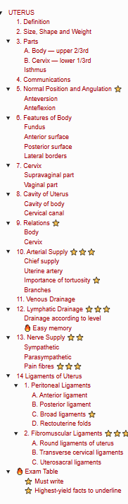
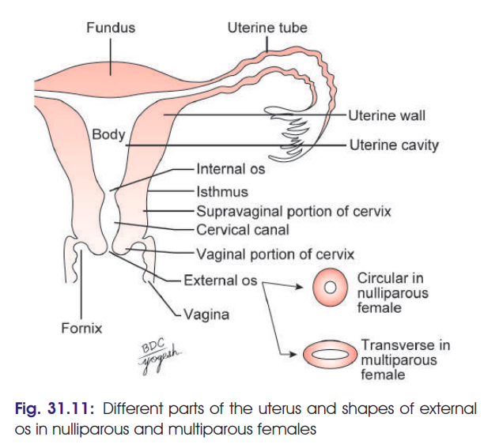
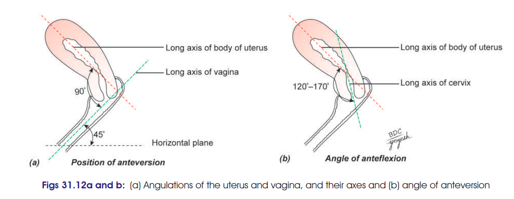
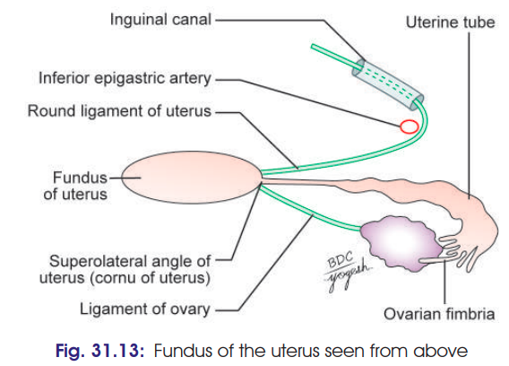
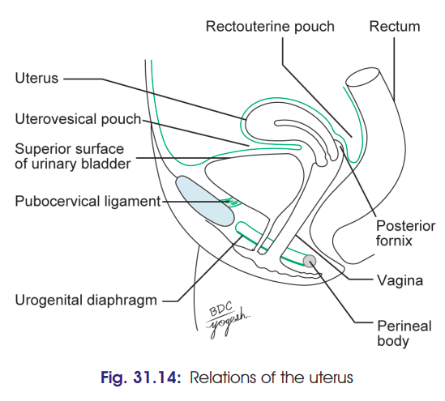

# UTERUS

> ### Headings
 > 

## 1. Definition

* Uterus is a **thick-walled, hollow, muscular, child-bearing organ**.
* Situated in the **pelvis between urinary bladder and rectum**.
* It provides **protection and nutrition to the fertilized ovum** and its muscular contractions expel the fetus during **parturition**.

## 2. Size, Shape and Weight

* **Shape:** Pyriform
* **Length:** 7.5 cm (3 inches)
* **Breadth:** 5 cm (2 inches)
* **Thickness:** 2.6 cm (1 inch)
* **Weight:** 30–40 g
* **Consistency:** Firm

## 3. Parts
 
> 

The uterus consists of:

### A. Body — upper 2/3rd

* **Fundus:** part above openings of uterine tubes
* **Two surfaces:**

  * Anterior/vesical
  * Posterior/intestinal
* **Two lateral borders**
* **Cornua:** superolateral angles where uterine tube, round ligament and ovarian ligament are attached.

### B. Cervix — lower 1/3rd

* Cylindrical and about **2.5 cm long**
* Less mobile than body
* Projects into anterior wall of vagina.
* Divided into:

  * **Supravaginal part**
  * **Vaginal part**

### Isthmus

* Circular constriction between **body and cervix**.

---

## 4. Communications

* **Superiorly:** uterine tubes
* **Inferiorly:** vagina

---

## 5. Normal Position and Angulation ⭐

> 

### Anteversion

* Forward angle between:

  * Long axis of **body of uterus**
  * Long axis of **vagina**
* Approximately **90°**
* Forward tilting of uterus relative to vagina.

### Anteflexion

* Forward angle between:

  * Long axis of **body**
  * Long axis of **cervix**
* Approximately **120°–170°**
* Thus, normally uterus is **anteverted and anteflexed**.

---

## 6. Features of Body

### Fundus

> 

* Free upper end of uterus.
* Lies **above openings of uterine tubes**.
* Convex/dome-shaped.
* Covered by peritoneum.
* Usually directed forwards when bladder is empty.
* **Usual site of implantation:** posterior wall of upper part of uterus/fundus.

### Anterior surface

* Flat.
* Related to **urinary bladder**.
* Forms posterior/superior wall of **uterovesical pouch**.

### Posterior surface

* Convex.
* Related to:

  * Coils of ileum
  * Sigmoid colon
* Forms anterior wall of **rectouterine pouch (pouch of Douglas)**.

### Lateral borders

* Attached to **broad ligament**.
* Uterine tube opens at upper end.
* **Round ligament:** anteroinferior to tube.
* **Ovarian ligament:** posteroinferior to tube.
* **Uterine artery** ascends along lateral border between layers of broad ligament.

---

## 7. Cervix

### Supravaginal part

**Anterior:**

* Urinary bladder

**Posterior:**

* Rectouterine pouch
* Ileum and sigmoid colon
* Rectum

**Lateral:**

* Ureter
* Uterine artery
* Parametrium

### Vaginal part

* Projects into anterior wall of vagina.
* Surrounded by **vaginal fornices**.
* Cervical canal opens into vagina through **external os**.

---

## 8. Cavity of Uterus

### Cavity of body

* **Sagittal section:** narrow slit-like cavity.
* **Coronal section:** triangular cavity with apex directed downwards.
* Apex continues into cervical canal through **internal os**.
* Superolateral angles receive openings of **uterine tubes**.

### Cervical canal

* **Fusiform** in shape.
* Communicates:

  * Above → uterine cavity through **internal os**
  * Below → vagina through **external os**
* Mucosal folds on anterior and posterior walls form **arbor vitae uteri**.
* These folds interlock and help close the canal.

---

## 9. Relations ⭐

> 

### Body

| Direction     | Relations                                |
| ------------- | ---------------------------------------- |
| **Anterior**  | Uterovesical pouch, urinary bladder      |
| **Posterior** | Rectouterine pouch, ileum, sigmoid colon |
| **Lateral**   | Broad ligament, ureter, uterine vessels  |

### Cervix

| Direction     | Relations                                                          |
| ------------- | ------------------------------------------------------------------ |
| **Anterior**  | Urinary bladder; anterior vaginal fornix                           |
| **Posterior** | Rectouterine pouch, ileum, sigmoid colon, rectum; posterior fornix |
| **Lateral**   | Ureter, uterine vessels; vaginal fornices                          |

---

Yep — add this as the **vascular, lymphatic and nerve supply** portion of the same 10-marker. These are definitely worth writing.

## 10. Arterial Supply ⭐⭐⭐

### Chief supply

* **Two uterine arteries** — chief arterial supply.
* They become **markedly enlarged during pregnancy**.
* **Ovarian arteries** provide additional supply.

### Uterine artery

* Branch of **anterior division of internal iliac artery**.
* Runs medially towards the **cervix**.
* **Crosses the ureter** about **2 cm lateral to the cervix**, above the lateral vaginal fornix.
* Then ascends along the lateral border of uterus in a **tortuous course**.
* Finally runs laterally towards the **hilum of ovary** and anastomoses with the ovarian artery.

### Importance of tortuosity ⭐

* Allows the uterine artery to **stretch/expand with enlargement of uterus during pregnancy** without being tightly stretched.

### Branches

Apart from uterus, it supplies:

* Vagina
* Medial 2/3rd of uterine tube
* Ovary
* Ureter
* Structures in broad ligament

> 🔥 **Must remember:** **Uterine artery crosses ABOVE the ureter** near the cervix.

---

## 11. Venous Drainage

* Veins form a **uterine venous plexus** along the lateral border of uterus.
* Drains through:

  * **Uterine veins**
  * Ovarian veins
  * Vaginal veins
* Ultimately → **internal iliac veins**.

---

## 12. Lymphatic Drainage ⭐⭐⭐

Lymphatics begin as **three intercommunicating plexuses**:

1. **Endometrial**
2. **Myometrial**
3. **Subperitoneal**

### Drainage according to level

| Part of uterus          | Lymph nodes                                                                         |
| ----------------------- | ----------------------------------------------------------------------------------- |
| **Fundus & upper body** | Mainly **aortic nodes**; partly **superficial inguinal nodes** along round ligament |
| **Lower body**          | **External iliac nodes**                                                            |
| **Cervix**              | **Internal iliac + sacral nodes**                                                   |

### 🔥 Easy memory

**Upper → Aortic**
**Middle → External iliac**
**Lower/Cervix → Internal iliac + Sacral**

---

## 13. Nerve Supply ⭐⭐

Uterus receives sympathetic and parasympathetic fibres through:

* **Inferior hypogastric plexus**
* **Ovarian plexus**

### Sympathetic

* **T12–L1**
* Produces:

  * Uterine contraction
  * Vasoconstriction

### Parasympathetic

* **S2–S4**
* Produces:

  * Uterine inhibition
  * Vasodilatation

> Effects are modified considerably by **hormonal influences** on the genital tract.

### Pain fibres ⭐⭐⭐

* **Body of uterus:** pain travels with **sympathetic nerves**
* **Cervix:** pain travels with **parasympathetic nerves**

---

## 14 Ligaments of Uterus

The ligaments of the uterus are classified into **two groups**:

### 1. Peritoneal Ligaments

> **Important:** These are merely **peritoneal folds** and **do NOT provide actual support to the uterus**.

#### A. Anterior ligament

* Formed by the **uterovesical fold of peritoneum**.
* Related to the **uterovesical pouch**.

#### B. Posterior ligament

* Formed by the **rectovaginal fold of peritoneum**.
* Forms the **rectovaginal pouch**.

#### C. Broad ligaments ⭐

* Right and left **folds of peritoneum**.
* Extend from the uterus to the **lateral pelvic wall**.
* Although called a ligament, they **do not provide significant mechanical support** to the uterus.

#### D. Rectouterine folds

* Right and left peritoneal folds.
* Extend posteriorly from the uterus towards the sacrum.
* Related to the **rectouterine pouch**.

---

### 2. Fibromuscular Ligaments ⭐⭐⭐

These are the **true supporting ligaments** of the uterus.

#### A. Round ligaments of uterus

* Fibromuscular bands extending from the **cornua of uterus**.
* Pass through the **inguinal canal**.
* End in the **labia majora**.
* Help maintain the **anteverted position** of uterus.

#### B. Transverse cervical ligaments

* Also called **cardinal ligaments**.
* Fibromuscular condensations of pelvic connective tissue.
* Extend from the **cervix and upper vagina towards the lateral pelvic wall**.
* Important **supports of the cervix and uterus**.

#### C. Uterosacral ligaments

* Extend from the **cervix** posteriorly towards the **sacrum**.
* Help support the uterus and maintain its normal position.

---

## 🔥 Exam Table

| Type              | Ligaments           | Key point                    |
| ----------------- | ------------------- | ---------------------------- |
| **Peritoneal**    | Anterior            | Uterovesical fold            |
|                   | Posterior           | Rectovaginal fold            |
|                   | Broad               | Uterus → lateral pelvic wall |
|                   | Rectouterine folds  | Peritoneal folds             |
| **Fibromuscular** | Round               | Helps maintain anteversion   |
|                   | Transverse cervical | Major support of cervix      |
|                   | Uterosacral         | Cervix → sacrum              |

### ⭐ Must write

**Peritoneal ligaments are not true supporting ligaments. The main fibromuscular supports are the transverse cervical, uterosacral and round ligaments.**

### ⭐ Highest-yield facts to underline

* **Uterine artery → branch of anterior division of internal iliac**
* **Uterine artery crosses ABOVE ureter**
* **Tortuous uterine artery → accommodates pregnancy**
* **Fundus → mainly aortic nodes**
* **Lower body → external iliac nodes**
* **Cervix → internal iliac + sacral nodes**
* **Body pain → sympathetic**
* **Cervical pain → parasympathetic**
