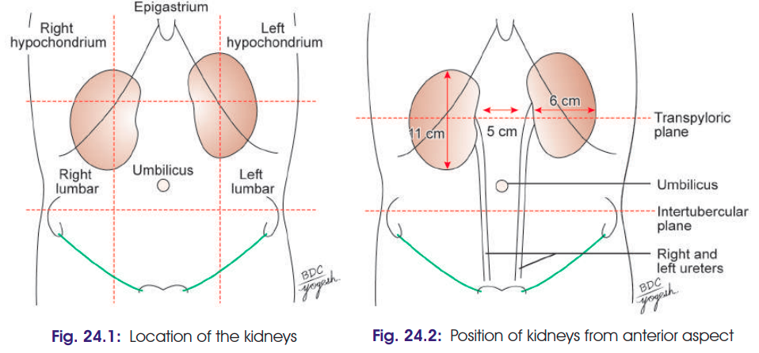
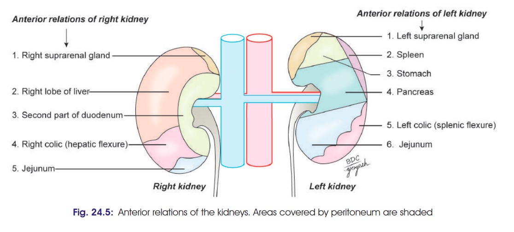
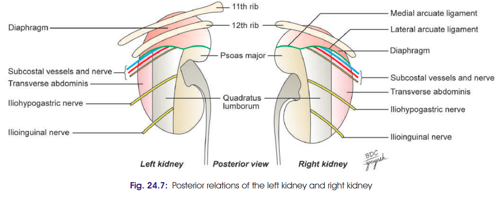
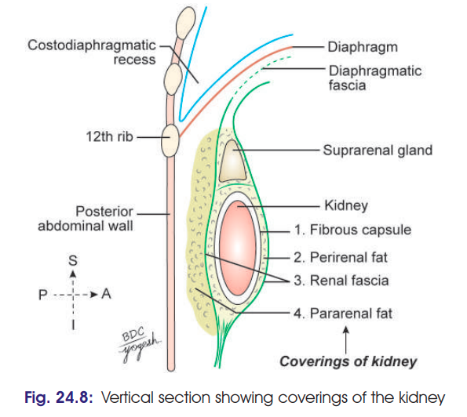
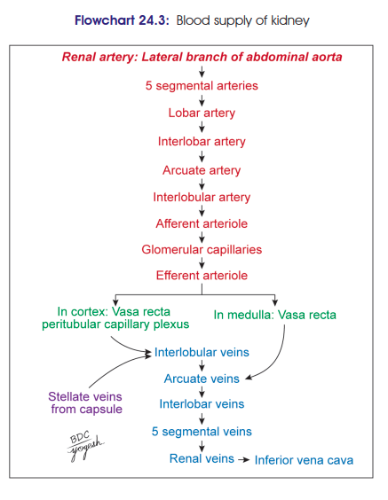
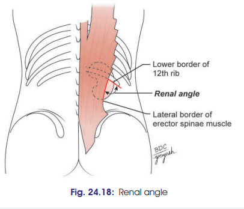

# Kidney
### Headings
- Introduction
- Functions
- Dimensions
- Location
- External Features
- Relations of Kidneys
- Capsules/Coverings of Kidney
- Blood Supply
- Lymphatic Drainage
- Nerve Supply
- Clininal

## Introduction 
 - bean-shaped, reddish-brown pair of excretory organs 
 - situated on the posterior abdominal wall, one on each side of the  vertebral column
 -  behind the peritoneum (retroperitoneal)
## Functions
- purification of blood by ultrafiltration & removal of metabolic waste product
- Conserves body fluid & maintains electrolyte balance
- Functions as an endocrine gland: forms erythropoietin, activates vit.D3, Renin
## Dimensions (TBLW)
- Anteroposterior (thickness) diameter: 3 cm
- Breadth: 6 cm
- Length: 11 cm (left kidney is 1.5 cm longer than the right)
- Weight: 150 g in male and 135 g in females
- 5 cm seperation b/w both kidneys
## Location
- The kidneys occupy the epigastric, hypochondriac, lumbar and umbilical regions 
- Vertebral level: Kidneys lie opposite to T12 to L3 vertebrae (Fig. 24.2). The right kidney is slightly lower than the left
- The transpyloric plane passes through the upper part of the hilus of the right kidney and through the lower part of the hilus of the left kidney

- 
## External Features
- Each kidney is bean-shaped. It has:
  1. Two poles: Superior and inferior
  2. Two borders: Medial and lateral
  3. Two surfaces: Anterior and posterior and
  4. Hilum.
    - Poles
        - 1. The superior or upper pole is broad and is in close
        -  contact with the corresponding suprarenal gland.
        -  2. The inferior or lower pole is pointed.
    - Surfaces
        -  3. The anterior surface is said to be irregular.
        -  4. The posterior surface flat.
    - Borders
        -  1. The lateral border is convex.
        -  2. The medial border is concave. Its middle part shows a depression, the hilus or hilum.
    - Hilum
      - The following structures are seen in the hilum from anterior side to posterior side: 
        - 1. Renal vein
        - 2. Renal artery
        - 3. Renal pelvis, which is the expanded upper end of the ureter.
## Relations of Kidney
- Peritoneal Relations:
  - The kidney is a retroperitoneal organ; it is covered
  anteriorly by parietal peritoneum only at the following
  areas:
    • For right kidney: Hepatic and jejunal areas.
    • For left kidney: Gastric, splenic and jejunal areas
- Anterior Relations:
  - Right Kidney
    1. Right suprarenal gland
    2. Right lobe of liver
    3. Second part of duodenum
    4. Right colic (hepatic) flexure
    5. Jejunum.
  - Left Kidney
    1. Left suprarenal gland
    2. Spleen
    3. Stomach
    4. Pancreas
    5. Left colic (splenic) flexure
    6. Jejunum.
  - 
- Posterior Relations (for both): 
  1. 11th rib: Only to the left kidney
  2. 12th rib
  3. Muscles: 
     1. Superiorly diaphragm 
     2. Medial to lateral: quadratus lumborum, psoas major and transverse abdominis
  4. Nerves emerging from lateral border of psoas major
  (from above downward): Subcostal (T12), iliohypogastric (L1), ilioinguinal (L1) nerves.
  1. Subcostal vessels.
  - 
## Capsules/Coverings of Kidney
- From inside to outside (Fibrous capsule, Perirenal fat, Renal fascia, Pararenal fat)
  1. Fibrous capsule
     1. true capsule
     2. condensation of fibrous capsule of kidney 
  2. Perirenal (perinephric) fat
     1. surrounds fibrous capsule
     2. fills renal sinus
  3. Renal fascia
     1. covers the kidney, suprarenal gland and perirenal fat
     2. two layers:
        1. anterior layer: *fascia of Gerota*
        2. posterior layer: *fascia of Zuckerkendl*
  4. Pararenal fat 
     1. adipose tissue layer covering renal fascia 
     2. fills up the paravertebral gutter
     3. forms a cushion for the kidney
- 
## Blood Supply
  - Each kidney is supplied by renal artery arising from abdominal aorta. Usually, there is a single renal artery for each kidney. In 30% individuals, an accessory renal artery is present.
  - Each kidney is drained by renal vein into the inferior vena cava. Left renal vein is longer.
  -  
## Lymphatic Drainage
- The lymphatics of the kidney drain into the lateral aortic nodes located at the level of origin of the renal arteries (L2).
## Nerve Supply
- The kidney is supplied by the renal plexus, an off shoot of the coeliac plexus. 
- It contains sympathetic (T10–L1) fibres which are chiefly vasomotor. 
- The afferent nerves of the kidney belong to segments T10 to T12
## Clininal
- Renal Pain:
  -  Pain sensation from kidney is carried by sympathetic fibres to T10–L1 spinal segment.
  - It is referred to loin, anterior abdominal wall, and it radiates down into the groin.
  - It occurs due to stretching of renal capsule
- Renal angle: 
  - The angle between the lower border of the 12th rib and the outer border of the erector spinae. 
  - It overlies the lower part of the kidney.
  - Tenderness in the kidney is elicited by applying pressure over this angle with the thumb
  - 
- Renal stones: 
  - Renal pelvis is a common site for renal stones. 
  - Staghorn calculus is a big venal calculus that obtains characteristic shape of renal pelvis and calyces. 
  - Kidneys stone lies on the body of vertebra.
  - Gallstones lie anterior to body of vertebra
- Pleural injury in kidney surgery:
  - In the posterior surgical exposures of the kidney, danger of opening the pleural cavity must be borne in mind.
  - The lower border of the pleura lies in between the 12th rib and the diaphragm.
  - When the 12th rib is absent or is too short to be felt, the 11th rib may be mistaken for the 12th, and the chances of opening the pleural cavity are greatly increased.
  - Lithotripsy has replaced conventional method to some degree.  
- Floating kidney: 
  - It is the hypermobility of the kidney.
  - If there is decrease in perinephric fat, the mobility of the kidney increases.
  - It can be moved up and down within the renal fascia.
  - Normally, kidney moves 2.5 cm vertically with respiration.
- Polycystic Kidney:
  - Most common congenital defect
  - Leads to hypertension
- Kidney transplantation: 
  - In chronic renal failure and end-stage kidney diseases, kidney transplantation can be performed.
  - Selection of donor’s kidney: 
    - The left kidney is preferred for donation as the left renal vein is longer (right renal vein is short) .
  - Procedure: 
    - Donated kidney is placed retroperitoneally in the iliac fossa. The renal artery is connected with internal iliac artery and renal vein with external iliac vein. Ureter is fixed into the urinary bladder.
