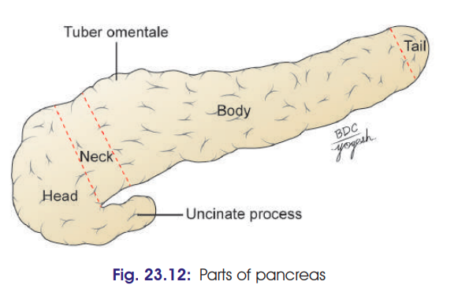
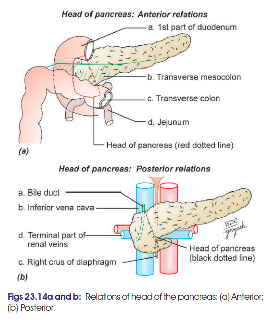
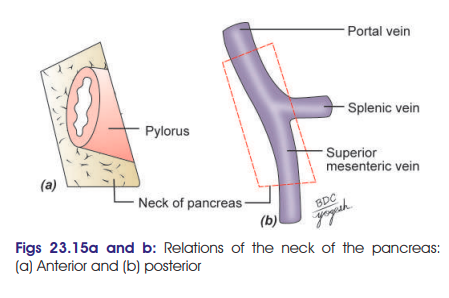
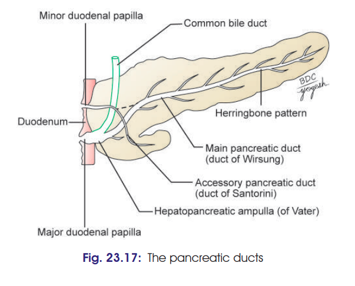
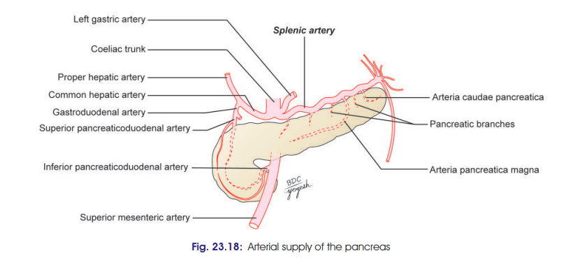
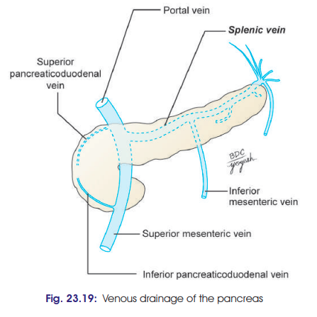

# Pancreas
### Headings
 - Introduction
 - Functions
 - Location
 - Dimensions
 - Parts
 - Relations
 - Duct System
 - Blood supply
 - Lymphatic Drainage
 - Nerve Supply
 - Clinical
## Introduction
 - soft, lobulated and elongated organ
 - partly exocrine and partly endocrine 
## Functions
 1. Exocrine function: 
    - secrete alkaline pancreatic juice that contains Bicarbonates & Pancreatic enzymes
 2. Endocrine function:
    - Islets of Langerhans secrete insulin, glucagon, somatostatin 
## Location
 - lies across posterior abdominal wall
 - T12 to L3 level
 - Retroperitoneal (tail is intraperitoneal)
 - Occupies epigastric, umblical and left hypochondriac regions
## Dimensions
 - J-shaped or retort shaped
   - thickness: 1.5 to 2 cm
   - width: 2 to 4 cm
   - length: 12 to 15 cm
   - weight: 80 to 90 gm
## Parts
- Divied into 4 parts: Head, Neck, Body & Tail
- 
## Relations  
- Head:
  - enlarged flattened right end of pancreas, situated within the ‘C-shaped’ curve of the duodenum
  - The head of the pancreas has the following features:
    1. Three borders: Superior, inferior and right-lateral
    2. Two surfaces: Anterior and posterior
    3. One process: Uncinate process.
  - Relations of the Head:
    - Three borders:
      1. Superior border is related to:
        • First part of the duodenum
        • Superior pancreaticoduodenal artery.
      2. Inferior border is related to:
        • 3rd part of the duodenum
        • Inferior pancreaticoduodenal artery.
      3. Right lateral border is related to:
        • 2nd part of the duodenum 
        • Terminal part of the bile duct
        • Anastomosis between the two pancreaticoduodenal arteries.
    - Two surfaces:
      1. Anterior surface is related, from above downwards, to:
        a. 1st part of duodenum
        b. Transverse colon
        c. Jejunum which is separated from it by peritoneum
      2. Posterior surface is related to:
        a. Inferior vena cava
        b. Terminal parts of the renal veins
        c. Right crus of the diaphragm
        d. Bile duct which runs downwards and to the right and is often embedded in the substance of pancreas.
    - Uncinate process:
      - The uncinate process is a triangular, hook-like projectionfrom lower part of the head. It is related: 
          1. Anteriorly to the superior mesenteric vessels and
          2. Posteriorly to the abdominal aorta.
  - 
- Neck:
  - slightly constricted part of the pancreas between its head and body
  - The neck has the following features:
    1. Two surfaces: Anterior and posterior
    2. Two borders: Upper and lower.
  - Relations of Neck:
    1. Anterior surface is related to: The peritoneum covering the posterior wall of the lesser sac, and the pylorus.
    2. Posterior surface is related to the termination of the superior mesenteric vein and the beginning of the portal vein 
    3. Upper border is related to the 1st part of duodenum.
    4. Lower border is related to the root of transverse mesocolon.
  - 
- Body: 
  - elongated & extends from its neck to the tail
  - The body of pancreas is slightly triangular in crosssection. It has:
    1. Two surfaces: Anterior and posterior
    2. Two borders: Superior and inferior
    3. One process: Tuber omentale: It is a rounded conical elevation from the right end of the superior border
  - Relations of Body:
    - Superior border
      - related to coeliac trunk over the tuber omentale and hepatic artery to the right and splenic artery to the left of tuber omentale.
    - Inferior border
      - related to the superior mesenteric vessels at its right end.
    - Anterior surface
      - covered by peritoneum and gives attachment to the transverse mesocolon
      - Relations above the attachment of transverse mesocolon:
        1. Lesser sac
        2. Stomach
      - Relations below the attachment of transverse mesocolon:
        1. Infracolic compartment of greater sac
        2. Coils of jejunum
        3. Duodenojejunal flexure
        4. Left colic flexure.
    - Posterior surface
      - devoid of the peritoneum. It lies on fusion fascia of Toldt. It is related to:
        1. Aorta
        2. Origin superior mesenteric artery
        3. Left suprarenal gland
        4. Upper pole of left kidney
        5. Left renal vein
        6. Splenic vein (may be embedded in the gland)
        7. Left crus of diaphragm.
- Tails: 
  - narrowest and the most left lateral portion of the pancreas
  - lies in the splenorenal (lienorenal) ligament along with splenic vessels
  - It is the only mobile part of pancreas. 
  - It contains the most significant number of islets of Langerhans.
## Duct System
- The exocrine pancreas is drained by two ducts—main and accessory
  - Main Pancreatic Duct of Wirsung
    - lies near the posterior surface of the pancreas and is recognised easily by its white colour
    - Within the head of the pancreas, the pancreatic duct is related to the bile duct which lies on its right side.
    - The two ducts enter the wall of the 2nd part of the duodenum and join to form the hepatopancreatic ampulla of Vater which opens by a narrow mouth
    on the summit of the major duodenal papilla, 8 to 10 cm distal to the pylorus.
  - Accessory Pancreatic Duct of Santorini
    - begins in the lower part of the head, crosses the front of the main duct with which it communicates and opens into the duodenum at the minor duodenal papilla. 
    - The papilla of accessory pancreatic duct is situated 6 to 8 cm distal to the pylorus. 
- 
## Blood supply
- Arterial Supply: 
  1. Splenic artery – branch of coeliac trunk.
  2. Superior pancreaticoduodenal artery – branch of
  gastroduodenal artery.
  3. Inferior pancreaticoduodenal artery – branch of
  superior mesenteric artery.
  - 
- Venous Supply: 
  1. Portal vein
  2. Superior mesenteric vein
  3. Splenic vein.
  - 
## Lymphatic Drainage
- pancreas drain into the following lymph nodes:
  1. Pancreaticosplenic nodes [main lymphatic nodes]
  2. Coeliac nodes
  3. Superior mesenteric nodes
  4. Pyloric nodes.
## Nerve Supply
  1. Parasympathetic fibres from vagus nerve: 
     - These are secretomotor fibres 
  2. Sympathetic fibres from coeliac and superior mesenteric plexuses: 
     - These are vasomotor.
## Clinical 
- Carcinoma of head: 
  - may compress bile duct that leads to obstructive jaundice. 
  - may also cause duodenal obstruction and compression of portal vein (resulting in ascites and portal hypertension).
- Acute pancreatitis:
  - an acute inflammation of pancreas that has severe complications and high mortality (death) rate.
  - It occurs because of abnormal activation of pancreatic proteolytic enzymes in the pancreas (usually, these enzymes get activated in the intestine). 
  - Activated enzymes cause inflammation, oedema and cellular death.
- Chronic pancreatitis:
  -  long-standing inflammation of pancreas (repeated attacks of mild acute pancreatitis).
- Pain from pancreatitis:
  -  is poorly localized. 
  -  Pain is referred to epigastrium. 
  -  Pain is also referred to posterior paravertebral region and around the lower thoracic vertebrae, due to inflammation of soft tissues of retroperitoneum. 
  -  Their afferents are being sent through lower intercostal nerves.
- Pseudocyst of pancreas:
  -  is a circumscribed collection of fluid containing pancreatic enzymes, blood and necrotic tissue. 
  -  It is located in lesser sac and may present symptoms similar to pancreatitis. 
  -  It occurs as a complication of pancreatitis.  