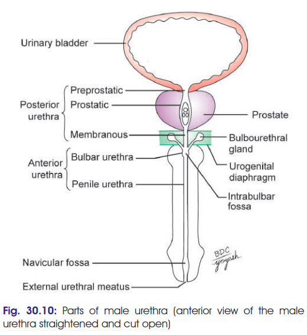
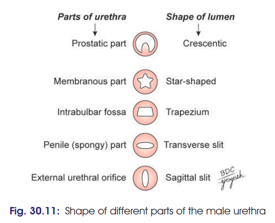
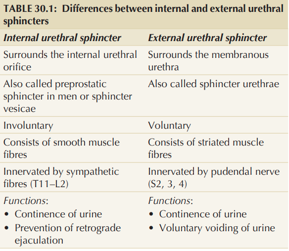
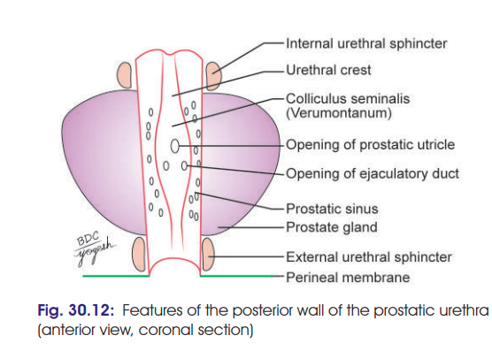
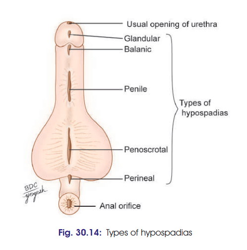

# Male Urethra
### Headings
- Introduction
- Parts of Urethra 
- Shape of Urethra
- Sphincters of Urethra
- Features of Urethra
- Arteries
- Veins
- Lymphatic Drainage
- Nerve Supply
- Clininal

## Introduction
- Male urethra is 18–20 cm long 
- extends from the internal urethral orifice in the urinary bladder to the external opening (meatus) at the end of the penis

## Parts of Urethra 
- Posterior Part
  - 4cm long
  - Divided into 3 parts
    - Prepostatic
    - Prostatic
    - Membranous
- Anterior Part
  - 16cm long
  - Divided into 2 parts
    - Bulbar
    - Pendulous/Penile
-  
 
## Shape of Urethra
- In flaccid penis, urethra as a whole represents double curve except during the passage of fluid along it.
- The urethral canal is a mere slit.
- In transverse section: 
  - 
## Sphincters of Urethra
- Two sphincters: Internal & External urethral sphincters
- Difference b/w Internal & External urethral sphincters
  - 

## Features of Urethra
- Posterior Urethra: 3 parts
  - Preprostatic urethra: 
    - 1 cm long. 
    - extends from the base of urinary bladder to the prostate. 
    - surrounded by proximal urethral sphincter in males.
  - Prostatic urethra: *(make flowchart)*
    - 3–4 cm long. 
    - widest and most dilatable part of male urethra
    - traverses through the substance of prostate closer to the anterior than the posterior surface of gland
    -  Lowermost part of prostatic urethra is fixed by puboprostatic ligaments and is, therefore, immobile
    -  Shows following features - (Urethral Crest, Prostatic Sinus, Verumontanum, Prostatic Utricle)
       -  Urethral crest: 
          -  median longitudinal mucosal crest
          -  projects posteriorly into the lumen making the lumen crescentic in transverse section
       - Prostatic Sinuses: 
         - Depressions on each side of urethral crest 
         - Shows 15-20 prostatic ducts
       - Verumontanum/Seminal Colliculus:
         - Rounded elevation in middle of urethral crest 
         - 3 orifices: Middle Prostatic utricle, 2 Ejaculatory Ducts
       - Prostatic Utricle: 
         - Cul-de-Sac *(a street closed at one end)*
         - consists of openings of numerous glands
         - Corresponds to Vagina (*vaginus masculinus*)
         - Develops from Mullerian Ducts
    - 
  - Membranous Urethra:
    - 2 to 2.5cm long
    - Second narrowest part of urethra (Ext. urethral orifice is the narrowest)
- Anterior Urethra: 2 parts
  - Bulbar Urethra: (entirely within perineum)
    - Surrounded by bulbospongiosus
    - has openings of bulbourethral glands
  - Penile/Pebdulous Urethra: (narrow, slit-like passage upto ext. urethral orifice)
    - Following features are seen - (Navicular fossa, External urethral oroifice, Urethral glands of Littre, Urethral Lacuanae, Lacuna magna/sinus of guerin)
      - Navicular Fossa: 
        - dilatation of terminal part of penile urethra within the glans penis
      - External urethral orifice: 
        - narrowest part of urethra. 
        - a slit-like opening
      - Urethral glands of Littre:
        - simple tubular mucous glands that open in the entire anterior urethra.
      - Urethral lacunae: 
        - pit-like recesses of urethral mucosa which project from entire urethra except in the navicular fossa.
      - Lacuna magna/Sinus of Guerin:
        - the largest urethral lacuna located on the roof of the navicular fossa.
        - Its mouth is guarded by mucous fold called *valvule of Guérin*
## Arteries
- 1. Urethral artery arises from internal pudendal artery just below perineal membrane and travels through corpus spongiosum to reach glans penis.
- 2. Dorsal penile artery via circumflex branches on each side
## Veins
- 1. Anterior urethra → dorsal vein of penis → internal pudendal vein which drains into prostatic venous plexus → internal iliac veins.
- 2. Posterior urethra → prostatic and vesical venous plexus → internal iliac veins.
## Lymphatic Drainage
- 1. Prostatic urethra → internal iliac.
- 2. Membranous urethra → internal iliac.
- 3. Anterior urethra → accompany that of glans → deep inguinal.
## Nerve Supply
- Prostatic plexus supplies the smooth muscle of prostate and prostatic urethra
- Parasympathetic nerves are from 2nd–4th sacral segments
- Greater cavernous nerves are sympathetic to preprostatic sphincter during ejaculation
- Nerve supply of rhabdosphincter is controversial but is said to be by neurons in Onuf’s nucleus situated in 2nd sacral segment of spinal cord; fibres pass via perineal branch of pudendal nerve.
## Clininal
- Urethritis:
  -  an infection of urethra
- Hypospadias:
  - common anomaly in which the urethra opens on the undersurface of the penis or in the perineum
  - It may be: 
    - glandular *on ventral surface of glans*
    - balanic *at base of glans*
    - penile *on ventral surface of penis*
    - penoscrotal *at junction of penis and scrotum*
    - perineal *at unfused part of scrotum*
  -  
- Epispadias:
  - rare condition that causes failure of development of infraumbilical part of anterior abdominal wall 
  - leads to opening of urethra or bladder on the dorsum of penis. 
  - It may be associated with ectopia vesicae