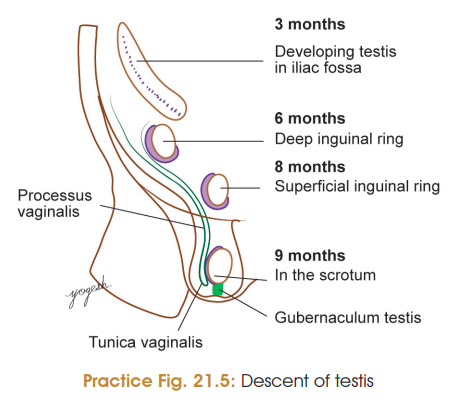
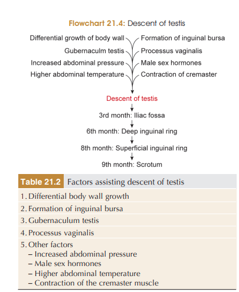

# DESCENT OF TESTIS ⭐⭐⭐

### Introduction

* Testis develops on the **posterior abdominal wall** at the level of the **upper lumbar vertebrae**.
* During development, it gradually descends from the abdominal cavity to the **scrotum**.
* At birth, the testis normally lies in the scrotum.

## Factors Responsible for Descent of Testis

### 1. Differential growth of posterior abdominal wall

* The posterior abdominal wall grows rapidly while the testis descends relatively slowly.
* This contributes to the **progressive downward displacement of the testis**.

### 2. Formation of inguinal bursa

* An outpouching of the anterior abdominal wall forms the **inguinal bursa**.
* Its passage through the anterior abdominal wall forms the **inguinal canal**.
* Its surface elevation forms the **scrotum**.
* The inguinal bursa therefore provides the pathway for descent of the testis.

### 3. Gubernaculum testis ⭐

* It is a **mesenchymal band** extending from the lower pole of the testis to the developing scrotum.
* Initially, it connects the testis to the anterior abdominal wall.
* The gubernaculum grows **slowly compared with the surrounding body wall**.
* As the body grows, the testis therefore comes to occupy a progressively lower position.
* It also **dilates the inguinal bursa and guides the testis towards the scrotum**.

### 4. Processus vaginalis ⭐

* It is a **diverticulum of peritoneum** that extends through the inguinal canal into the scrotum.
* It provides a pathway for the descending testis.
* After descent:

  * **Distal part → tunica vaginalis**
  * **Proximal part → normally obliterates**
* Obliteration of the proximal part is influenced by **androgens**, through **CGRP released by the genitofemoral nerve**, and by **hepatocyte growth factor**.

### 5. Other factors

* **Increased intra-abdominal pressure** due to growth of abdominal viscera.
* **Male sex hormones (androgens).**
* **CGRP from genitofemoral nerve** → contraction of cremaster muscle.
* Temperature difference between abdomen and scrotum may also contribute.

---

## ⭐ Mechanism — easiest way to remember

**Testis in lumbar region**
↓
**Gubernaculum + processus vaginalis provide pathway**
↓
**Inguinal canal develops**
↓
**Testis passes through inguinal canal**
↓
**Reaches scrotum**
↓
**Processus vaginalis → tunica vaginalis**

### 🔥 High-yield points

| Structure/factor                 | Role                                                   |
| -------------------------------- | ------------------------------------------------------ |
| **Gubernaculum**                 | Guides testis towards scrotum                          |
| **Inguinal bursa**               | Provides pathway                                       |
| **Processus vaginalis**          | Peritoneal diverticulum; guides descent                |
| **Distal processus vaginalis**   | Forms tunica vaginalis                                 |
| **Proximal processus vaginalis** | Obliterates                                            |
| **Genitofemoral nerve → CGRP**   | Cremaster contraction                                  |
| **Androgens**                    | Important for descent/processus vaginalis obliteration |
| **↑ Intra-abdominal pressure**   | Assists descent                                        |
