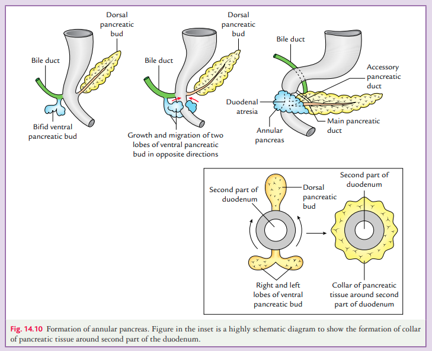

# Annular Pancreas (Short Note)

## Definition
- **Annular pancreas** is a congenital anomaly in which the **second part of the duodenum is surrounded by a ring of pancreatic tissue**.

## Incidence
- Occurs in approximately **1 in 12,000–15,000 newborns**.
- **More common in males** than females.

## Etiology (Cause)
- Normally, the **ventral and dorsal pancreatic buds** fuse after rotation of the duodenum.
- Annular pancreas results due to:
  - **Bifid ventral pancreatic bud** (**most common cause**) ⭐
  - **Failure of rotation of the ventral pancreatic bud**

## Effects / Clinical Features
- **Duodenal obstruction**
- **Pancreatitis**
- **Peptic ulcers**
- In **intrauterine life**, may cause **polyhydramnios** due to fetal duodenal obstruction.

## Diagnosis
- **Abdominal X-ray:** **Double bubble sign**
  - Gas in the **stomach**
  - Gas in the **proximal part of the duodenum**

## Treatment
- **Surgical bypass** of the obstructed duodenum.
- Procedure of choice: **Duodenojejunostomy**.

---

---

## High-Yield MCQs
- **Most common cause:** ⭐ **Bifid ventral pancreatic bud**
- **Part of duodenum affected:** **Second part**
- **Characteristic X-ray finding:** **Double bubble sign**
- **Associated prenatal finding:** **Polyhydramnios**
- **Treatment of choice:** **Duodenojejunostomy**