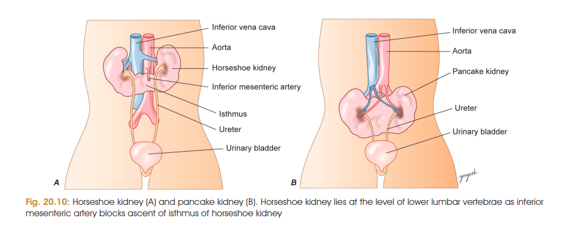
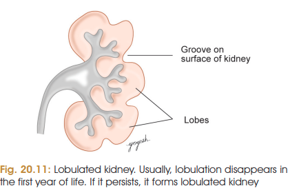

# Congenital Anomalies of Kidney
### Headings 
1. * Renal Agenesis
1. * Duplication of Kidney
1. * Horseshoe Kidney
1. * Pancake Kidney
1. * Lobulated Kidney
1. * Anomalies of ascent
1. * PKD 
1. * Accessory Renal Artery
1. * Wilms' tumour
### 1. Renal agenesis

* **Complete failure of development of kidney**.
* May be **unilateral or bilateral**.
* **Cause:** failure of formation of ureteric bud.
* GDNF signalling is important for ureteric bud growth; mutations involving **SALL1, PAX2, EYA1** may cause renal agenesis.

---

### 2. Duplication of kidney

* **Early division of ureteric bud** may produce an additional kidney.
* Kidneys may be **separate or fused**.
* Ureters may be **separate or partially fused**.

---

### 3. Horseshoe kidney ⭐

* The two kidneys are **fused at their lower poles** by an isthmus.
* The kidney remains at a **lower lumbar level**.
* **Reason:** ascent of the isthmus is prevented by the **inferior mesenteric artery**.

**Memory:**
**Horseshoe → lower poles fused → low position → IMA blocks ascent.**

---

### 4. Pancake kidney

* Both kidneys **fuse completely** to form a **single renal mass**.

---

### 5. Lobulated kidney

* Fetal kidney is normally **lobulated**.
* Normally, lobulation disappears during the **first year of life**.
* Persistence → **persistent lobulated kidney**.

---

### 6. Anomalies of ascent

| Anomaly                 | Position                              |
| ----------------------- | ------------------------------------- |
| **Pelvic kidney**       | Remains in pelvic cavity              |
| **Lower lumbar kidney** | Lies against lower lumbar vertebrae   |
| **Thoracic kidney**     | Excessive ascent into thoracic cavity |

---

### 7. Congenital PKD (polycystic kidney disease)⭐

* Characterized by formation of **multiple renal cysts**.
* Usually **bilateral**.
* Due to abnormal development/dilatation of **uriniferous tubules**.

**Types:**

* **ARPKD** — childhood presentation.
* **ADPKD** — usually presents in adulthood.
  
**Treatment:** Dialysis and kidney transplantation.

---

### 8. Accessory renal artery

* **Persistence of fetal renal arteries** produces accessory/supernumerary renal arteries.
* **Most common renal vascular anomaly.**
* May compress the ureter → **hydronephrosis**.

⭐ **Very easy MCQ:**
**Most common renal vascular anomaly = Accessory renal artery**

---

### 9. Wilms' tumour

* **Most common primary renal tumour of childhood.**
* Due to mutation of **WT1 gene**.
* Gene located on **chromosome 11p13**.

---

## 🧠 Last-minute recall

**A D H P L A P A W**

* **A** — Agenesis
* **D** — Duplication
* **H** — Horseshoe
* **P** — Pancake
* **L** — Lobulated
* **A** — Anomalies of ascent
* **P** — Polycystic kidney
* **A** — Accessory renal artery
* **W** — Wilms' tumour
