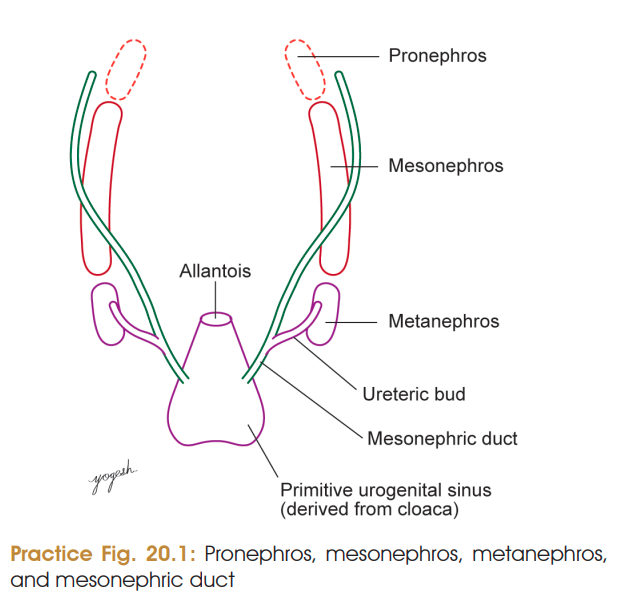
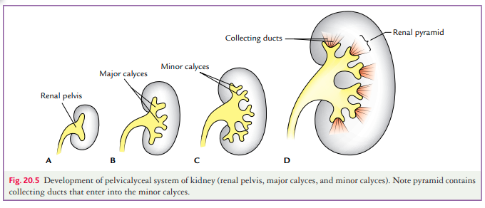
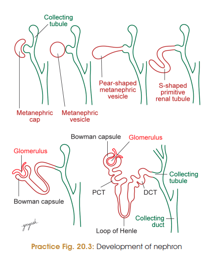
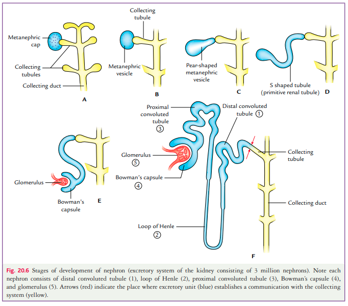
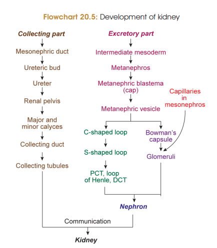
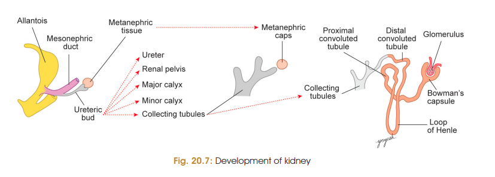

# Development of Kidney

### Evolutionary history — *Ontogeny repeats phylogeny*

Kidney develops from the **nephrogenic cord of intermediate mesoderm** extending from cervical to sacral region.

The evolutionary sequence is:

**Pronephros → Mesonephros → Metanephros**

| Type            | Human development                              | Fate                            |
| --------------- | ---------------------------------------------- | ------------------------------- |
| **Pronephros**  | Cervical region, beginning of **4th week**     | Regresses                       |
| **Mesonephros** | Thoracolumbar region, end of **4th week**      | Mostly regresses; duct persists |
| **Metanephros** | Lumbosacral region, beginning of **3rd month** | Forms **definitive kidney**     |

> **Clinical/exam point:** Metanephros is the definitive kidney in humans.

---

# Stages of Development

## 1. Development of collecting system

* **Ureteric bud** arises from the **caudal part of mesonephric duct**.
* It grows towards the **metanephric blastema**.
* The dilated end of ureteric bud forms an **ampulla**, which is capped by metanephric blastema.
* Ampulla undergoes repeated **dichotomous branching** (12–14 generations) to form renal pelvis, major calyces, minor calyces, collecting ducts, and collecting tubules
  
### Ureteric bud forms:

**Ureteric bud → renal pelvis → major calyces → minor calyces → collecting ducts → collecting tubules**

⭐ **Remember:**
**Ureteric bud = collecting system**

---

## 2. Development of secretory/excretory part

* Metanephric blastema forms a cap around the dividing ureteric bud.
* Cells of metanephric blastema form a **metanephric vesicle**.
* Metanephric vesicle becomes an **S-shaped primitive renal tubule**.
* One end expands to form **Bowman’s capsule**.
* The other end joins the **collecting tubule**.
* Capillaries invaginate Bowman’s capsule to form the **glomerulus**.

### Primitive renal tubule forms:

**Bowman’s capsule → PCT → Loop of Henle → DCT**

Thus, the **metanephric blastema forms the nephron**.

⭐ **Remember:**

**Metanephric blastema = secretory part/nephron**

---

# 3. Ascent of Kidney

* Initially, metanephric kidneys develop in the **pelvic cavity at sacral level**.
* They ascend to the **thoracolumbar region**.
* By about the **9th week**, kidneys reach their adult position.

### Causes of ascent

1. **Better Blood Supply**
1. **Smaller pelvic cavity** fails to accommodate the enlarging kidneys.
2. **Differential growth of posterior abdominal wall**
3. **Reduction of fetal curvature**

💡 Don't overthink “ascent”:
**Pelvis → abdomen**

---

# 4. Changes in Blood Supply

* Initially supplied by the **median sacral artery**.
* During ascent, kidneys receive blood from successive **lateral branches of abdominal aorta**.
* Finally, a lateral branch at approximately **L2 level** persists as the **definitive renal artery**.

⭐ **Key concept:**
**As kidney ascends → its blood supply shifts upward.**

---

# 5. Rotation of Kidney

* After reaching the thoracolumbar region, the kidney rotates **medially around its vertical axis**.
* Therefore, the **hilum changes from anterior/ventral → medial**.

### One-line sequence

**Pelvic kidney → ascends → blood supply changes → rotates medially → hilum faces medially**

---

## 🧠 Ultra-high-yield summary

### ⭐ The two things you absolutely should not mix up

**Ureteric bud → collecting part**

**Metanephric blastema → secretory part/nephron**

# 6. [Congenital Anomalies of Kidney](./Imp%20applied/Congenital%20Anomalies%20of%20Kidney.md)