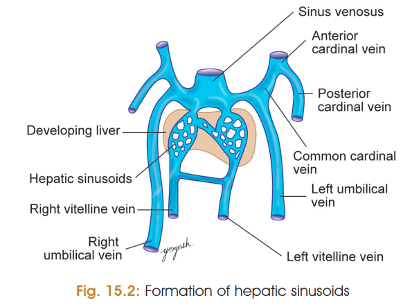
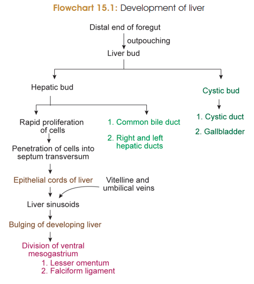
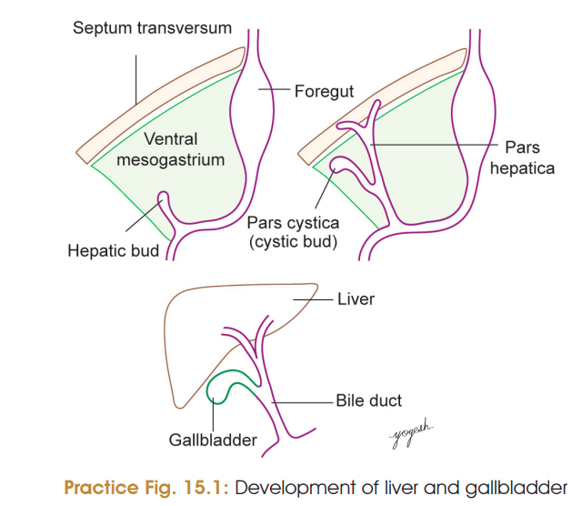
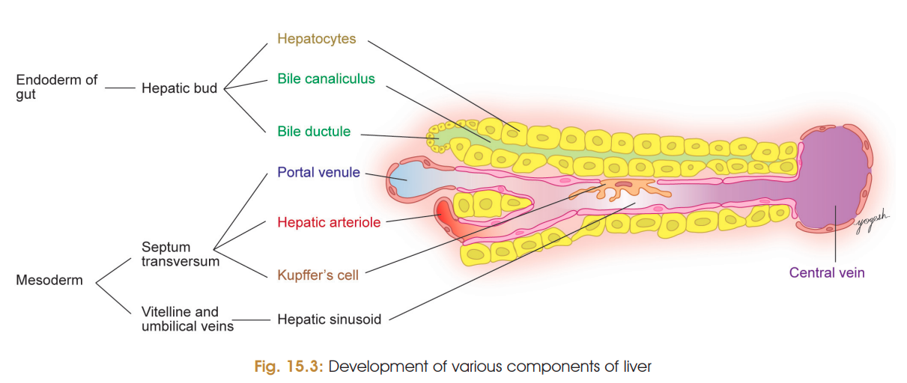
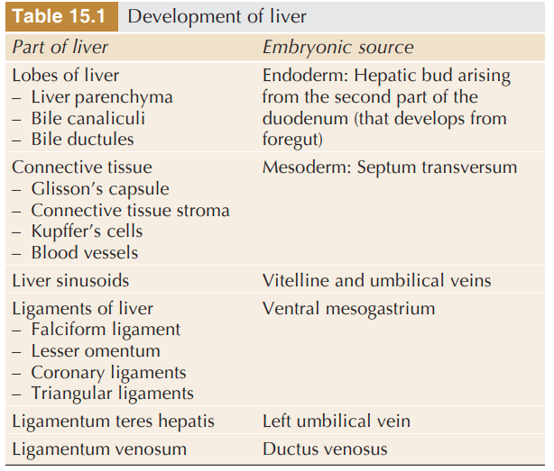

# Liver Development
### Sources of Development

1. **Endodermal hepatic bud**
   → Hepatocytes + intrahepatic biliary apparatus

2. **Septum transversum (mesoderm)**
   → Connective tissue, fibrous capsule, Kupffer cells + blood vessels

3. **Vitelline + umbilical veins**
   → Hepatic sinusoids

4. **Ventral mesentery**
   → Lesser omentum + falciform, coronary and triangular ligaments

---

## Stages of Development

**1. Formation of hepatic bud**

* During **3rd week of IUL**.
* Hepatic bud arises from the **ventral wall of terminal foregut** at the developing second part of duodenum.

**2. Growth of hepatic bud**

* Grows **ventrally and cranially** into the ventral mesogastrium.
* Reaches the **septum transversum**.

**3. Division of hepatic bud**

* Divides into:

  * **Cranial pars hepatica** → liver
  * **Caudal pars cystica** → gallbladder
* Pars hepatica → **right and left hepatic ducts**.
* Hepatic ducts form solid cords → **hepatic trabeculae**.

**4. Formation of hepatic sinusoids**

* Hepatic trabeculae separate → **hepatic sinusoids**.
* Vitelline and umbilical veins passing through septum transversum break up and communicate with these sinusoids.

> 

**5. Formation of bile canaliculi**

* Hepatic ducts branch → **intrahepatic biliary passages**.

**6. Formation of capsule and connective tissue**

* Mesenchyme of septum transversum forms:
  → Blood vessels
  → Kupffer cells
  → Hematopoietic cells
  → Fibrous capsule of liver

**7. Formation of peritoneal ligaments**

* Developing liver divides ventral mesogastrium into:
  → **Falciform ligament**
  → **Lesser omentum**
* Peritoneal reflections from liver to diaphragm form:
  → **Coronary ligament**
  → **Triangular ligaments**

> 
> 
> 
>  

---

## Molecular Regulation

**Cardiac mesoderm → FGF2 → hepatic gene expression → hepatic bud**

* **BMPs** → enhance action of FGF2.
* **HNF-3 and HNF-4** → control differentiation into **hepatocytes and biliary cells**.

### ⭐ Super-short flowchart

**Foregut endoderm**
↓
**Hepatic bud (3rd week)**
↓
**Pars hepatica + pars cystica**
↓
**Liver + gallbladder**
↓
**Hepatic trabeculae**
↓
**Sinusoids + hepatocytes + biliary apparatus**
↓
**Liver divides ventral mesogastrium**
↓
**Falciform ligament + lesser omentum**
