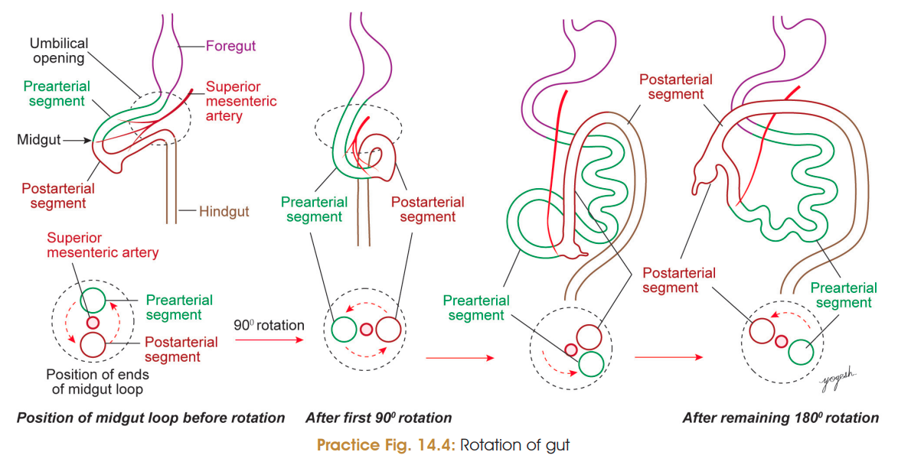
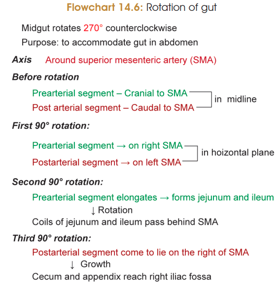

Yep 😭 same way we’ve been doing the anatomy answers — **exam-oriented, short points, flowchart-friendly, no unnecessary paragraphs**, while keeping all the important marks.

## Rotation of Gut

**Definition**

* Midgut undergoes **270° counterclockwise rotation** around the axis of the **superior mesenteric artery (SMA)**.
* **Purpose:** To accommodate the herniated midgut within the small abdominal cavity.

> 
> 

### Basic division

* SMA divides the midgut into:

  * **Prearterial segment** → cranial to SMA
  * **Postarterial segment** → caudal to SMA

### Stages of Rotation

**1. First 90° rotation**

* Midgut rotates **90° counterclockwise** around SMA.
* Brings the prearterial segment → **right side**
* Postarterial segment → **left side**
* This rotation occurs as the midgut returns into the abdominal cavity.

**2. Remaining 180° rotation**

* Prearterial segment elongates → forms **jejunum and ileum**.
* Further **counterclockwise rotation** occurs.
* Jejunal and ileal coils come to lie **behind SMA**.
* SMA comes to lie **ventral to duodenum**.
* Further rotation brings the **caecum and appendix to the right side**.
* Caecal bud descends → **right iliac fossa** → adult position.
* **Transverse colon crosses anterior to SMA.**

### Fate of Mesentery

* Initially, all parts of midgut are attached to posterior abdominal wall by **dorsal mesentery**.
* After rotation:

  * Mesentery of **duodenum, ascending colon and descending colon** undergoes **zygosis** → these become **secondarily retroperitoneal**.
* Persistent mesentery forms:

  * **Mesentery** → jejunum & ileum
  * **Transverse mesocolon**
  * **Sigmoid mesocolon**
  * **Mesoappendix**

### ⭐ Flowchart to memorize

**Midgut → 270° counterclockwise rotation around SMA**

**90° →**
Prearterial → Right
Postarterial → Left

**+ 180° →**
Jejunum + ileum → behind SMA
SMA → anterior to duodenum
Caecum + appendix → right side → right iliac fossa
Transverse colon → crosses SMA

**Mesenteric zygosis →**
Duodenum + ascending colon + descending colon → **retroperitoneal**

## Congenital Anomalies of Midgut

### 1. Umbilical fecal fistula / Vitelline fistula

* Due to **patent vitellointestinal duct**.
* Communication between **small intestine and exterior**.
* Results in **discharge of fecal matter through umbilicus**.

### 2. Meckel's diverticulum

* Due to **persistence of vitellointestinal duct**.
* Most common anomaly of vitellointestinal duct.

### 3. Enterocystoma / Vitelline cyst

* Cyst formed due to persistence of the **middle part of vitellointestinal duct**.

**Persistent vitellointestinal duct →**

* Meckel's diverticulum
* Vitelline cyst / enterocystoma
* Umbilical fistula
* Umbilical (vitelline) sinus

### 4. Raspberry tumor of umbilicus

* Due to persistence of **distal part of vitellointestinal duct** at umbilicus.
* Produces a **raspberry-red tumor**.

### 5. Exomphalos / Omphalocele

* Normally, physiological herniation of gut disappears by **12th week of IUL**.
* Failure of return → gut loops remain at umbilicus.
* Produces a **rounded mass at umbilicus**.

### 6. Congenital umbilical hernia

* **Intestinal coils protrude through umbilical opening**.
* Contents are covered by:

  * Skin
  * Connective tissue
  * Peritoneum
* **Reducible** by pushing the intestinal coils back.
* Reappears during **coughing/crying**.
* Usually disappears spontaneously by **2–3 years**.
* If persistent → **surgical treatment**.

### 7. Gastroschisis

* Congenital defect of **anterior abdominal wall**.
* Abdominal contents protrude outside.
* Due to **failure of complete lateral folding of embryo**.
* Incidence: **1 in 10,000 births**.

### 8. Errors of Rotation

* Rotation may be:

  * **Absent / nonrotation**
  * **Incomplete**
  * **Reversed**
* Causes abnormal position of abdominal viscera.

**Important diagnostic landmark:**
**Ligament of Treitz**
→ normally lies **left of L1/L2 vertebrae**.

**Examples:**

**No rotation →**

* **Left-sided colon**
* **Right-sided small intestine**

**Reversed rotation →**

* Duodenum lies **anterior to transverse colon**
* Transverse colon lies **posterior to SMA**

**Mixed rotation →**

* Caecum may lie **inferior to pylorus**

### 9. Apple-peel atresia

**Also called:**

* Christmas-tree intestinal atresia

* **Type IIIb intestinal atresia**

* Atresia of **small intestine**.

* Accounts for about **10% of intestinal atresias**.

* Usually **duodenum/proximal jejunum ends blindly**.

* Distal small intestine wraps around its **vascular supply**.

* Appearance resembles an **apple peel**.

### ⭐ One-line revision

**Vitellointestinal duct anomalies →**
**Meckel + Vitelline cyst + Umbilical fistula + Umbilical sinus + Raspberry tumor**

**Rotation anomalies →**
**Nonrotation / incomplete rotation / reversed rotation → abnormal position of viscera**

**Abdominal wall defects →**
**Omphalocele + Umbilical hernia + Gastroschisis**

> Check out the TB for **Meckel's Diverticulum** and **physiological hernia**