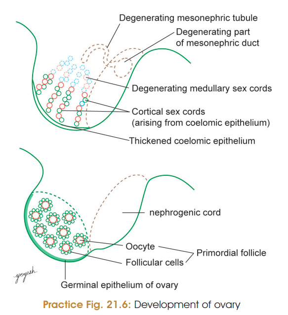
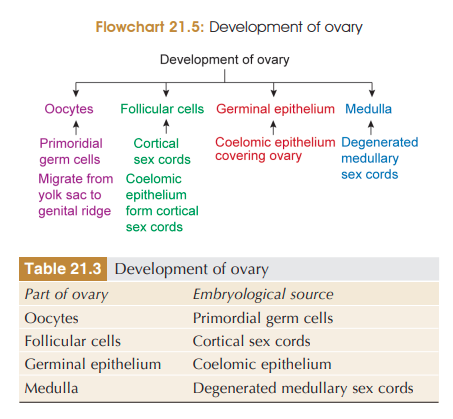

# Development of Ovary

### 1. Formation of genital ridge

* Gonads develop from the **genital ridge** on the posterior abdominal wall.
* It is formed in the **5th week** by proliferation of coelomic epithelium covering the medial surface of the mesonephros.
* **Primordial germ cells** arising from epiblasts migrate to the genital ridge during the 5th week.
* Up to the **7th week**, the gonad remains **indifferent/ambisexual**.

### 2. Migration of Primordial Germ Cells

* **Primordial germ cells** migrate from the **yolk sac → genital ridge**.
* They become incorporated into the developing gonad.

### 3. Formation of Ovarian Medulla

* **Primitive medullary sex cords degenerate**.
* Their remnants form the **medulla of ovary**.

### 4. Formation of Cortical Cords

* In the **7th week**, coelomic epithelium forms a **second generation of sex cords → cortical cords**.
* Cortical cords remain confined to the **cortex** and do not extend into the medulla.

### 5. Formation of Primordial Follicles

* In the **3rd month**, cortical cords break up into clusters surrounding primordial germ cells.
* **Primordial germ cell → oogonium**
* Surrounding cells → **follicular cells**
* Together → **primordial follicle**.

### 6. Covering and Attachment

* Coelomic epithelium forms the **single-layered germinal epithelium** of ovary.

  * **Important:** It is a misnomer; it does **not** produce germ cells.
* Ovary is attached to the broad ligament by the **mesovarium**.

---

## Descent of Ovary

* Ovary develops on the **posterior abdominal wall** and descends into the **true pelvis**.
* **Gubernaculum ovarii** connects ovary to the future labium majus.
* Development of the **uterus and broad ligament** arrests further descent.

### Derivatives of gubernaculum

**Gubernaculum**
→ **Ligament of ovary**: ovary → uterus
→ **Round ligament of uterus**: uterus → labium majus through inguinal canal

### 🔥 Flowchart to memorize

**Primordial germ cells**
↓
**Genital ridge**
↓
**Medullary cords degenerate → ovarian medulla**
↓
**Cortical cords form**
↓
**Clusters around germ cells**
↓
**Oogonium + follicular cells**
↓
**Primordial follicle**

## Anomalies of Ovary

1. **Absence of ovary**

   * Ovary may be absent **unilaterally or bilaterally**.

2. **Duplication**

   * Ovary may be **duplicated**.

3. **Ectopic ovary**

   * Ovary may be present in:

     * **Inguinal canal**
     * **Labium majus**

4. **Ovarian teratoma**

   * Tumour containing derivatives of **all three germ layers**.
   * May contain tissues such as **bone, cartilage, hair, thyroid or adrenal tissue**.

