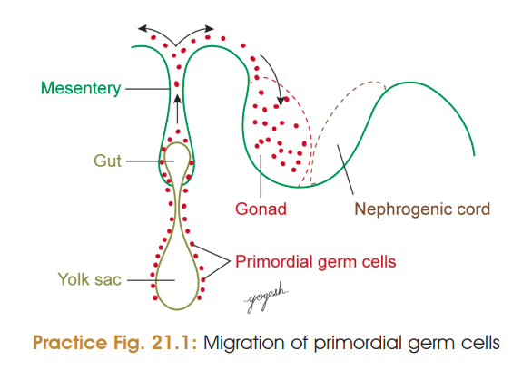
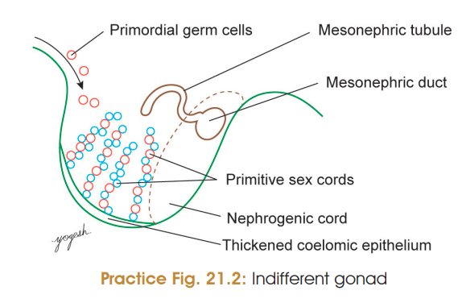
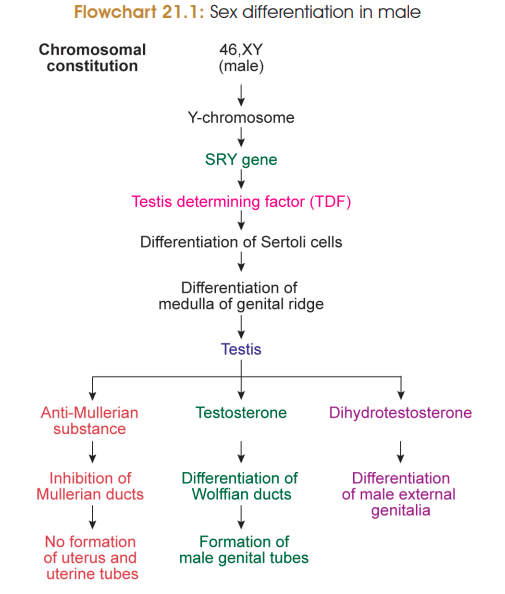

# Development of Testis ⭐⭐⭐

### 1. Formation of genital ridge

* Gonads develop from the **genital ridge** on the posterior abdominal wall.
* It is formed in the **5th week** by proliferation of coelomic epithelium covering the medial surface of the mesonephros.
* **Primordial germ cells** migrate to the genital ridge during the 5th week.
* Up to the **7th week**, the gonad remains **indifferent/ambisexual**.

### 2. Differentiation into testis

* **Y chromosome → SRY gene → Testis-determining factor (TDF)** → development of testis.
* Testis develops mainly from the **medulla of the genital ridge**.

### 3. Development of seminiferous tubules and rete testis

* Primitive sex cords extend into the medulla and form **medullary (testis) cords**.
* These cords converge towards the **hilum** and form a network called **rete testis**.
* Later, the medullary cords become canalized to form **seminiferous tubules**.
* Communication between seminiferous tubules and rete testis develops by the **4th month of IUL**.

### 4. Development of testicular coverings and cells

* **Sex cord cells → Sertoli cells**.
* **Primordial germ cells → spermatogonia**.
* Mesenchymal tissue forms the **tunica albuginea** and mediastinal septa.
* Mesenchymal cells between the testis cords differentiate into **Leydig cells**.

### 5. Development of efferent duct system

* Rete testis communicates with **12–15 mesonephric tubules**.
* These mesonephric tubules form the **efferent ductules of testis**.
* The **mesonephric duct** forms:

  * **Duct of epididymis**
  * **Vas deferens**
  * **Seminal vesicle**
  * **Ejaculatory duct**

### 6. [Clinical Anatomy](./Imp%20applied/Testis%20Applied.md)

### ⭐ One-line flowchart to memorize

**Genital ridge → SRY/TDF → medullary sex cords → seminiferous tubules + rete testis → rete testis + mesonephric tubules → efferent ductules → mesonephric duct → epididymis + vas deferens + seminal vesicle + ejaculatory duct**

### 🔥 Must-remember MCQ/Viva points

* **Genital ridge:** 5th week
* **Indifferent gonad:** up to 7th week
* **TDF:** SRY gene on **short arm of Y chromosome**
* **Testis:** develops from **medulla**
* **Sertoli cells:** sex cords
* **Spermatogonia:** primordial germ cells
* **Leydig cells:** mesenchymal tissue
* **Efferent ductules:** mesonephric tubules
* **Epididymis, vas deferens, seminal vesicle, ejaculatory duct:** mesonephric duct
* **Tunica albuginea:** mesenchymal tissue
