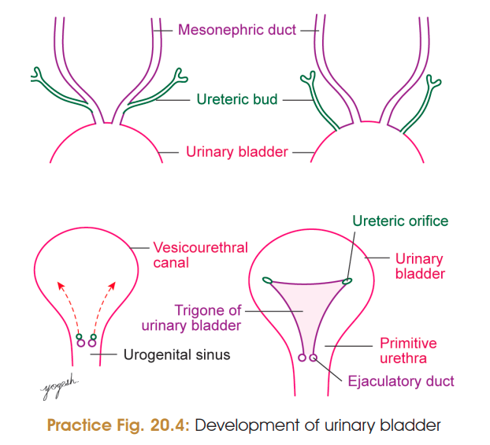
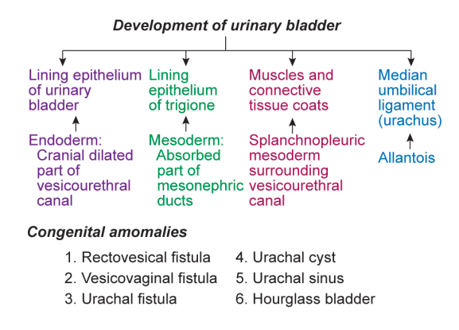
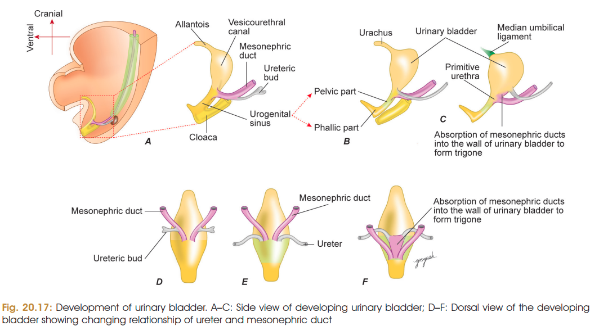

# Development of Urinary Bladder

### Introduction

The urinary bladder develops mainly from the **vesicourethral canal**, which is derived from the **urogenital sinus**.

The adult bladder has:

* Inner **transitional epithelium**
* Middle **smooth muscle and connective tissue**
* Outer **serous/connective tissue coat**

The interior contains a smooth triangular area called the **trigone**.

---

# 1. Division of Cloaca

* The **cloaca** is divided by the **urorectal septum** into:

  * **Ventral urogenital sinus**
  * **Dorsal primitive rectum**
* Urorectal septum reaches the cloacal membrane and divides it into:

  * Ventral **urogenital membrane**
  * Dorsal **anal membrane**
* Urorectal septum forms the **perineal body**.

### Urogenital sinus

The mesonephric ducts open into the urogenital sinus during the **5th week**.

Their openings divide the urogenital sinus into:

**Cranial vesicourethral canal → Caudal definitive urogenital sinus**

The definitive urogenital sinus is further divided into:

* **Pelvic part**
* **Phallic part**

⭐ **For bladder:** remember the **vesicourethral canal**.

---

# 2. Formation of Trigone ⭐

Initially:
**Ureteric bud + Mesonephric duct → common opening** into **vesicourethral canal**

Then the **mesonephric ducts are gradually incorporated into the dorsal wall** of the vesicourethral canal.

As incorporation continues:

* Openings of the **ureteric buds move laterally and cranially**.
* Incorporated mesonephric ducts form a **triangular area** on the dorsal wall.
* This triangular area forms the **trigone of the urinary bladder**.

### Easy flow

**Common opening**

↓ absorption of mesonephric ducts

**Ureteric openings separate and move laterally + cranially**

↓

**Trigone forms**

⭐ **Most important concept:**
**Trigone is formed by incorporation of mesonephric ducts into the dorsal wall of the bladder.**

### Fate of mesonephric ducts

* **Female:** terminal parts disappear.
* **Male:** terminal parts form **ejaculatory ducts**.

---

# 3. Development of Muscular and Connective Tissue Coats

The **muscular and connective tissue coats** of the urinary bladder develop from the **splanchnopleuric layer of intraembryonic mesoderm** surrounding the vesicourethral canal.

---

## 🧠 10-second revision

```text
CLOACA
  ↓
Urorectal septum
  ↓
Urogenital sinus
  ↓
Vesicourethral canal
  ↓
Mesonephric ducts incorporated into dorsal wall
  ↓
TRIGONE
```

### ⭐ Must-remember facts

| Point                            | Remember                           |
| -------------------------------- | ---------------------------------- |
| Bladder develops mainly from     | **Vesicourethral canal**           |
| Cloaca divided by                | **Urorectal septum**               |
| Trigone develops from            | **Incorporated mesonephric ducts** |
| Ureteric openings                | Move **laterally and cranially**   |
| Bladder muscle/connective tissue | **Splanchnopleuric mesoderm**      |
| Urorectal septum forms           | **Perineal body**                  |




# 4. Congenital Anomalies of Urinary Bladder

### 1. Fistulas

**a. Congenital rectovesical fistula**

* Due to **incomplete formation of urorectal septum**.
* Abnormal communication develops between **rectum and urinary bladder**.

**b. Congenital vesicovaginal fistula**

* Due to abnormal projection of the **Müllerian eminence** into the vesicourethral part of cloaca.
* Results in communication between **urinary bladder and vagina**.

**c. Urachal fistula ⭐**

* Due to **persistence of allantois**.
* Urinary bladder communicates with the **exterior at the umbilicus**.

---

### 2. Urachal cyst ⭐

* Due to **non-obliteration of the middle part of allantois**.
* Forms a **midline cystic swelling** in the anterior abdominal wall.

---

### 3. Urachal sinus

* Due to **non-obliteration of the distal part of allantois**.
* Has an **opening at the umbilicus**.

---

### 4. Hourglass bladder

* Urinary bladder is divided into **upper and lower compartments**.
* Division is produced by a **constriction in the middle part** of the bladder.

---

## 🧠 Urachus anomalies — easiest way to remember

Think of the **allantois/urachus** as a tube from bladder → umbilicus:

| What remains patent?      | Anomaly                                       |
| ------------------------- | --------------------------------------------- |
| **Entire tube**           | **Urachal fistula** → urine reaches umbilicus |
| **Middle part**           | **Urachal cyst**                              |
| **Distal/umbilical part** | **Urachal sinus** → opens at umbilicus        |

**Fistula = whole thing open**
**Cyst = middle remains**
**Sinus = umbilical end remains open**

