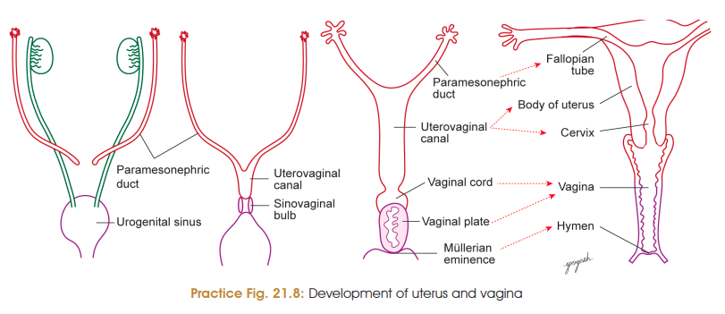
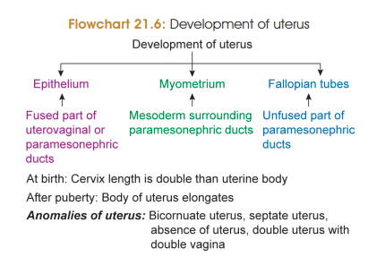

# Development of Uterus 
## Paramesonephric duct/Müllerian duct formation
 - Develops from coelomic epithelial invagination into mesonephric ridge/nephrogenic cord in 6th week of IUL
 - Paramesonephric duct opens cranially into peritoneal (coelomic) cavity
 - Grows caudally, crosses mesonephric duct ventrally to enter urorectal septum
 - Caudal end of both PM duct (left and right) fuse to form uterovaginal canal
## Formation of parts of Uterus
* Uterus develops from the following sources:
  1. Epithelium from uterovaginal canal (fused part of paramesonephric ducts).
  2. Myometrium from mesoderm surrounding paramesonephric ducts.
  3. Fallopian tubes from unfused part of paramesonephric ducts.
* At birth, cervix is twice in length than body of uterus. 
* After puberty, the body of uterus elongates and becomes longer than the cervix.

Yep 👀 **these are absolutely worth adding directly under Development of Uterus**, especially because the anomalies are basically **failures of fusion/development of the paramesonephric (Müllerian) ducts**.

# Anomalies of Uterus

### 1. Bicornuate uterus

* **Partial non-fusion** of caudal parts of paramesonephric ducts.
* Uterus has **two horns (cornua)**.
* Each horn communicates with one fallopian tube.

### 2. Unicornuate uterus

* **Failure of development of one paramesonephric duct**.
* Results in **half-developed uterus + one fallopian tube**.

### 3. Septate uterus

* Paramesonephric ducts **fuse**, but the intervening septum **fails to disappear**.
* Uterine cavity remains divided by a **septum**.

### 4. Absence of uterus

* **Complete failure of development of uterus**.
* Rare.

### 5. Double uterus — **Uterus didelphys**

* **Complete failure of fusion** of right and left paramesonephric ducts.
* Results in **two separate uterine halves**.

### 6. Double uterus + double vagina

* **Failure of fusion of paramesonephric ducts + failure of fusion of sinovaginal bulbs**.
* Results in **double uterus with double vagina**.

---

## 🔥 The actual logic

Think of normal development:

**Right Müllerian duct + Left Müllerian duct**
↓ **fusion**
**Single uterus**

So:

| Developmental error                                  | Anomaly                           |
| ---------------------------------------------------- | --------------------------------- |
| **Partial non-fusion**                               | **Bicornuate uterus**             |
| **Complete non-fusion**                              | **Double uterus / didelphys**     |
| **One duct fails to develop**                        | **Unicornuate uterus**            |
| **Fusion occurs but septum persists**                | **Septate uterus**                |
| **Complete failure of development**                  | **Absent uterus**                 |
| **Müllerian ducts + sinovaginal bulbs fail to fuse** | **Double uterus + double vagina** |

### ⭐ One-line memory

**“Partial = Bicornuate, No fusion = Didelphys, One side = Unicornuate, Septum stays = Septate.”**
