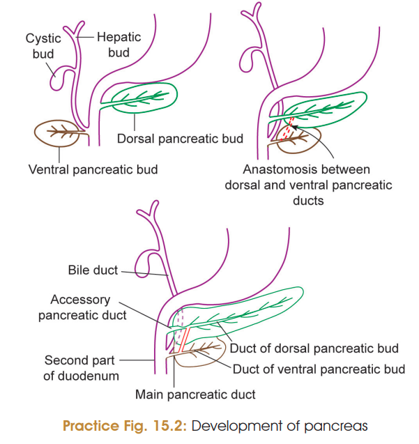
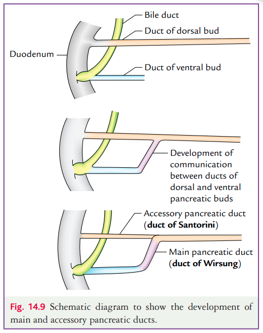

# Stages of Development of Pancreas
### Headings: 
 - Formation of Pancreatic Buds 
 - Rotation & Fusion of Pancreatic Buds
 - Formation of Pancreatic Ducts
 - Formation of Acini and Islets of Langerhans
 - Formation of Supporting Tissue
 - Final Position of Pancreas
---
## 1. Formation of Pancreatic Buds
- **By 3rd week**, two pancreatic buds develop from the **terminal part of the foregut**:
  - **Dorsal pancreatic bud** → arises from the **dorsal wall**.
  - **Ventral pancreatic bud** → arises from the **ventral wall**.
- **MCQ:** Dorsal pancreatic bud appears **earlier** than the ventral pancreatic bud.
- Ventral pancreatic bud develops in association with the **hepatic bud** and both share a **common opening into the duodenum**.
- Ventral pancreatic bud is:
  - **Smaller** in size.
  - Located **distal** to the dorsal pancreatic bud.
- Growth of buds:
  - **Ventral bud** grows in the **ventral duodenal mesentery**.
  - **Dorsal bud** grows in the **dorsal duodenal mesentery**.

---

## 2. Rotation and Fusion of Pancreatic Buds
- Differential growth of the **duodenal wall** causes **rotation of the duodenum**.
- During rotation:
  - **Ventral pancreatic bud** (with the **common bile duct**, arising from the hepatic bud) moves to the **right side** of the duodenum.
  - **Dorsal pancreatic bud** remains on the **left side** of the duodenum.
- Continued differential growth brings the **ventral bud** closer to the **dorsal bud**.
- **Fusion of ventral and dorsal pancreatic buds** occurs during the **7th week of intrauterine life (IUL)**.

---

## 3. Formation of Pancreatic Ducts
After fusion, the ducts anastomose to form:

### a. Main Pancreatic Duct (Duct of Wirsung)
Formed by:
- Duct of the **ventral pancreatic bud**.
- **Distal part** of the duct of the **dorsal pancreatic bud**.
- **Anastomosing channel** between the two ducts.

### b. Accessory Pancreatic Duct (Duct of Santorini)
- Formed by the **proximal part** of the duct of the **dorsal pancreatic bud**.

---

## 4. Formation of Acini and Islets of Langerhans
- Both pancreatic buds undergo **extensive branching**.
- **Pancreatic acini** develop at the ends of the branches.
- Some ductal cells separate to form the **Islets of Langerhans**.
- **Islets appear by the 3rd month** of intrauterine life.
- **Insulin secretion begins by the 10th week**.
- **MCQ:** Insulin secretion starts by the **10th week** of IUL.

---

## 5. Formation of Supporting Tissue
- Surrounding **mesoderm** forms:
  - Capsule
  - Connective tissue
  - Septa
  - Blood vessels of the pancreas

---

## 6. Final Position of Pancreas
- Along with the **duodenum**, the pancreas becomes **secondarily retroperitoneal**.
- **Exception:** The **tail of the pancreas** remains **intraperitoneal**, lying within the **lienorenal (splenorenal) ligament**.

---

## High-Yield MCQs
- Dorsal pancreatic bud appears **earlier** than the ventral bud.
- Ventral pancreatic bud develops with the **hepatic bud**.
- Fusion of pancreatic buds occurs in the **7th week of IUL**.
- **Main pancreatic duct** = Ventral duct + distal dorsal duct + anastomosis.
- **Accessory pancreatic duct** = Proximal dorsal duct.
- **Insulin secretion begins by the 10th week**.
- **Tail of pancreas** lies in the **lienorenal (splenorenal) ligament** and is **intraperitoneal**.
 
--- 

## Developmental Anomalies
### [1. Annular Pancreas](Imp%20applied/Annular_pancreas.md)
- **Definition:** Congenital anomaly in which the **second part of duodenum is surrounded by a ring of pancreatic tissue**.
- **Incidence:** 1 in **12,000–15,000 newborns**.
- **Sex:** Males are affected more commonly than females.
- **Cause:**
  - Normally, ventral and dorsal pancreatic buds fuse after rotation of the duodenum.
  - Annular pancreas occurs due to:
    - **Bifid ventral pancreatic bud** ⭐ (most common cause).
    - Failure of rotation of ventral pancreatic bud.
- **Effects:**
  - Duodenal obstruction.
  - Pancreatitis.
  - Peptic ulcers.
  - Polyhydramnios during intrauterine life.
- **Diagnosis:**
  - X-ray abdomen shows **double bubble appearance** due to gas in:
    - Stomach.
    - Proximal part of duodenum.
- **Treatment:**
  - Surgical bypass of obstruction by **duodenojejunostomy**.
---

### 2. Divided Pancreas (Pancreatic Divisum)
- Occurs due to **failure of fusion of dorsal and ventral pancreatic buds**.
- It is the **most common congenital anomaly of pancreas**. ⭐

---

### 3. Accessory Pancreatic Tissue (Ectopic Pancreas)
- Presence of pancreatic tissue outside the normal pancreas.
- Sites:
  - **Stomach** ⭐ (most common site).
  - Duodenum.
  - Gallbladder.
  - Meckel’s diverticulum.

---

### 4. Inversion of Pancreatic Duct
- Abnormal arrangement of pancreatic ducts.
- **Main pancreatic duct:**
  - Formed by the **duct of dorsal pancreatic bud**.
  - Opens into the **minor duodenal papilla**.
- **Ventral pancreatic duct:**
  - Joins the **common bile duct**.
  - Opens into the **major duodenal papilla**.