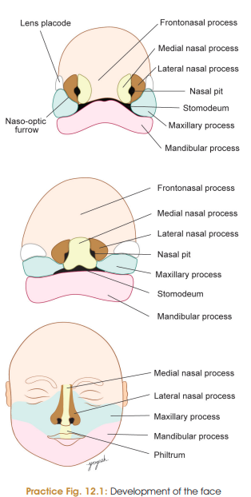
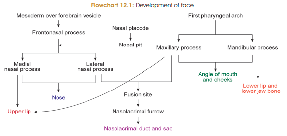

LMAO 😭 **Face development is genuinely one of those “why are there 5 processes, 3 prominences, and 17 fusions??” topics.**
Let's make it **5-mark + diagram/flowchart friendly**. Don't memorize the paragraph—memorize **WHO → FUSES WITH WHOM → FORMS WHAT**.

# Development of Face — 5 Marks

### Basic points

* Face develops from **5 mesodermal processes** appearing around the **stomodeum** during the **4th week of IUL**.
* Facial development occurs mainly between **4th–8th weeks**.
* The embryo acquires a **human-like appearance by the end of 8th week**.

### Five Facial Processes

**1. Frontonasal process** → unpaired
**2. Maxillary processes** → paired
**3. Mandibular processes** → paired

---

## Steps in Development

### 1. Formation of Frontonasal Process

* In **5th week**, mesoderm covering the bulging forebrain proliferates → **frontonasal process**.
* Bilateral **nasal/olfactory placodes** develop on it.
* Placodes become depressed → **nasal pits**.

### 2. Formation of Nasal Processes

Margins of nasal pit become elevated:

**Nasal pit →**

* Medial margin → **Medial nasal process**
* Lateral margin → **Lateral nasal process**

### 3. Development of Maxillary Process

* Maxillary processes arise from the **first pharyngeal arch**.
* Grow **medially**.
* Fuse with:

  * **Medial nasal process**
  * **Lateral nasal process**

### 4. Fusion of Facial Processes

**Medial nasal processes fuse → Intermaxillary segment**

Intermaxillary segment forms:

* **Philtrum of upper lip**
* **Premaxillary part of maxilla**
* **Primitive palate**

**Lateral nasal processes → Alae of nose** ⭐ MCQ

**Maxillary processes → Entire upper lip**

* Maxillary processes grow medially and cover the philtrum region.

### 5. Formation of Nose and Anterior Nares

* Between **7th–10th weeks**, maxillary processes fuse with medial and lateral nasal processes.
* Nasal pits become separated from stomodeum.
* They form the **primitive anterior nares**.
* Continuous growth of nasal processes → **bridge of nose**.

---

## Development of Lower Face

### Mandibular processes

* Arise from **first pharyngeal arch**.
* Form:

  * **Lower lip**
  * **Chin**
  * Part of **cheeks**

### Formation of Cheeks and Mouth

* Maxillary + mandibular processes fuse laterally.
* This reduces the oral fissure and forms the **cheeks**.
* Fusion of maxillary and mandibular processes forms the **lateral angles of mouth**.

> 
> 

---

# ⭐ Most Important Flowchart

### Facial processes

**Frontonasal process**
↓
**Nasal placodes**
↓
**Nasal pits**
↓
**Medial nasal process + Lateral nasal process**

Meanwhile:

**1st pharyngeal arch**
↙️　　　　　　　　　↘️
**Maxillary process**　 **Mandibular process**

---

### What each process forms

| Process           | Main derivatives                           |
| ----------------- | ------------------------------------------ |
| **Frontonasal**   | Forehead, bridge of nose                   |
| **Medial nasal**  | **Philtrum**, premaxilla, primitive palate |
| **Lateral nasal** | **Alae of nose** ⭐                         |
| **Maxillary**     | **Upper lip**, cheeks                      |
| **Mandibular**    | **Lower lip, chin, cheeks**                |

### Nerve supply ⭐

* **Frontonasal process** → **Ophthalmic nerve (V1)**
* **Maxillary process** → **Maxillary nerve (V2)**
* **Mandibular process** → **Mandibular nerve (V3)**

### 🧠 One-line memory

**“Front = forehead/nose, Medial = middle lip, Lateral = ala, Maxillary = upper lip, Mandibular = lower lip.”**

And the **absolute MCQ killer:**
**Medial nasal processes → philtrum**
**Lateral nasal processes → alae of nose**
**Maxillary process → upper lip**
**Mandibular process → lower lip + chin**

Yep — this one is **easy marks** if you tie each anomaly to the failed/excessive fusion.

# Developmental Anomalies of Face — 5 Marks

### 1. Oblique facial cleft ⭐

* Due to **nonfusion of maxillary and lateral nasal processes**.
* Cleft extends from **medial angle of eye → mouth**.
* Associated with **nonformation of nasolacrimal duct**.

### 2. Macrostomia

* **Wide mouth**.
* Due to **incomplete fusion of maxillary and mandibular processes**.

### 3. Microstomia

* **Small mouth**.
* Due to **excessive fusion of maxillary and mandibular processes**.

### 4. Proboscis

* **Elongated, cylindrical projecting nose**.
* In some cases associated with **cyclopia** → fusion of both eyes.

### 5. Retrognathia

* **Small mandible**.
* Chin does not reach the normal facial profile.

### 6. Agnathia

* **Absence of jaw**.
* Usually due to **failure of development of mandible**.

### 7. Hypertelorism

* **Widely placed eyes**.
* Due to **broad nasal bridge**.
* Caused by a **wide frontonasal process**.

---

## ⭐ MCQ Table

| Anomaly                  | Key cause / feature                                  |
| ------------------------ | ---------------------------------------------------- |
| **Oblique facial cleft** | Nonfusion of **maxillary + lateral nasal processes** |
| **Macrostomia**          | **Incomplete** maxillary + mandibular fusion         |
| **Microstomia**          | **Excessive** maxillary + mandibular fusion          |
| **Proboscis**            | Elongated projecting nose                            |
| **Retrognathia**         | Small mandible                                       |
| **Agnathia**             | Absence of jaw                                       |
| **Hypertelorism**        | Widely placed eyes + broad nasal bridge              |

### 🧠 Fusion trick

**Maxillary + Lateral nasal ❌ → Oblique cleft**

**Maxillary + Mandibular**

* **Incomplete fusion → Big mouth (Macrostomia)**
* **Excessive fusion → Small mouth (Microstomia)**
