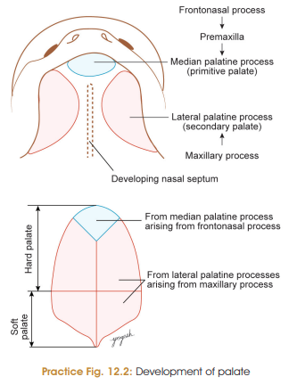

Yep, this one is actually pretty systematic once you split **primary vs secondary palate**. 😭

# Development of Palate — 5 Marks

### Components of Palate

Palate develops from **2 components**:

1. **Primary palate** → derived from **frontonasal process**
2. **Secondary palate** → derived from **maxillary processes**

**Primary palate + Secondary palate → Definitive palate**

* **Anterior 3/4th** → ossifies → **Hard palate**
* **Posterior 1/4th** → remains unossified → **Soft palate + uvula**

---

## Stages of Palatogenesis

* Palatogenesis occurs between **5th–12th week of IUL**.

### 1. Development of Primary Palate

* During **6th week**, intermaxillary segment forms a shelf-like projection called **primary palate / median palatine process**.
* It later forms the **premaxillary part of maxilla**.
* It bears the **upper four incisor teeth**.

### 2. Development of Secondary Palate

* During **6th week**, two mesenchymal projections arise from the **inner aspect of maxillary processes**.
* These are called **lateral palatine processes / secondary palate**.

### 3. Fusion of Lateral Palatine Processes

During **7th–8th weeks**, lateral palatine processes:

* Fuse with **each other in midline**
* Fuse with **nasal septum**
* Fuse with **posterior part of primary palate**

### 4. Formation of Definitive Palate

**Primary palate + Secondary palate → Definitive palate**

* **Incisive foramen** separates primary and secondary palates.
* **Anterior 3/4th** → ossifies → **hard palate**
* **Posterior 1/4th** → remains unossified → **soft palate + uvula**

### 5. Incisive Fossa and Canals

* Persistent nasopalatine canal in median plane of premaxilla → **incisive fossa**.
* Right and left **incisive canals** open into the incisive fossa.

> 
> 
---

# Muscles of Soft Palate ⭐

Mesoderm of branchial arches invades the soft palate.

### **1st Arch → Tensor veli palatini**

### **4th Arch →**

* Levator veli palatini
* Palatoglossus
* Palatopharyngeus
* Musculus uvulae

---

## ⭐ The Flowchart You Actually Need

**Frontonasal process**
↓
**Intermaxillary segment**
↓
**Primary palate**

**Maxillary processes**
↓
**Lateral palatine processes**
↓
**Secondary palate**

**Primary + Secondary palate**
↓
**Definitive palate**
↓
**Anterior 3/4 → Hard palate**
**Posterior 1/4 → Soft palate + Uvula**

### 🧠 High-yield MCQs

* **Primary palate** → Frontonasal process
* **Secondary palate** → Maxillary processes
* **Incisive foramen** → separates primary & secondary palate
* **Hard palate** → anterior **3/4**
* **Soft palate + uvula** → posterior **1/4**
* **Tensor veli palatini** → **1st arch**
* **Other soft-palate muscles** → **4th arch**
