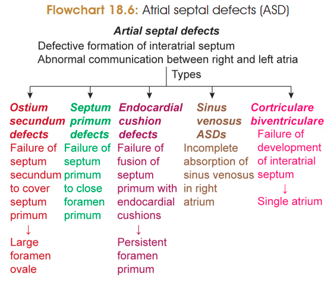

# ATRIAL SEPTAL DEFECTS (ASD)

## 1. Definition

**Atrial septal defects (ASDs)** are **congenital defects of the interatrial septum** resulting in abnormal communication between the **right and left atria**.

---

## 2. Incidence & Cause

* **Incidence:** ~6.4 / 10,000 births
* **Female : Male = 2 : 1**
* **Cause:** Mutation of **NKX2.5**

---

# 3. Types of ASD ⭐

> 

## 4. Types — Exam Table

<table>
  <thead>
    <tr>
      <th>Type</th>
      <th>Defect</th>
    </tr>
  </thead>
  <tbody>
    <tr>
      <td><b>Ostium secundum</b> ⭐</td>
      <td>Septum secundum fails to cover septum primum  <b> → </b> maybe due to short septum secundum or more absorption of septum primum → <b>Large persistent foramen ovale</b></td>
    </tr>
    <tr>
      <td><b>Septum primum defect</b></td>
      <td>Septum primum fails to close foramen primum → <b>Persistent foramen primum</b></td>
    </tr>
    <tr>
      <td><b>Endocardial cushion defect</b></td>
      <td>Septum primum fails to fuse with endocardial cushions → <b>Persistent foramen primum</b></td>
    </tr>
    <tr>
      <td><b>Sinus venosus ASD</b></td>
      <td>Incomplete absorption of sinus venosus → Defect near <b>SVC opening</b></td>
    </tr>
    <tr>
      <td><b>Common atrium</b> ⭐</td>
      <td>Complete failure of interatrial septum development</td>
    </tr>
  </tbody>
</table>

### ⭐ Most important

$$
\boxed{\text{Ostium secundum ASD = one of the commonest congenital heart defects}}
$$

### 🧠 Development → Defect

$$
\boxed{
\begin{matrix}
\text{Septum secundum} &\rightarrow& \text{Ostium secundum ASD}\\\
\text{Septum primum} &\rightarrow& \text{Septum primum ASD}\\\
\text{Endocardial cushions} &\rightarrow& \text{Cushion defect}\\\
\text{Sinus venosus} &\rightarrow& \text{Sinus venosus ASD}\\\
\text{Interatrial septum} &\rightarrow& \text{Common atrium}
\end{matrix}}
$$
