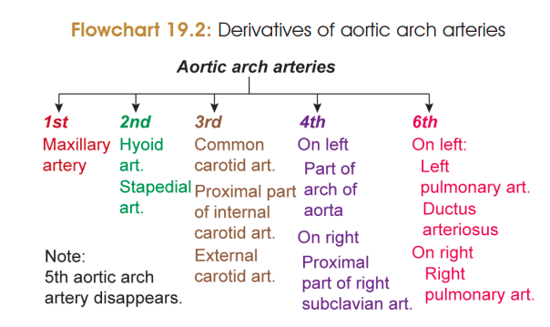
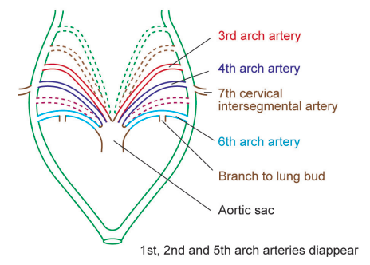
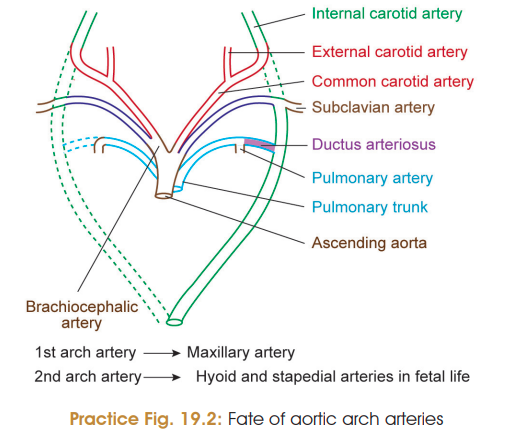
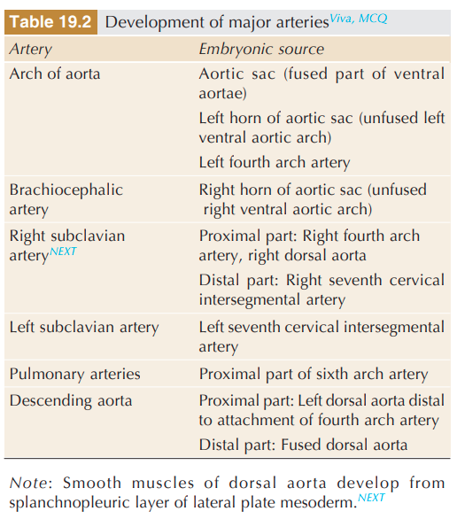
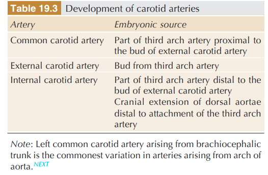

# DEVELOPMENT OF ARTERIAL SYSTEM ⭐⭐⭐⭐⭐

The **aortic arch arteries** are temporary embryonic vessels connecting the **aortic sac with the dorsal aortae**. They undergo selective persistence, disappearance and remodeling to form the major arteries of the adult body.

## Derivatives of Aortic Arch Arteries ⭐⭐⭐⭐⭐

| Aortic arch  | Derivative                                                                                                        |
| ------------ | ----------------------------------------------------------------------------------------------------------------- |
| **1st arch** | Mostly disappears → **maxillary artery** remains                                                                  |
| **2nd arch** | Mostly disappears → **hyoid & stapedial arteries** remain                                                         |
| **3rd arch** | **Common carotid artery + proximal internal carotid artery**; bud from 3rd arch forms **external carotid artery** |
| **4th arch** | **Left:** part of arch of aorta    **Right:** proximal part of right subclavian artery                         |
| **5th arch** | **Disappears**                                                                                                    |
| **6th arch** | **Left:** left pulmonary artery + ductus arteriosus    **Right:** right pulmonary artery                       |

> 

> 
> 

### ⭐ Ductus arteriosus

* Distal part of the **left 6th aortic arch**.
* Connects **left pulmonary artery with left dorsal aorta**.
* After birth → becomes **ligamentum arteriosum**.

---

# Changes in Dorsal Aortae ⭐

1. Dorsal aortae remain **separate** in the region of the pharyngeal arch arteries.
2. Caudal to the 6th arch, they **fuse** to form a single dorsal aorta.
3. This later forms the **descending thoracic and abdominal aorta**.

### Carotid duct / Ductus caroticus

* Portion of dorsal aorta **between the 3rd and 4th arch arteries**.
* **Disappears completely.**

---

# Portions Which Disappear ⭐

1. Most of **1st and 2nd arch arteries**
2. **Ductus caroticus**
3. **Right dorsal aorta caudal to 4th arch**
4. **5th aortic arch**
5. **Distal part of right 6th arch artery**

---

# Important Overgrowth / Remodeling ⭐

1. Dorsal aortae grow cranially beyond the attachment of the 1st arch → contribute to **internal carotid artery**.
2. A bud from the **3rd arch** forms the **external carotid artery**.
3. **7th intersegmental arteries** communicate with the dorsal aorta at the level of the 4th arch → participate in formation of **subclavian arteries**.
4. Proximal portions of the **right 3rd and 4th arteries** fuse → form the **brachiocephalic artery** arising from the aortic sac.

> 
> 

---

## 🧠 Ultra-high-yield memory

**1 → Maxillary**
**2 → Hyoid + Stapedial**
**3 → Carotids**
**4 → Aorta / Right Subclavian**
**5 → Gone**
**6 → Pulmonary + Ductus**

### 🔥 Viva favourite

**Left 6th = Left pulmonary + ductus arteriosus**
**Right 6th = Right pulmonary only**

**Ductus arteriosus → ligamentum arteriosum after birth.**
