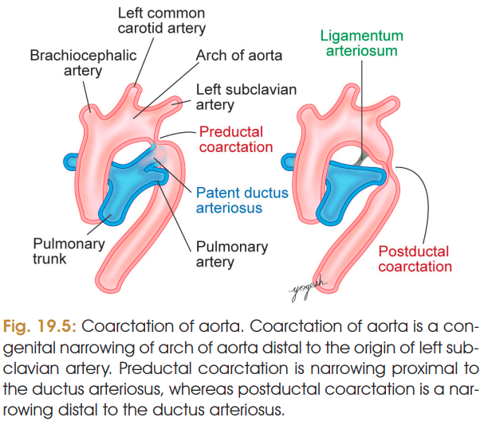

# COARCTATION OF AORTA — 5 MARKS ⭐⭐⭐⭐⭐

### Definition

* **Coarctation of aorta** is a **congenital narrowing of the aorta**, usually in the region of the arch **distal to the origin of the left subclavian artery**.

> 

### Incidence

* Occurs in approximately **3.2 per 10,000 births**.

### Types ⭐

**A. Preductal coarctation**

* Narrowing occurs **proximal to the ductus arteriosus**.

**B. Postductal coarctation**

* Narrowing occurs **distal to the ductus arteriosus**.

### Effects / Clinical features ⭐⭐⭐

Narrowing of the aorta causes obstruction to blood flow to the lower part of the body:

* **↑ Blood pressure in upper limbs**
* **↓ Blood pressure in lower limbs**
* Increased workload on the left ventricle → **left ventricular hypertrophy**

### 🧠 Easy memory

**COARCTATION → Aorta narrowed**

**Above narrowing:** ↑ BP → **Upper limb**

**Below narrowing:** ↓ BP → **Lower limb**

**↑ LV workload → LV hypertrophy**
