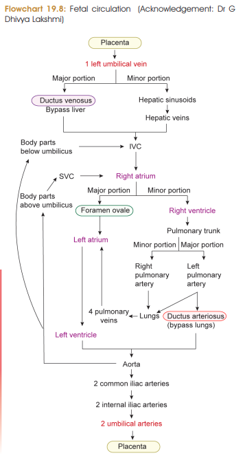
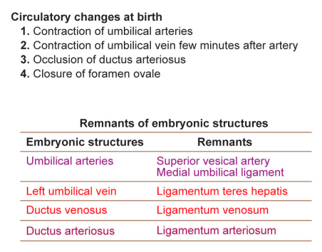

# Fetal Circulation — 5 Marks ⭐

### Definition / Introduction

The **fetus depends on the placenta** for:

* **Nutrients and oxygen**
* Removal of **CO₂ and metabolic wastes**

> 

### Special Structures of Fetal Circulation

1. **Placenta**

   * Site of exchange of nutrients, gases and waste products between mother and fetus.

2. **Umbilical vein**

   * Carries **oxygenated, nutrient-rich blood** from placenta → fetus.

3. **Umbilical arteries**

   * Carry **deoxygenated blood, CO₂ and wastes** from fetus → placenta.
   * Oxygen saturation ≈ **58%** ⭐

4. **Foramen ovale**

   * Opening between right and left atria.
   * Allows most blood to pass **right atrium → left atrium**, thereby bypassing fetal lungs.

5. **Ductus venosus**

   * Carries oxygenated blood from **umbilical vein + left branch of portal vein → IVC**.
   * Thus **bypasses most of the liver**.

6. **Ductus arteriosus**

   * Connects **left pulmonary artery → aorta**.
   * Allows blood to bypass the fetal lungs.

### Peculiarities of Fetal Circulation ⭐⭐⭐

**Three important shunts:**

> **Ductus venosus → bypasses liver**
> **Foramen ovale → bypasses lungs**
> **Ductus arteriosus → bypasses lungs**

genui{"learning_viz":{"type_id":"BLOOD_CIRCULATION"}}

1. **Regulation of oxygenated blood**

   * A sphincter at the junction of **left umbilical vein and ductus venosus** regulates flow of oxygenated blood to the fetus.

2. **Mixing of oxygenated and venous blood occurs in:**

   * Liver
   * Both atria
   * Terminal part of IVC
   * Distal part of arch of aorta

3. **Transseptal circulation**

   * Blood passes **right atrium → foramen ovale → left atrium**.

4. **Upper limb development**

   * Upper limb bud receives more blood than lower limb bud.
   * Hence, **upper limbs are relatively longer in the fetus**.

### 🔥 Last-minute MCQs

* **Oxygenated blood to fetus:** Umbilical **vein**
* **Waste blood to placenta:** Umbilical **arteries**
* **Umbilical artery O₂ saturation:** **~58%**
* **Liver bypass:** **Ductus venosus**
* **Lung bypass:** **Foramen ovale + ductus arteriosus**
* **3 fetal shunts:** **DV + FO + DA**
* **Transseptal flow:** **RA → LA through foramen ovale**
* **DA:** **Left pulmonary artery → aorta**

