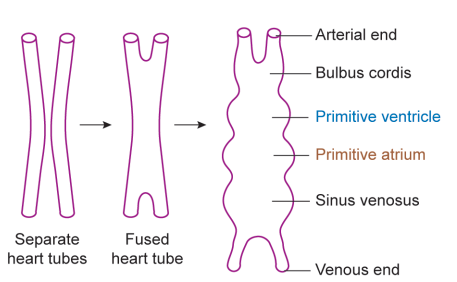
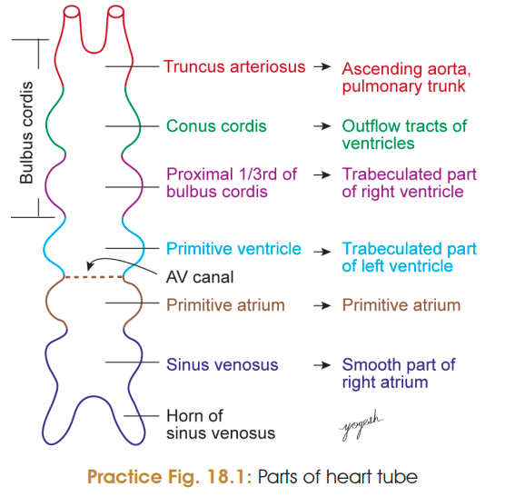
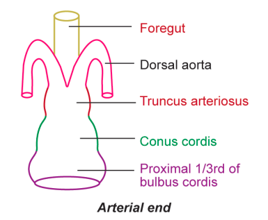
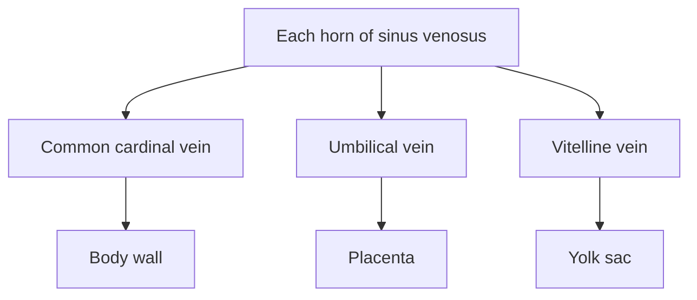
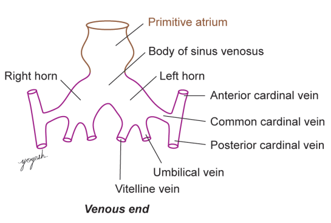
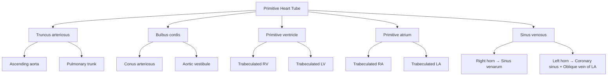
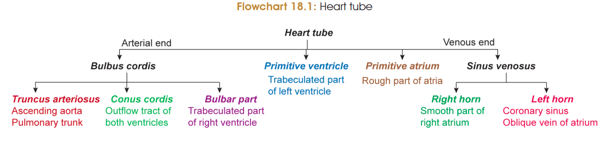
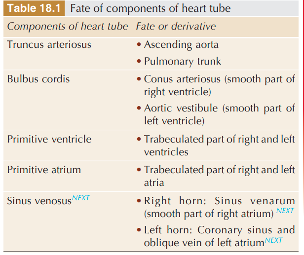

# ❤️ HEART TUBE — 5 Marks

## 1. Formation of Heart Tube ⭐

* During the **3rd week**, the **endoderm of primitive pharynx** induces **vasculogenesis** in the **primary heart field**.
* Small vessels join to form **two endothelial heart tubes**:

  * Right heart tube
  * Left heart tube
* These endothelial tubes give rise to the **endocardium**.
* The two tubes **fuse in the midline** → form a **single primitive heart tube**.
* The ends remain **bifurcated**.

> 

$$
\boxed{\text{2 endothelial heart tubes}
\rightarrow
\text{fusion}
\rightarrow
\text{single primitive heart tube}}
$$

---

## 2. Ends of Heart Tube

| End             | Direction | Name                                  |
| --------------- | --------- | ------------------------------------- |
| **Cranial end** | Arterial  | **Arterial end / Truncus arteriosus** |
| **Caudal end**  | Venous    | **Venous end / Sinus venosus**        |

---

# 3. Dilatations of Heart Tube ⭐

> 

The primitive heart tube develops **four dilatations** from cranial → caudal:

|   No. | Dilatation              | Important components                            |
| ----: | ----------------------- | ----------------------------------------------- |
| **1** | **Bulbus cordis**       | Truncus arteriosus + Conus cordis + Bulbar part |
| **2** | **Primitive ventricle** | —                                               |
| **3** | **Primitive atrium**    | —                                               |
| **4** | **Sinus venosus**       | Right & left horns                              |

### 🧠 Cranial → Caudal

$$
\boxed{
\text{Truncus}
\rightarrow
\text{Bulbus}
\rightarrow
\text{Primitive ventricle}
\rightarrow
\text{Primitive atrium}
\rightarrow
\text{Sinus venosus}
}
$$

---

# 4. Arterial End — Truncus Arteriosus

* Truncus arteriosus has **right and left limbs/horns**.
* Each limb is continuous with the corresponding **dorsal aorta**.
* Connection occurs through the **pharyngeal arch arteries**.
* Ultimately, **six pairs of pharyngeal arch arteries** connect the truncus with the dorsal aortae.
* They run on either side of the **foregut/primitive pharynx**.

> 

---

# 5. Venous End — Sinus Venosus ⭐

* Unfused sinus venosus forms:

  * **Right horn**
  * **Left horn**

### Each horn receives 3 veins:

> 

### 🧠 Order to remember

$$
\boxed{\text{Common cardinal → Umbilical → Vitelline}}
$$

**Source:**

* Common cardinal → **body wall**
* Umbilical → **placenta**
* Vitelline → **yolk sac**

---

# 6. Fate of Heart Tube Components ⭐⭐⭐

| **Primitive heart tube**        | **Adult derivative**                                                                                         |
| ------------------------------- | ------------------------------------------------------------------------------------------------------------ |
| **Truncus arteriosus**          | **Ascending aorta + Pulmonary trunk**                                                                        |
| **Bulbus cordis**               | **Conus arteriosus** → smooth part of right ventricle + **Aortic vestibule** → smooth part of left ventricle |
| **Primitive ventricle**         | **Trabeculated parts of both ventricles**                                                                    |
| **Primitive atrium**            | **Trabeculated parts of both atria**                                                                         |
| **Right horn of sinus venosus** | **Sinus venarum** → smooth part of right atrium                                                              |
| **Left horn of sinus venosus**  | **Coronary sinus + oblique vein of left atrium**                                                             |

### 🔥 Fate flowchart

## 🧠 **Lock**

**Formation → Ends → Dilatations → Arterial end → Venous end → Fate**

$$
\boxed{
\text{2 tubes}
\rightarrow
\text{fusion}
\rightarrow
\text{primitive heart tube}
\rightarrow
\text{dilatations}
\rightarrow
\text{adult derivatives}
}
$$

> 

> 