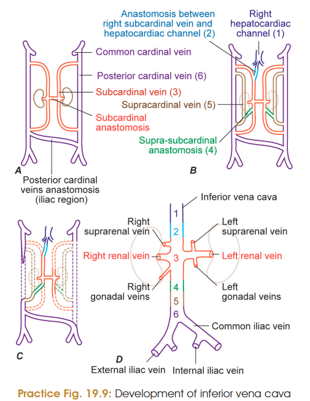
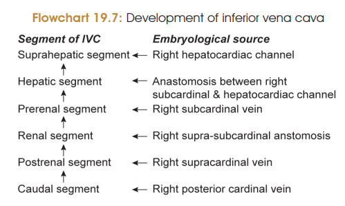

## IVC — Development & Anomalies 

### Development of Inferior Vena Cava

> 
> 

**IVC develops from 6 components:**

1. **Caudal segment** → caudal part of **right posterior cardinal vein**
2. **Postrenal segment** → **right supracardinal vein**
3. **Renal segment** → **right supra-subcardinal anastomosis**
4. **Prerenal segment** → **right subcardinal vein**
5. **Hepatic segment** → anastomosis between **right subcardinal vein + right vitelline vein (common hepatic veins)**
6. **Suprahepatic segment** → **right vitelline vein / right hepatocardiac channel**

### ⭐ Anomalies of IVC — Very Important

1. **Double IVC**

   * Due to failure of anastomosis between two posterior cardinal veins **or** persistence of left subcardinal and supracardinal veins.
   * Left IVC develops from **left posterior cardinal vein** below renal veins.

2. **Absence of IVC**

   * Due to failure of communication between **right subcardinal vein and right hepatocardiac channel**.

3. **Preureteric IVC**

   * Infrarenal IVC develops from **subcardinal vein** instead of supracardinal vein.
   * Therefore, IVC lies **anterior to right ureter**.

4. **Azygos continuation of IVC**

   * Due to failure of development of **hepatic segment of IVC**.
   * IVC drains into SVC through the **azygos vein**.

### 🔥 MCQ Must-Remember

**IVC segments → source:**

> **Caudal → Right posterior cardinal**
> **Postrenal → Right supracardinal**
> **Renal → Right supra-subcardinal anastomosis**
> **Prerenal → Right subcardinal**
> **Hepatic → Right subcardinal + vitelline**
> **Suprahepatic → Right vitelline / hepatocardiac channel**
