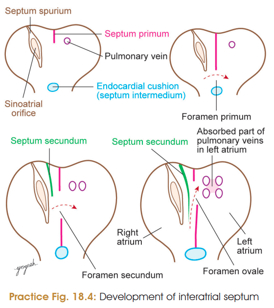
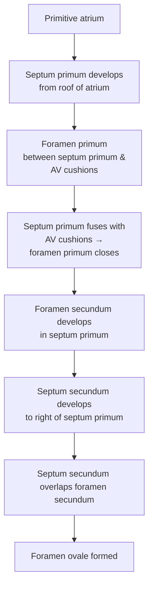
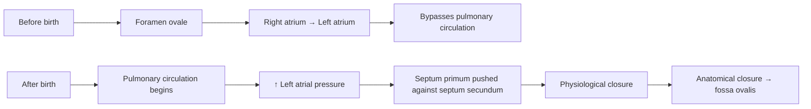
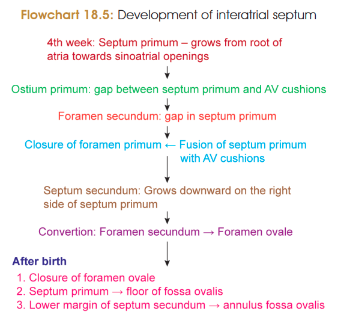

# INTERATRIAL SEPTUM

## 1. Development

The **interatrial septum** develops during the **5th week of intrauterine life** mainly from:

1. **Septum primum**
2. **Septum secundum**

---

## 2. Stages of Development ⭐

> 

### ① Septum primum

* Develops from the **roof of primitive atrium**.
* Grows downward towards **AV cushions (septum intermedium)**.
* Initially leaves a gap → **foramen primum**.

### ② Foramen primum

* Gap between **septum primum** and **AV cushions**.
* Eventually **closes** when septum primum fuses with AV cushions.

### ③ Foramen secundum

* Appears in the **upper part of septum primum** before foramen primum completely closes.
* Maintains communication between the atria.

### ④ Septum secundum

* **Crescent-shaped** septum develops from roof of primitive atrium.
* Develops to the **right of septum primum**.
* Grows towards AV cushions and overlaps the foramen secundum.

### ⑤ Foramen ovale

$$
\boxed{\text{Septum secundum overlaps foramen secundum}}
\rightarrow
\boxed{\text{Foramen ovale}}
$$

* Forms an **oblique passage** between right and left atria.

---

# 3. Fate After Birth

### Adult derivatives

| Embryonic structure | Adult derivative          |
| ------------------- | ------------------------- |
| **Septum primum**   | **Floor of fossa ovalis** |
| **Septum secundum** | **Annulus ovalis**        |
| **Foramen ovale**   | Normally closes           |

---

# 4. Function of Foramen Ovale ⭐

### In fetal life

$$
\boxed{\text{Right atrium} \rightarrow \text{Foramen ovale} \rightarrow \text{Left atrium}}
$$

* Acts as a **valve-like opening**.
* Allows blood to pass **RA → LA**.
* Prevents significant reverse flow **LA → RA**.
* Thus **bypasses pulmonary circulation** because fetal lungs are non-functional for gas exchange.

### After birth

**Lung expansion → pulmonary circulation ↑ → pulmonary venous return ↑ → LA pressure ↑**

$$
\begin {matrix}
\boxed{\uparrow LA\ pressure} \\\
\downarrow \\\
\boxed{\text{septum primum pushed against septum secundum}}\\\
\downarrow \\\
\boxed{\text{closure of foramen ovale}}\\\
\end {matrix}
$$

**Eventually:** anatomical fusion → **fossa ovalis**.

---

### 🧠 Rapid Recall

$$
\boxed{
\text{Primum → Primium → Secundum → Secundum → Ovale}
}
$$

**Septum primum → foramen primum → foramen secundum → septum secundum → foramen ovale**.

> 