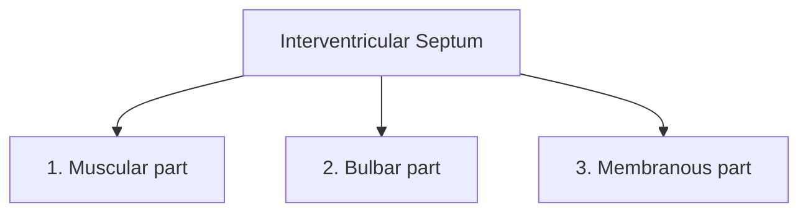
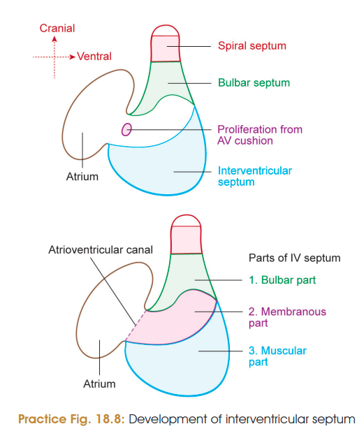
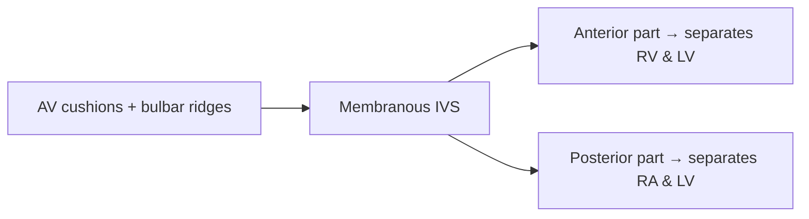
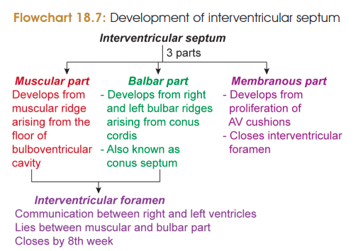

# DEVELOPMENT OF INTERVENTRICULAR SEPTUM

### Definition

The **interventricular septum (IVS)** separates the **right and left ventricles**.

It develops from **3 parts**:

> 

| Part                  | Development                                                                                              |
| --------------------- | -------------------------------------------------------------------------------------------------------- |
| **Muscular part ⭐**   | Develops from a **muscular ridge** arising from the floor of the bulboventricular cavity                 |
| **Bulbar part**       | Develops from **right and left bulbar ridges** of conus cordis                                           |
| **Membranous part ⭐** | Develops by proliferation of **AV cushion tissue** which fills the gap between muscular and bulbar parts |

### Stages of Development

**1. Muscular part**

* Muscular IVS grows from the **floor of bulboventricular cavity**.
* It divides the primitive ventricle into right and left halves.
* It grows towards the **septum intermedium (AV cushion)** and fuses partially with it.
* An **interventricular foramen** remains between the developing parts.

>  **Proximal one-third** of Bulbus Cordis **fuses** with **primitive ventricle** to form **bulboventricular chamber**.

**2. Bulbar part**

* **Right and left bulbar ridges** develop in the conus cordis.
* They fuse to form the **bulbar part of IVS**.
* It grows caudally towards the muscular part.
* The interventricular foramen lies between the muscular and bulbar parts.

**3. Membranous part ⭐**

* By the **8th week**, the interventricular foramen is closed by tissue proliferating from the **AV cushions and bulbar ridges**.
* This forms the **membranous part** of IVS.
* It completes separation of the ventricles.

### Important Derivatives

### 🧠 Quick recall

$$
\boxed{\text{IVS = Muscular + Bulbar + Membranous}}
$$

**Muscular → floor of bulboventricular cavity**
**Bulbar → bulbar ridges**
**Membranous → AV cushions**

> 