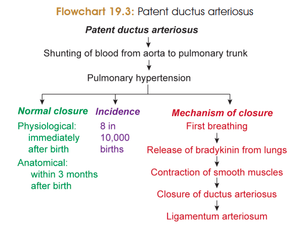

# PATENT DUCTUS ARTERIOSUS (PDA)

### Definition

* **Patent ductus arteriosus** is the **failure of closure of the ductus arteriosus** after birth.
* The ductus arteriosus connects the **left pulmonary artery with the arch of aorta** during fetal life.

### Normal function of ductus arteriosus

* In fetal life, lungs are non-functional for gas exchange.
* Ductus arteriosus allows blood to **bypass the lungs**, shunting blood from the **pulmonary trunk → descending aorta**.

### Normal closure after birth ⭐⭐⭐

**1. Physiological/functional closure**

* Occurs **immediately after birth** due to reflex contraction of smooth muscle in its wall.
* Some **aorta → left pulmonary artery shunting** may continue for up to **4 days**.

**2. Anatomical closure**

* Occurs within approximately **3 months (12 weeks)**.
* Due to **proliferation of tunica intima into the lumen**, influenced by **TGF-β**.

### Pathology ⭐

* Failure of closure → **PDA**.
* Blood is shunted from the **aorta → pulmonary circulation** after birth.
* This produces increased pulmonary blood flow.

### Factors affecting closure ⭐

* **Prostaglandins → maintain ductus arteriosus open.**
* **Prostaglandin inhibitors (e.g. indomethacin) → promote closure.**

### Mechanism of closure

* After birth, initial inflation of the lungs causes release of **bradykinin**.
* Bradykinin causes **contraction of smooth muscle** in the ductus arteriosus.
* → **Physiological closure**.

### Remnant ⭐

* The closed ductus arteriosus becomes the **ligamentum arteriosum**.
* The **left recurrent laryngeal nerve loops around the arch of aorta near the ligamentum arteriosum**.

### 🔥 Flowchart for exam

> 

**Birth**
↓
**Lung inflation → bradykinin ↑**
↓
**Smooth muscle contraction**
↓
**Functional closure**
↓
**Intimal proliferation**
↓
**Anatomical closure**
↓
**Ligamentum arteriosum**

**PDA → Aorta → Pulmonary artery → ↑ pulmonary blood flow**
