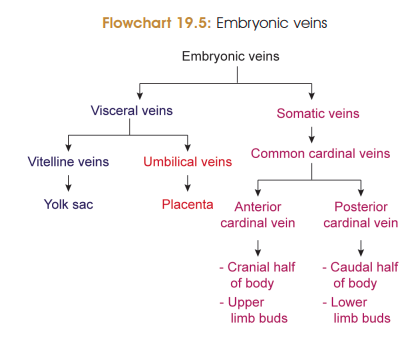
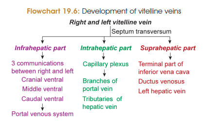
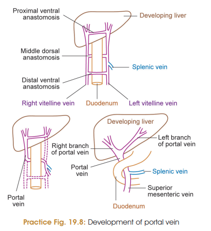
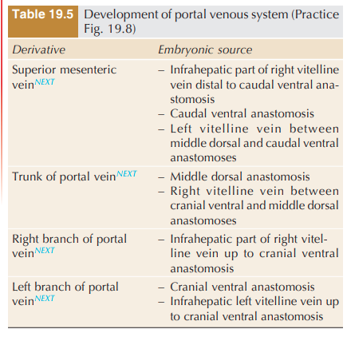
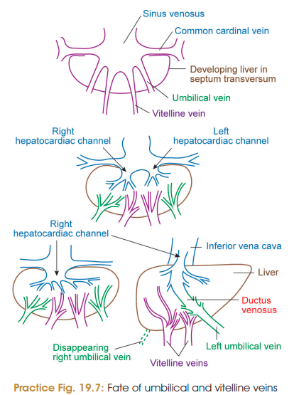

# DEVELOPMENT OF PORTAL VEIN ⭐⭐⭐⭐⭐

The **portal vein develops mainly from the vitelline veins** during development of the gastrointestinal tract and liver.

> 
> 

### Basic development

* Two **vitelline veins (right and left)** drain the yolk sac.
* After formation of the gut, the vitelline veins pass on **either side of the gut tube**, through the **septum transversum**, and open into the **sinus venosus**.
* The developing liver in the septum transversum divides each vitelline vein into:

  1. **Infrahepatic part**
  2. **Intrahepatic part**
  3. **Suprahepatic part**

> 
> 

---

## A. Infrahepatic Parts ⭐⭐⭐

* Lie **caudal to septum transversum**, on either side of the primitive gut.
* Around the **duodenum**, right and left vitelline veins communicate through **three transverse anastomoses**:

  * **Cranial ventral**
  * **Middle dorsal**
  * **Caudal ventral**
* These form a **figure-of-8 arrangement**.

### Important derivatives ⭐⭐⭐⭐⭐

Selective disappearance of segments of the infrahepatic vitelline veins forms:

* **Superior mesenteric vein**
* **Trunk of portal vein**
* **Right branch of portal vein**
* **Left branch of portal vein**

**MCQ pearl:**
👉 **Portal vein develops from vitelline veins + their interconnections around the duodenum.**

---

## B. Intrahepatic Part

* The vitelline veins form a **capillary network** within the developing liver.
* This network joins the developing **hepatic sinusoids**.

It forms:

* **Venae advehentes** → branches of the **portal vein**
* **Venae revehentes** → tributaries of the **hepatic veins**

---

## C. Suprahepatic Parts ⭐

* A **subdiaphragmatic anastomosis** develops between the right and left vitelline veins.
* It connects with the **cranial ventral intervitelline anastomosis**.
* The **left vitelline vein regresses**.

The remaining portions contribute to:

1. **Common hepatic vein** → later contributes to the **terminal part of IVC**
2. **Ductus venosus**
3. **Left hepatic vein**

---

## 🔥 EXAM FLOWCHART

**Right + Left vitelline veins**
↓
**Pass on either side of gut → septum transversum**
↓
**Developing liver divides them into**
↓
**Infrahepatic + Intrahepatic + Suprahepatic**

### Infrahepatic

**3 anastomoses around duodenum**
↓
**Portal vein + SMV + right & left portal branches**

### Intrahepatic

**Vitelline veins → hepatic sinusoidal plexus**
↓
**Venae advehentes → portal branches**
**Venae revehentes → hepatic vein tributaries**

### Suprahepatic

**Subdiaphragmatic anastomosis + regression of left vitelline vein**
↓
**Common hepatic vein + ductus venosus + left hepatic vein**

### ⭐ Must-memorize MCQs

* **Portal vein → vitelline veins**
* **SMV → vitelline veins**
* **Left vitelline vein → regresses**
* **Ductus venosus → vitelline vein system**
* **Venae advehentes → portal system**
* **Venae revehentes → hepatic venous system**

> 