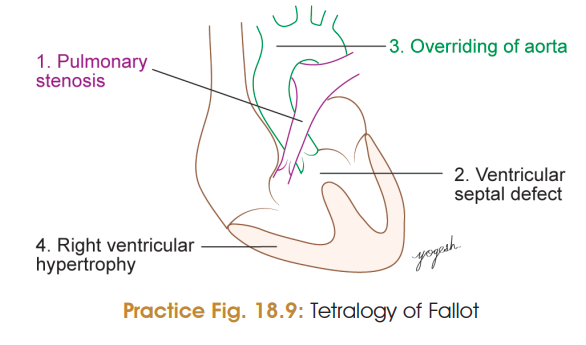
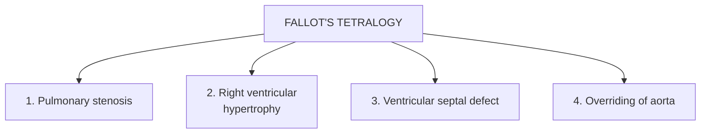
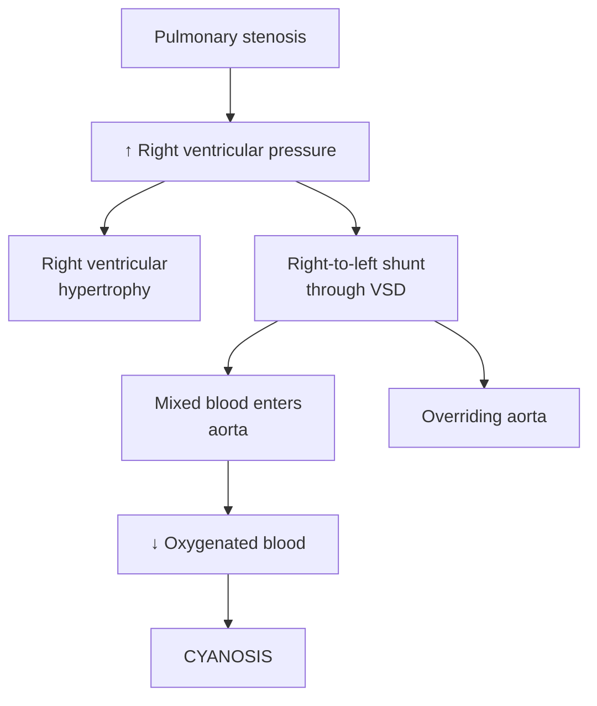
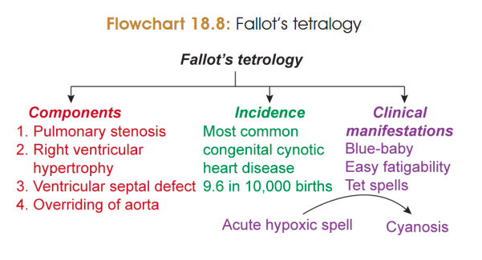

# FALLOT'S TETRALOGY

### Definition

**Fallot's tetralogy (TOF)** is a **congenital cyanotic heart defect** characterized by four abnormalities.

### Components ⭐

| Component                            | Explanation                                                             |
| ------------------------------------ | ----------------------------------------------------------------------- |
| **1. Pulmonary stenosis**            | Obstruction of right ventricular outflow                                |
| **2. Right ventricular hypertrophy** | Due to increased pressure in right ventricle                            |
| **3. VSD**                           | Abnormal communication between ventricles                               |
| **4. Overriding aorta**              | Aorta is displaced over the VSD and receives blood from both ventricles |

### Incidence

* **Most common congenital cyanotic heart disease**
* **9.6 / 10,000 births**
* Accounts for **6–10% of congenital heart diseases**

### Cause

* Mostly **unknown**
* Associated with **maternal phenylketonuria**
* **JAG1** gene involved in formation of conotruncal septum by neural crest cells

### Diagnosis

1. **Echocardiography**
2. **Chest X-ray:** *Coeur en sabot* / **boot-shaped heart** ⭐

### Pathophysiology ⭐

### Clinical Manifestations

* **Cyanosis** of lips and nail beds → **blue baby**
* **Easy fatigability**
* **Tet-spells:** acute hypoxic spells characterized by:

  * Breathlessness
  * Cyanosis
  * Agitation
  * Syncope

### 🧠 One-line recall

$$
\boxed{\text{TOF = Pulmonary stenosis + RVH + VSD + Overriding aorta}}
$$

