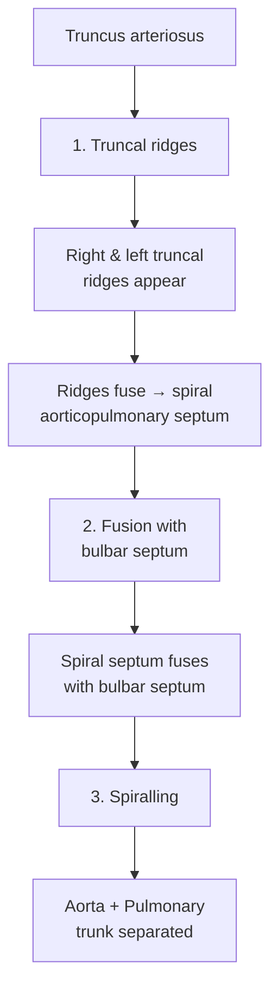
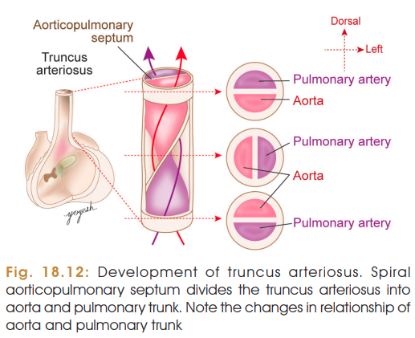

# FORMATION OF AORTICOPULMONARY SEPTUM

### Definition

The **aorticopulmonary septum** is a spiral septum that develops in the **truncus arteriosus** and divides it into the **ascending aorta and pulmonary trunk**.

### Steps of Development

> 

### 1. Formation of Truncal Ridges

* Two **truncal ridges** develop in the truncus arteriosus.
* They grow and **fuse to form the spiral aorticopulmonary septum**.

### 2. Fusion with Bulbar Septum

* The spiral septum lies in the **same plane as the bulbar septum**.
* It grows and **fuses with the bulbar septum**.
* At this stage, the **aorta lies posterior to the pulmonary trunk**.

### 3. Spiralling of Septum ⭐

* The septum follows a **spiral course**.
* It separates the truncus into:

  * **Aorta**
  * **Pulmonary trunk**
* The aorta, initially posterior to the pulmonary trunk, gradually comes to lie **on the right side and finally anterior to the pulmonary trunk**.

---

## Clinical Integration

### Transposition of Great Vessels

* Caused by **reverse spiralling/attachment of the aorticopulmonary septum**.
* **Aorta → right ventricle**
* **Pulmonary trunk → left ventricle**
* Incidence: **4.8 / 10,000 births**

### Persistent (Common) Truncus Arteriosus

* **Failure of development of the aorticopulmonary septum**.
* Results in a **common outflow tract** for both ventricles.
* **Always associated with VSD** due to failure of contribution of bulbar ridges to ventricular septum.

### 🧠 Recall

$$
\boxed{
    \text{
        Truncal ridges → Spiral septum → Fusion with bulbar septum → Aorta + Pulmonary trunk
        }}
$$
