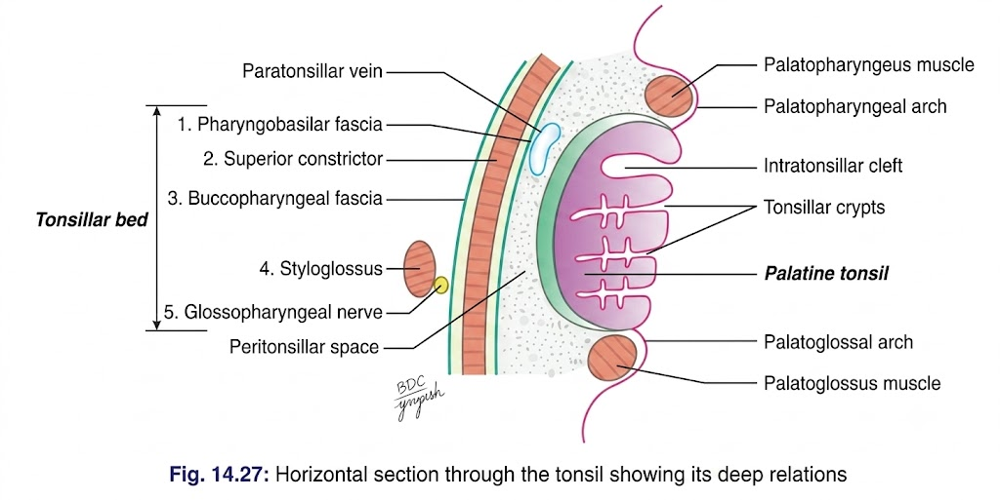
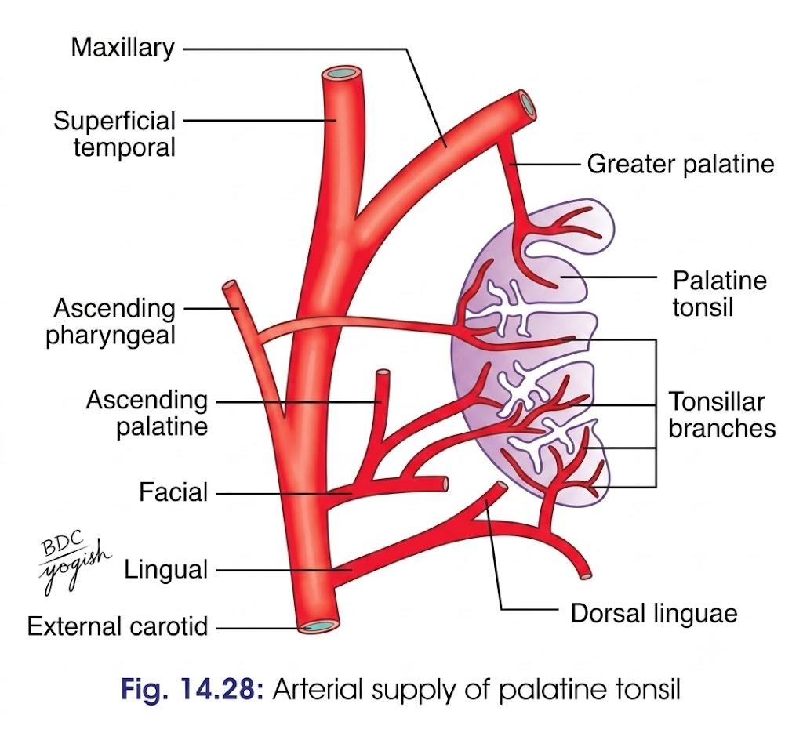

# PALATINE TONSIL

* **Introduction**

  * Palatine tonsil = lymphoid mass occupying the **tonsillar fossa/sinus**
  * Located between:

    * **Palatoglossal arch anteriorly**
    * **Palatopharyngeal arch posteriorly**
  * Visible through the mouth

* **Situation / Location**

  * Tonsillar fossa of the oropharynx
  * Between palatoglossal and palatopharyngeal arches

* **Features**

  * **Shape:** Almond-shaped
  * **Surfaces:**

    * Medial
    * Lateral
  * **Borders:**

    * Anterior
    * Posterior
  * **Poles:**

    * Upper
    * Lower

* **Medial Surface**

  * Covered by **stratified squamous epithelium**
  * Continuous with oral mucosa
  * Contains **12–15 crypts**
  * Largest crypt = **Intratonsillar cleft**

    * Situated in upper part
    * Represents internal opening of **2nd pharyngeal pouch**
    * Important site for **peritonsillar abscess**

* **Lateral Surface**

  * Covered by **hemicapsule**
  * Capsule derived from **pharyngobasilar fascia**
  * Related to:

    * Superior constrictor
    * Styloglossus
    * Palatopharyngeus

* **Bed of Tonsil**

  * From medial → lateral:

    * Pharyngobasilar fascia
    * Superior constrictor + palatopharyngeus
    * Buccopharyngeal fascia
    * Styloglossus *(lower part)*
    * Glossopharyngeal nerve
  * Further laterally:

    * Facial artery and its branches
    * **Internal carotid artery lies ~2.5 cm posterolateral to tonsil**

> 

* **Borders and Poles**

  * **Anterior border**

    * Palatoglossal arch + muscle
  * **Posterior border**

    * Palatopharyngeal arch + muscle
  * **Upper pole**

    * Soft palate
    * 
  * **Lower pole**

    * Tongue

* **Mucosal Folds**

  * **Plica triangularis**

    * Triangular mucosal fold
    * Covers anteroinferior part of tonsil
  * **Plica semilunaris**

    * Semilunar mucosal fold
    * May cross upper part of tonsillar sinus

* **Intratonsillar Cleft**

  * Largest crypt
  * Located in upper part
  * Semilunar opening
  * Represents internal opening of **2nd pharyngeal pouch**
  * Common site of origin of **peritonsillar abscess (quinsy)**

* **Arterial Supply**

  * **Main:** Tonsillar branch of facial artery
  * Additional:

    * Ascending palatine branch of facial artery
    * Dorsal lingual branches of lingual artery
    * Ascending pharyngeal branch of external carotid artery
    * Greater palatine branch of maxillary artery

> 

* **Venous Drainage**

  * Paratonsillar veins
  * Drain into:

    * Palatine veins
    * Pharyngeal veins
    * Facial vein

* **Lymphatic Drainage**

  * Mainly to **jugulodigastric lymph nodes**
  * **No afferent lymphatics**

* **Nerve Supply**

  * **Glossopharyngeal nerve**
  * Greater and lesser palatine nerves from **pterygopalatine ganglion**

* **Clinical Anatomy**

  * Tonsils are relatively large in children and regress after puberty
  * **Tonsillitis**

    * Infection of tonsil
    * May spread to surrounding tissue → **peritonsillar abscess**
  * **Quinsy**

    * Peritonsillar abscess
    * Drained by incision at most prominent point
  * **Tonsillectomy**

    * Surgical removal of enlarged/infected tonsil
    * Important because of close relation of vessels and nerves
  * **Referred ear pain**

    * Tonsillitis may cause ear pain
    * Due to common sensory supply by **glossopharyngeal nerve**
  * Tonsils may act as a **septic focus**

### 🔥 Prof-exam "must not miss" points

If you're short on time, make absolutely sure these are in your answer:

**Location → features → lateral relations/bed → blood supply → lymphatics → nerve supply → clinical**

And the **killer anatomy relation**:

> **Internal carotid artery = 2.5 cm posterolateral to palatine tonsil**

Plus:

> **Lymph → jugulodigastric node**
> **No afferent lymphatics**
> **Tonsillar branch of facial artery = main arterial supply**
> **Glossopharyngeal = main nerve supply + referred ear pain**

This is the kind of hierarchy I'd use for your **10-mark answer**, rather than trying to memorize the textbook paragraphs.
