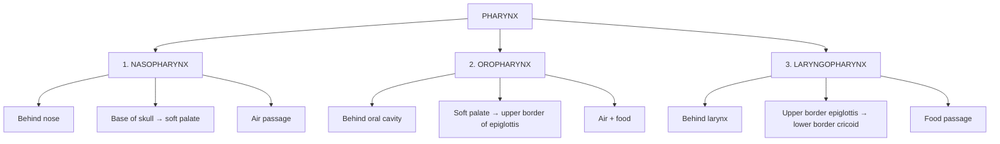
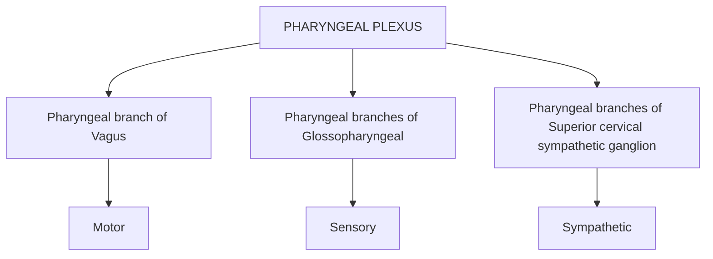
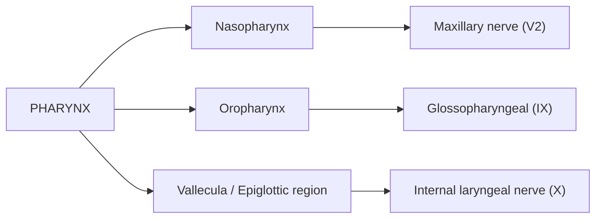
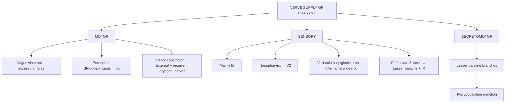

# PHARYNX — Subdivisions & Nerve Supply

> **Exam focus:** Since the question specifically asks **“subdivisions + nerve supply”**, keep boundaries/structure brief and give maximum weight to the **3 subdivisions + nerve supply**.

---

## 1. Definition

**Pharynx** = a **wide muscular tube** situated behind the **nose, mouth and larynx**.

### Functions

* **Nasopharynx** → air
* **Oropharynx** → air + food
* **Laryngopharynx** → food

---

# 2. SUBDIVISIONS OF PHARYNX

### Comparison

| Feature               | **Nasopharynx**                                        | **Oropharynx**                             | **Laryngopharynx**                                |
| --------------------- | ------------------------------------------------------ | ------------------------------------------ | ------------------------------------------------- |
| **Situation**         | Behind nose                                            | Behind oral cavity                         | Behind larynx                                     |
| **Extent**            | Base of skull → soft palate                            | Soft palate → upper border of epiglottis   | Upper border epiglottis → lower border of cricoid |
| **Communication**     | Nose → oropharynx                                      | Oral cavity → nasopharynx + laryngopharynx | Larynx → oesophagus                               |
| **Main function**     | **Air**                                                | **Air + food**                             | **Food**                                          |
| **Epithelium**        | Ciliated columnar                                      | Stratified squamous non-keratinised        | Stratified squamous non-keratinised               |
| **Important feature** | Auditory tube opening, tubal tonsil, pharyngeal tonsil | Palatine tonsil                            | Piriform fossa                                    |

### 🔑 One-line recall

$$
\boxed{\text{Naso = Air \quad Oropharynx = Air + Food \quad Laryngo = Food}}
$$

---

# 3. NERVE SUPPLY

## Pharyngeal Plexus

The **pharyngeal plexus** lies mainly on the **middle constrictor**.

### Components

1. **Pharyngeal branch of vagus**

   * Carries fibres of **cranial accessory nerve**
2. **Pharyngeal branches of glossopharyngeal nerve**
3. **Pharyngeal branches of superior cervical sympathetic ganglion**

---

## A. Motor Supply ⭐

### Main rule

$$
\boxed{\text{All muscles of pharynx → Vagus via cranial accessory fibres}}
$$

### EXCEPTION

$$
\boxed{\text{Stylopharyngeus → Glossopharyngeal nerve (IX)}}
$$

| Muscle               | Nerve                                           |
| -------------------- | ----------------------------------------------- |
| Superior constrictor | **Vagus**                                       |
| Middle constrictor   | **Vagus**                                       |
| Inferior constrictor | **Vagus** + external/recurrent laryngeal nerves |
| Salpingopharyngeus   | **Vagus**                                       |
| Palatopharyngeus     | **Vagus**                                       |
| **Stylopharyngeus**  | **Glossopharyngeal (IX)** ⭐                     |

### Inferior constrictor

Receives additional motor supply from:

* **External laryngeal nerve**
* **Recurrent laryngeal nerve**

---

# 4. SENSORY SUPPLY

| Region                            | Sensory nerve                                         |
| --------------------------------- | ----------------------------------------------------- |
| **Nasopharynx**                   | **Maxillary nerve (V2)** via pterygopalatine ganglion |
| **Pharynx — mainly**              | **Glossopharyngeal (IX)**                             |
| Some pharyngeal sensation         | **Vagus (X)**                                         |
| **Soft palate & tonsil**          | Lesser palatine + glossopharyngeal                    |
| **Vallecula & epiglottic region** | Internal laryngeal branch of **vagus (X)**            |

---

# 5. Secretomotor Supply

**Parasympathetic secretomotor fibres:**

$$
\boxed{\text{Lesser palatine branches → pterygopalatine ganglion → pharynx}}
$$

---

# ⭐ EXAM FLOWCHART — NERVE SUPPLY

## 🧠 Last-minute memory

### **Motor**

**“Pharynx = X, but Stylopharyngeus = IX”**

### **Sensory**

**“Naso = V2, Oro = IX, Laryngo = X”**

$$
\boxed{\text{NASO → V2 \qquad ORO → IX \qquad LARYNGO → X}}
$$

This gives you a very clean **5-mark answer** while still covering the high-yield viva points.
