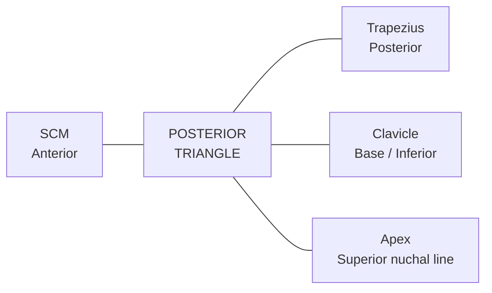
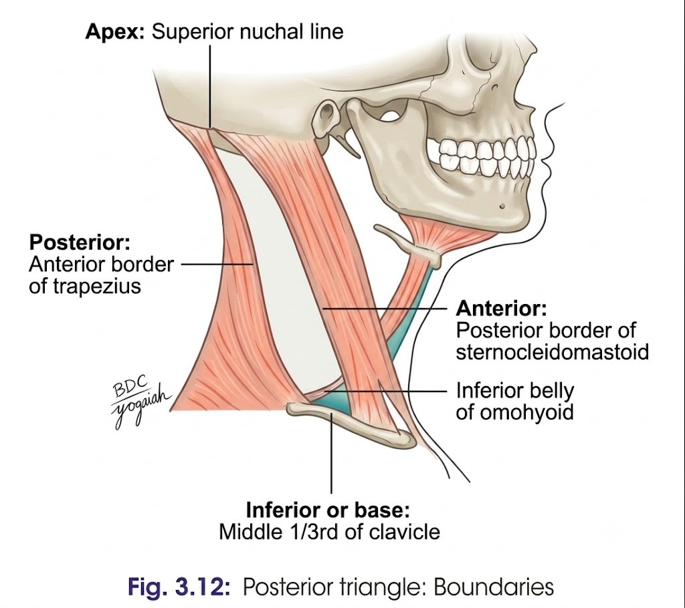
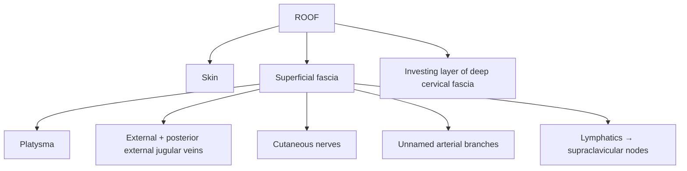
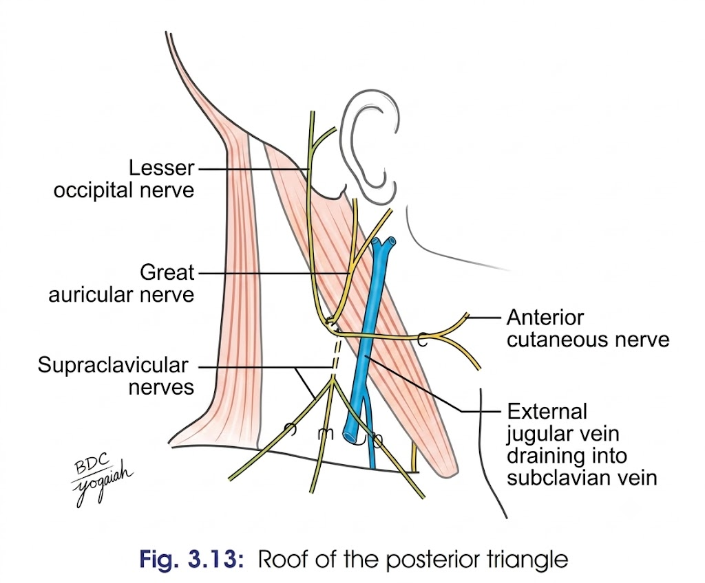
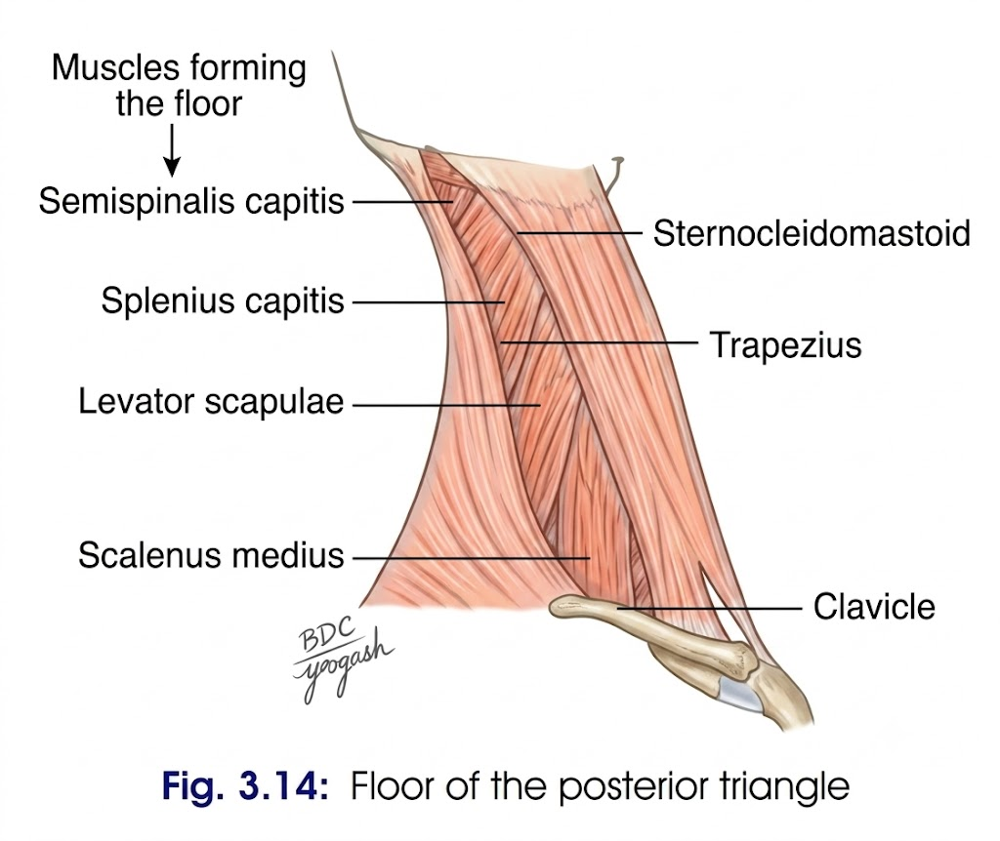
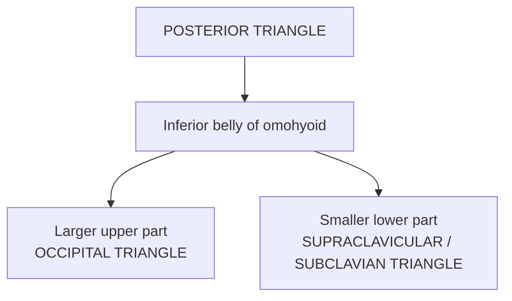
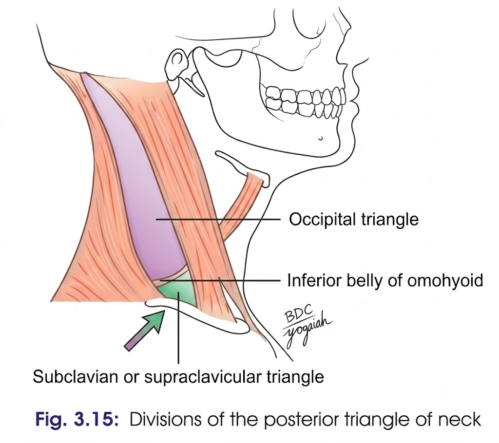
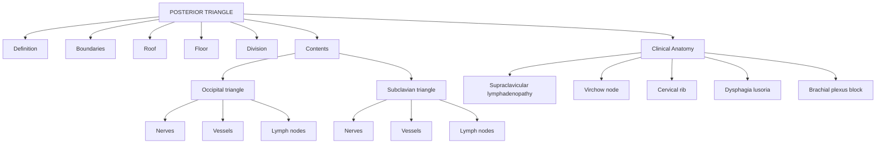

# POSTERIOR TRIANGLE OF NECK

> **Definition:** A triangular space on the side of the neck situated **behind the sternocleidomastoid (SCM)**.

---

## 1. Boundaries

| Boundary            | Structure                                          |
| ------------------- | -------------------------------------------------- |
| **Anterior**        | Posterior border of **SCM**                        |
| **Posterior**       | Anterior border of **trapezius**                   |
| **Base / Inferior** | Middle ⅓ of **clavicle**                           |
| **Apex**            | Superior nuchal line, where SCM and trapezius meet |

### Quick boundary map

> 

---

# 2. Roof

The roof is formed by:

> 

### Superficial fascia contains

* **Platysma**
* **External & posterior external jugular veins**
* Cutaneous branches:

  * Supraclavicular
  * Great auricular
  * Transverse cutaneous
  * Lesser occipital nerves
* Unnamed arteries from:

  * Occipital
  * Transverse cervical
  * Suprascapular arteries
* Lymph vessels → **supraclavicular lymph nodes**

---

# 3. Floor

Formed by **prevertebral layer of deep cervical fascia**, covering:

$$
\boxed{
\text{Splenius capitis}
\rightarrow
\text{Levator scapulae}
\rightarrow
\text{Scalenus medius}
}
$$

**Mnemonic:** **S → L → S**

> 

---

# 4. Division

The **inferior belly of omohyoid** divides the posterior triangle into:

> 

---

# 5. Contents

## A. Occipital Triangle

### Nerves

* **Spinal accessory nerve (XI)**
* Four cutaneous branches of cervical plexus:

  * Lesser occipital — **C2**
  * Great auricular — **C2, C3**
  * Transverse cervical — **C2, C3**
  * Supraclavicular — **C3, C4**
* Muscular branches:

  * To levator scapulae — **C3, C4**
  * To trapezius — **C3, C4**
  * Nerve to rhomboids — **C5**, proprioceptive

### Vessels

* **Transverse cervical artery & vein**
* **Occipital artery**

### Lymph nodes

* **Occipital nodes**
* **Supraclavicular nodes**

---

## B. Supraclavicular / Subclavian Triangle

### Nerves

* **Roots and trunks of brachial plexus**
* Long thoracic nerve — **C5–C7**
* Nerve to subclavius — **C5, C6**
* Suprascapular nerve — **C5, C6**

### Vessels

* **3rd part of subclavian artery & vein**
* Suprascapular artery & vein
* Commencement of transverse cervical artery
* Termination of corresponding vein
* Lower part of external jugular vein

### Lymph nodes

→ Few **supraclavicular nodes**

---

# 6. Contents — High-Yield Table

| **Occipital triangle**                | **Subclavian triangle**           |
| ------------------------------------- | --------------------------------- |
| Spinal accessory nerve                | Roots & trunks of brachial plexus |
| Cutaneous branches of cervical plexus | Long thoracic nerve               |
| Muscular branches                     | Nerve to subclavius               |
| Transverse cervical vessels           | Suprascapular nerve               |
| Occipital artery                      | 3rd part of subclavian vessels    |
| Occipital nodes                       | Suprascapular vessels             |
| Supraclavicular nodes                 | Supraclavicular nodes             |

---

# 7. Clinical Anatomy

### 1. Supraclavicular lymphadenopathy

**Common swelling of posterior triangle**

→ Enlarged supraclavicular lymph nodes.

⚠️ During biopsy → **accessory nerve (XI) must be preserved**.

### Causes

* Tuberculosis
* Hodgkin's disease
* Malignancies of:

  * Breast
  * Arm
  * Chest

### Virchow's node

$$
\boxed{\text{Left supraclavicular node} = \text{Virchow's node}}
$$

May be involved in metastasis from:

→ **Stomach**
→ **Testis**
→ Other abdominal viscera

---

### 2. Block dissection of neck

**Removal of cervical lymph nodes + involved surrounding structures** for malignant disease.

Important:

> Structures **deep to prevertebral fascia** are relatively protected, including the **brachial and cervical plexuses and their muscular branches**.

---

### 3. Cervical rib

$$
\text{Cervical rib}
\rightarrow
\text{Compression of 2nd part of subclavian artery}
\rightarrow
\text{↓ Upper limb blood supply}
$$

Collateral circulation occurs through **scapular anastomoses**.

---

### 4. Dysphagia lusoria

$$
\boxed{
\text{Abnormal subclavian artery}
\rightarrow
\text{Compression of oesophagus}
\rightarrow
\text{Dysphagia lusoria}
}
$$

---

### 5. Subclavian artery compression

**Short scalenus anterior** may compress the **2nd part of subclavian artery**.

→ ↓ blood supply to upper limb

**Treatment:** Division of the muscle can abolish the effect.

---

### 6. Brachial plexus block

Local anaesthetic is injected:

**Between 1st rib and skin above clavicle**

→ blocks **brachial plexus**

→ useful for **upper-limb surgery**.

---

# ⭐ Exam Flow

### **Exam priority**

If you're short on time, make sure you **don't skip**:

**Boundaries → Roof → Floor → Division → Contents in a table → 4–5 clinical points.**

That gives you a very clean **10-marker structure** without turning it into a paragraph dump.

<table>
  <thead>
    <tr>
      <th colspan="3">TABLE 3.1: Contents of the posterior triangle</th>
    </tr>
    <tr>
      <th>Contents</th>
      <th>Occipital triangle</th>
      <th>Subclavian triangle</th>
    </tr>
  </thead>
  <tbody>
    <tr>
      <td rowspan="2"><b>Nerves</b></td>
      <td>
        Spinal accessory nerve 
        Four cutaneous branches of cervical plexus 
        &nbsp;&nbsp;a. Lesser occipital (C2) 
        &nbsp;&nbsp;b. Great auricular (C2, C3) 
        &nbsp;&nbsp;c. Anterior cutaneous nerve of neck (C2, C3) 
        &nbsp;&nbsp;d. Supraclavicular nerves (C3, C4) 
        Muscular branches: 
        &nbsp;&nbsp;a. Two small branches to levator scapulae (C3, C4) 
        &nbsp;&nbsp;b. Two small branches to trapezius (C3, C4) 
        &nbsp;&nbsp;c. Nerve to rhomboids (proprioceptive) (C5)
      </td>
      <td>
        Roots and trunks of brachial plexus 
        Nerve to serratus anterior (long thoracic, C5–C7) 
        Nerve to subclavius (C5, C6) 
        Suprascapular nerve (C5, C6)
      </td>
    </tr>
    <tr>
      <td>
        <b>Vessels</b> 
        Transverse cervical artery and vein 
        Occipital artery
      </td>
      <td>
        3rd part of subclavian artery and subclavian vein 
        Suprascapular artery and vein 
        Commencement of transverse cervical artery 
        Termination of the corresponding vein 
        Lower part of external jugular vein
      </td>
    </tr>
    <tr>
      <td><b>Lymph nodes</b></td>
      <td>Along the posterior border of the sternocleidomastoid, more in the lower part—the supraclavicular nodes and a few at the upper angle—the occipital nodes</td>
      <td>A few members of the supraclavicular chain</td>
    </tr>
  </tbody>
</table>