# Temporomandibular Joint (TMJ)

> **Type → Articular surfaces → Ligaments → Disc & cavity → Relations → Blood supply → Nerve supply → Movements → Mechanism → Stability**

---

## 1. Type of Joint

* **Complex, bicondylar synovial joint**
* Articular surfaces are covered by **fibrocartilage**.
* An **intra-articular disc** divides the joint cavity into upper and lower compartments.

$$
\boxed{\text{TMJ = Complex + Bicondylar + Synovial}}
$$

---

# 2. Articular Surfaces

> 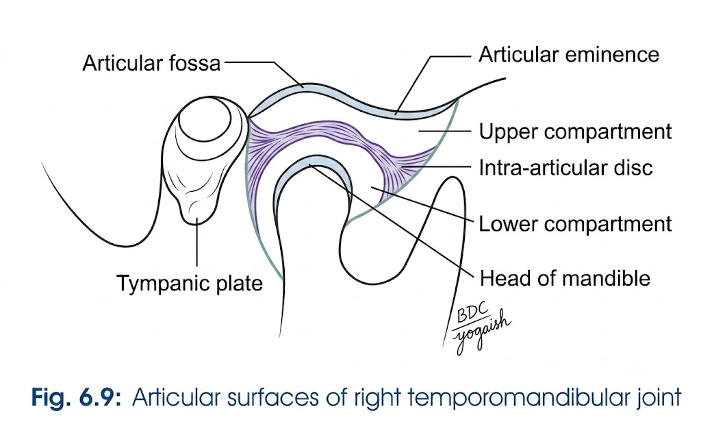

### A. Superior articular surface — Temporal bone

Formed by:

1. **Articular tubercle**

   * Tubercle of root of zygoma
   * Anterior root of zygoma
2. **Anterior part of mandibular fossa**
3. Posterior non-articular part → **tympanic plate**

### B. Inferior articular surface

* **Head of mandible**

### Important

| Feature             | TMJ                           |
| ------------------- | ----------------------------- |
| Articular cartilage | **Fibrocartilage**            |
| Cavity              | Divided by **articular disc** |

> ⭐ **Remember:** Most synovial joints → hyaline cartilage; **TMJ → fibrocartilage**.

---

# 3. Ligaments

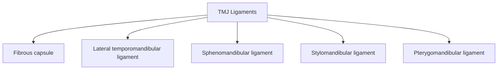

> 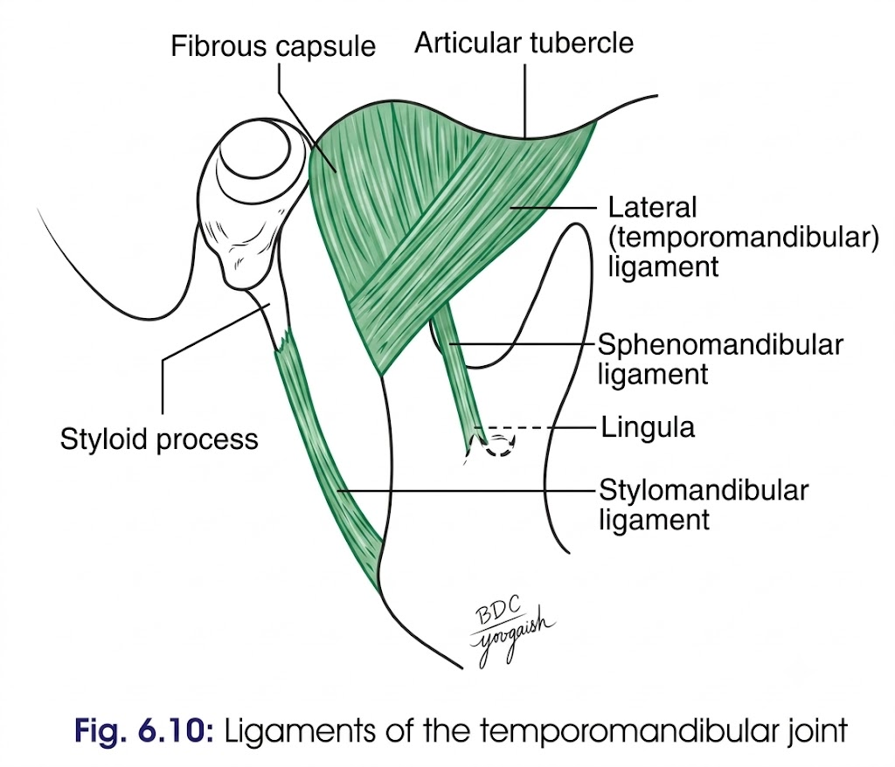

## A. Fibrous Capsule

**Attachments:**

* Above →

  * Articular tubercle
  * Circumference of mandibular fossa
  * Squamotympanic fissure
* Below → **Neck of mandible**

**Features:**

* Loose **above disc**
* Tight **below disc**
* Synovial membrane lines the capsule and neck of mandible.

---

## B. Lateral Temporomandibular Ligament

* Strengthens lateral part of capsule.
* Fibres → **downwards and backwards**
* Attached:

  * Above → tubercle of root of zygoma + anterior root
  * Below → posterolateral aspect of neck of mandible

### Function

$$
\boxed{\text{Prevents backward dislocation}}
$$

---

## C. Sphenomandibular Ligament

* Accessory ligament.
* **Remnant of dorsal part of Meckel's cartilage**

**Attachments:**

$$
\text{Spine of sphenoid}
\longrightarrow
\text{Lingula of mandibular foramen}
$$

### Relations

| Lateral                | Medial          |
| ---------------------- | --------------- |
| Lateral pterygoid      | Chorda tympani  |
| Auriculotemporal nerve | Wall of pharynx |
| Maxillary artery       | —               |

* Near lower end → pierced by **mylohyoid nerve and vessels**

---

## D. Stylomandibular Ligament

* Thickened part of **deep cervical fascia**
* Separates **parotid and submandibular glands**

**Attachments:**

$$
\text{Styloid process}
\longrightarrow
\text{Angle + posterior border of ramus of mandible}
$$

---

# 4. Joint Cavity & Articular Disc

### Articular Disc

* **Oval intra-articular disc**
* Divides joint cavity into:

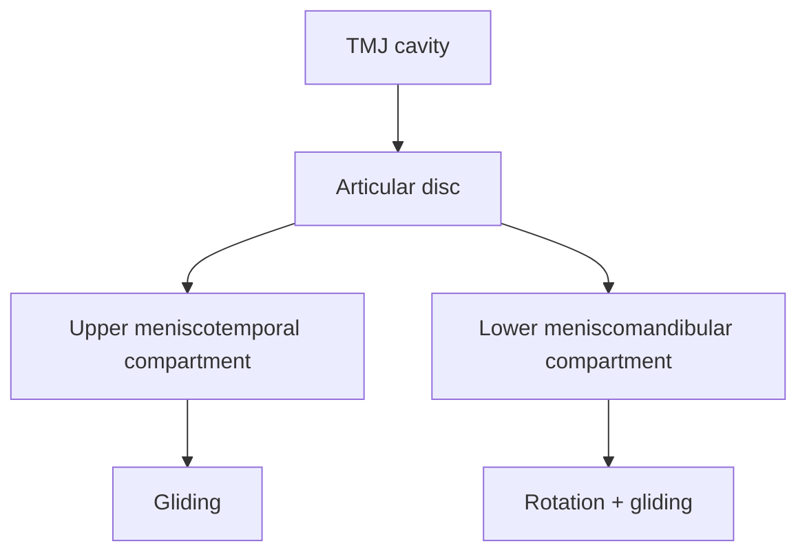

| Compartment                   | Movement           |
| ----------------------------- | ------------------ |
| **Upper / meniscotemporal**   | Gliding            |
| **Lower / meniscomandibular** | Rotation + gliding |

> 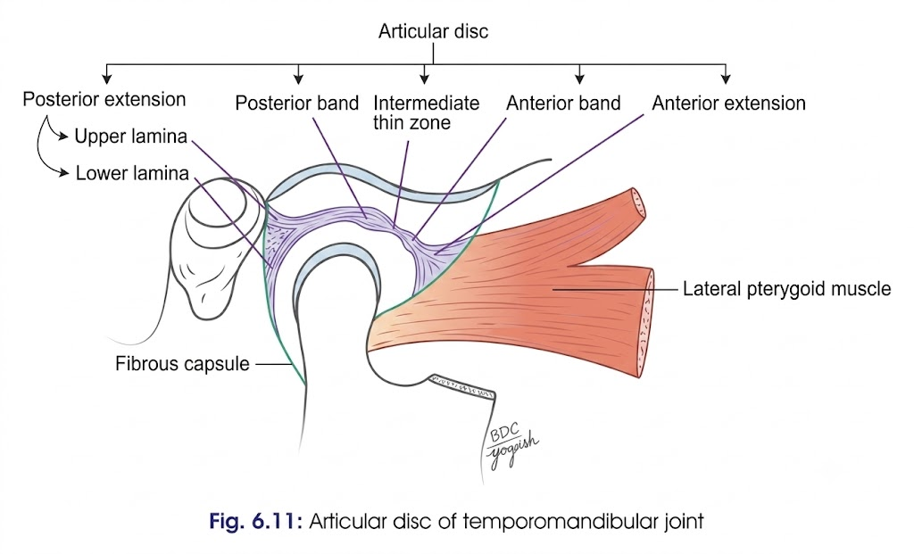

### Shape of disc

* Superior surface → **concavoconvex**
* Inferior surface → **concave**
* Periphery attached to fibrous capsule.

### Parts

1. Anterior region
2. Anterior thick band
3. Intermediate region
4. Posterior thick band
5. Bilaminar region containing **venous plexus**

> The disc represents a degenerated primitive insertion of **lateral pterygoid**.

---

# 5. Functions of Articular Disc

1. **Prevents friction** between articular surfaces.
2. Acts as a **cushion → shock absorption**.
3. **Stabilises mandibular condyle** by filling the space between surfaces.
4. Proprioceptive fibres → **regulate movements**.
5. Increases area of contact → **distributes weight**.

$$
\boxed{\text{Disc = Friction ↓ + Shock absorption + Stability + Proprioception}}
$$

---

# 6. Relations of TMJ

| Direction     | Relations                                                                                            |
| ------------- | ---------------------------------------------------------------------------------------------------- |
| **Lateral**   | Skin & fasciae; parotid gland; temporal branches of facial nerve                                     |
| **Medial**    | Tympanic plate; spine of sphenoid; auriculotemporal & chorda tympani nerves; middle meningeal artery |
| **Anterior**  | Lateral pterygoid; masseteric nerve & artery                                                         |
| **Posterior** | Parotid gland; superficial temporal vessels; auriculotemporal nerve                                  |
| **Superior**  | Middle cranial fossa; middle meningeal vessels                                                       |
| **Inferior**  | Maxillary artery & vein                                                                              |

### ⭐ High-yield relation

$$
\boxed{\text{TMJ is closely related to the middle cranial fossa superiorly}}
$$

---

# 7. Blood Supply

### Arterial

* **Superficial temporal artery**
* **Maxillary artery**

### Venous

* Veins accompany the arteries.

---

# 8. Nerve Supply

* **Auriculotemporal nerve**
* **Masseteric nerve**

---

# 9. Movements of TMJ

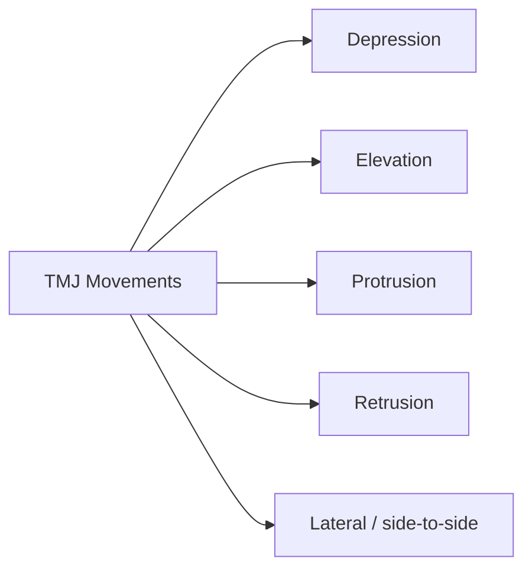

1. **Depression** → opening mouth
2. **Elevation** → closing mouth
3. **Protrusion** → chin forwards
4. **Retrusion** → chin backwards
5. **Lateral movements** → chewing/grinding

---

# 10. Mechanism of TMJ Movements

## Two compartments

| Compartment           | Main movement |
| --------------------- | ------------- |
| **Meniscotemporal**   | Gliding       |
| **Meniscomandibular** | Rotation      |

### Axes of rotation

1. **Transverse axis**

   * Passes mediolaterally through centre of neck of mandible
   * Responsible for **depression & elevation**

2. **Vertical axis**

   * Passes through posterior border of ramus
   * Responsible for **side-to-side movements**

---

## Depression of Mandible

### 3 Phases

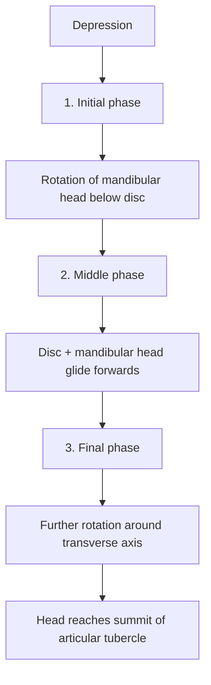

### Phase 1 — Initial

* Occurs mainly in **lower compartment**
* Mandibular head rotates **forwards**
* Transverse axis remains fixed.

### Phase 2 — Middle

* Occurs in **upper compartment**
* Disc + mandibular head **glide forwards together**
* Transverse axis moves forwards.

### Phase 3 — Final

* Transverse axis becomes fixed again.
* Further rotation occurs.
* Head reaches **summit of articular tubercle**.

### Elevation

$$
\boxed{\text{Elevation = reverse sequence of depression}}
$$

---

# 11. Side-to-Side Movement

* Mandibular head of one side:

  * **Glides forwards** in upper compartment
  * Rotates around **vertical axis**
* Followed by reverse movement of opposite mandibular head.

➡️ Produces **grinding/chewing movement**.

---

# 12. Factors Maintaining Stability of TMJ

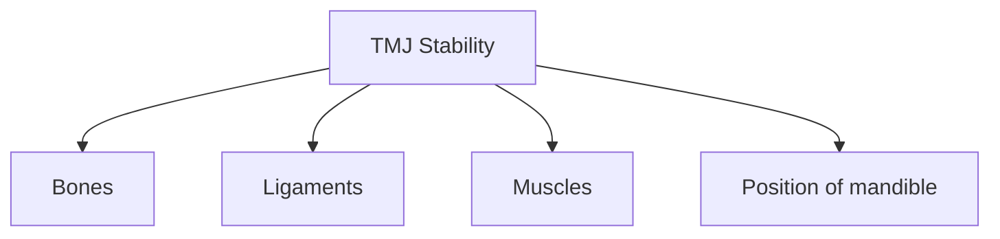

### 1. Bones

* **Articular tubercle** → prevents anterior dislocation.
* **Postglenoid tubercle** → prevents posterior dislocation.

### 2. Ligament

* **Lateral temporomandibular ligament**
  → prevents backward dislocation.

### 3. Muscles

* Posterior fibres of **temporalis**
  → prevent anterior dislocation.
* **Lateral pterygoid**
  → prevents posterior dislocation.

### 4. Position of Mandible

* TMJ is most stable in **occlusion** → mouth closed.

$$
\boxed{\text{Maximum TMJ stability = Occlusion}}
$$

---

## 🧠 Rapid Recall

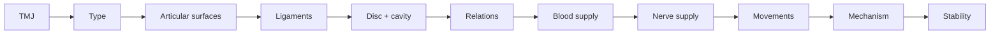

### **Absolute must-write points ⭐**

* **Complex bicondylar synovial joint**
* Articular surfaces covered by **fibrocartilage**
* **Intra-articular disc** divides cavity into upper & lower compartments
* Upper → **gliding**
* Lower → **rotation + gliding**
* Depression → **3 phases**
* Nerve supply → **auriculotemporal + masseteric**
* Stability → **bones + ligaments + muscles + occlusion**

# Clinical Anatomy of TMJ

## 1. Palpation of TMJ

### Method

1. Ask the patient to:

   * Open and close the mouth several times.
   * Move the opened jaw **side-to-side**.
   * Move the jaw **forwards and backwards**.

### Site of palpation

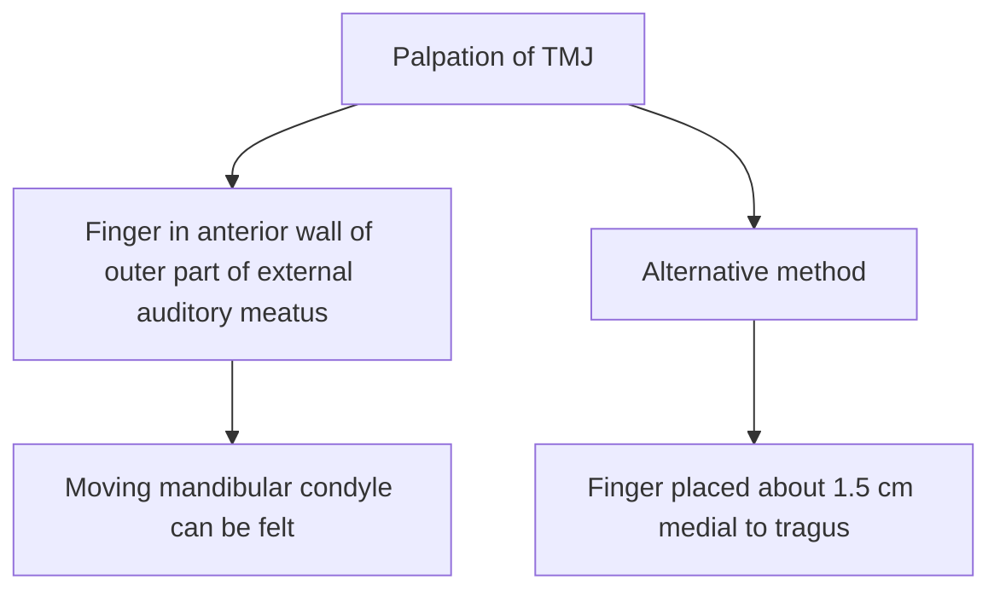

---

# 2. Dislocation of Mandible

### Common type

$$
\boxed{\text{Anterior dislocation}}
$$

### Mechanism
$$
\begin{array}{c}
\textbf{Excessive opening of mouth}
\\[8pt]
\downarrow
\\[8pt]
\text{Mandibular head moves forwards}
\\[8pt]
\downarrow
\\[8pt]
\text{Slips underneath the \textbf{articular eminence}}
\\[8pt]
\downarrow
\\[8pt]
\text{Enters the \textbf{infratemporal fossa}}
\\[8pt]
\downarrow
\\[8pt]
\boxed{\textbf{Patient cannot close the mouth}}
\end{array}
$$

---

# 3. Reduction of Dislocated TMJ

### Principle

$$
\boxed{\text{Bring mandibular condyle behind the articular eminence}}
$$

### Method

* Place **thumbs on the last molar teeth**.
* **Lower the ramus** of mandible.
* Simultaneously **elevate the chin** with other fingers.
* Condyle is guided back behind the articular eminence.

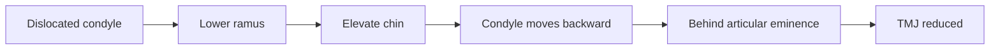

---

# 4. TMJ Syndrome

**TMJ syndrome** → symptoms due to TMJ disorder and/or associated muscle involvement.

| Muscle involved       | Spasm produces |
| --------------------- | -------------- |
| **Masseter**          | Facial pain    |
| **Temporalis**        | Headache       |
| **Lateral pterygoid** | Jaw pain       |

### Easy recall

$$
\boxed{\text{Masseter → Face \quad Temporalis → Head \quad Lateral pterygoid → Jaw}}
$$

---

# 5. Clicking / Popping of TMJ

### Causes

* Abnormal joint function
* **Arthritis**
* Fracture/dislocation of mandibular head
* **Muscular spasm**
* **Malocclusion of teeth**
* **Parotid gland infection**

---

# 6. Nerve Injury During TMJ Surgery

Possible damage to:

* **Facial nerve (VII)**
* **Auriculotemporal nerve**

### ⭐ Clinical importance

$$
\boxed{\text{TMJ surgery → risk to VII + auriculotemporal nerve}}
$$

---

## 🧠 Clinical TMJ — 30-second revision

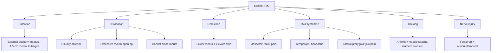
