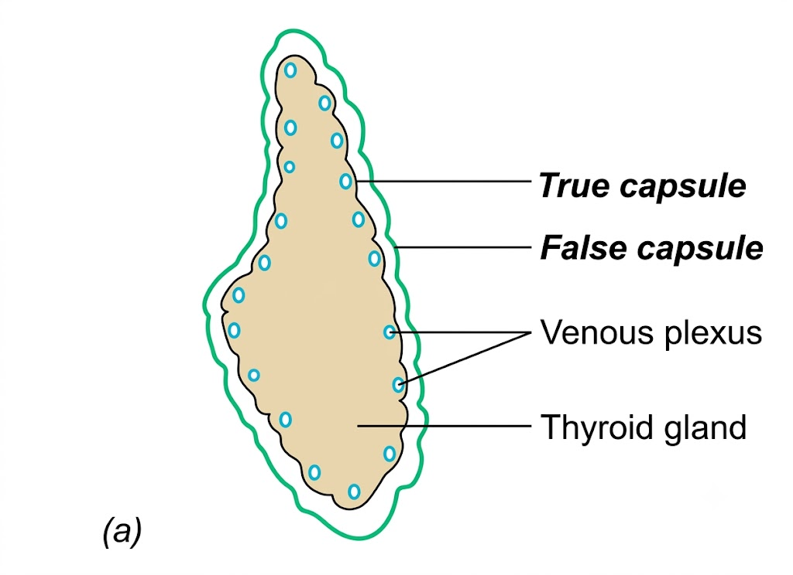
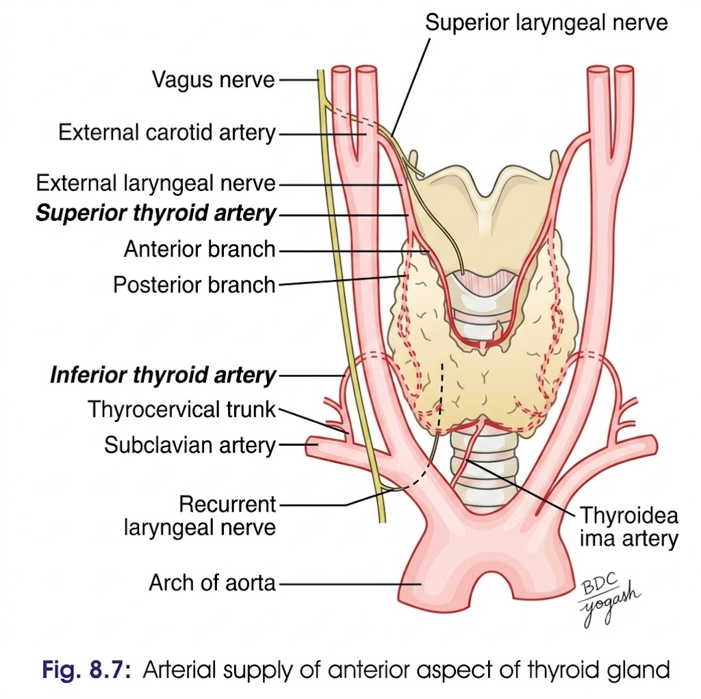
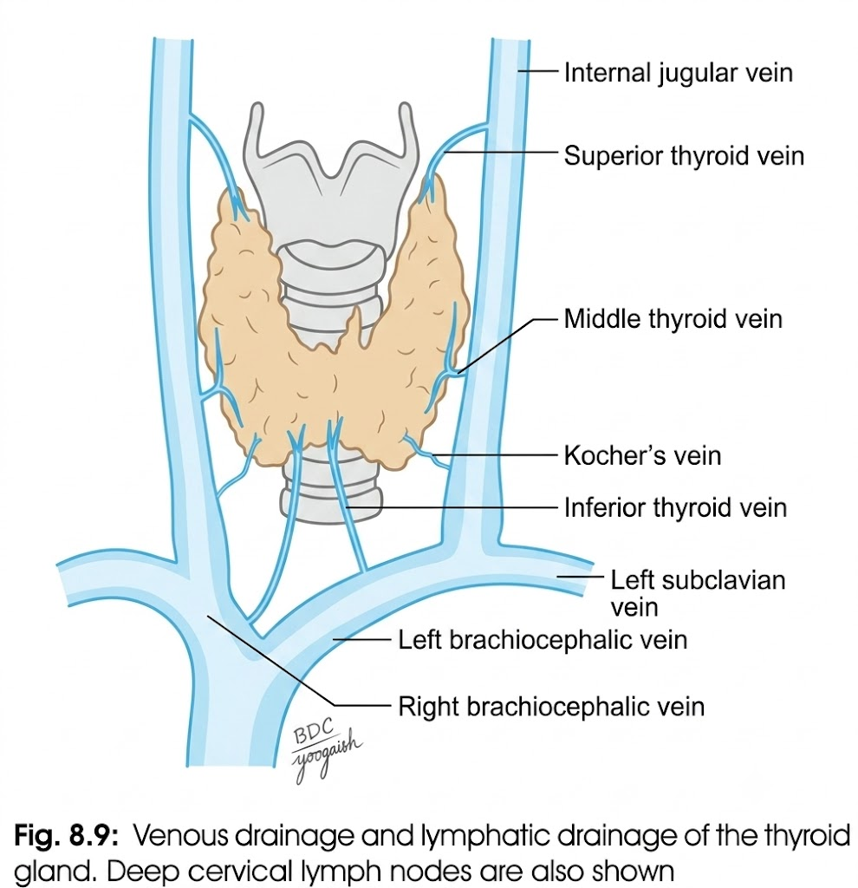
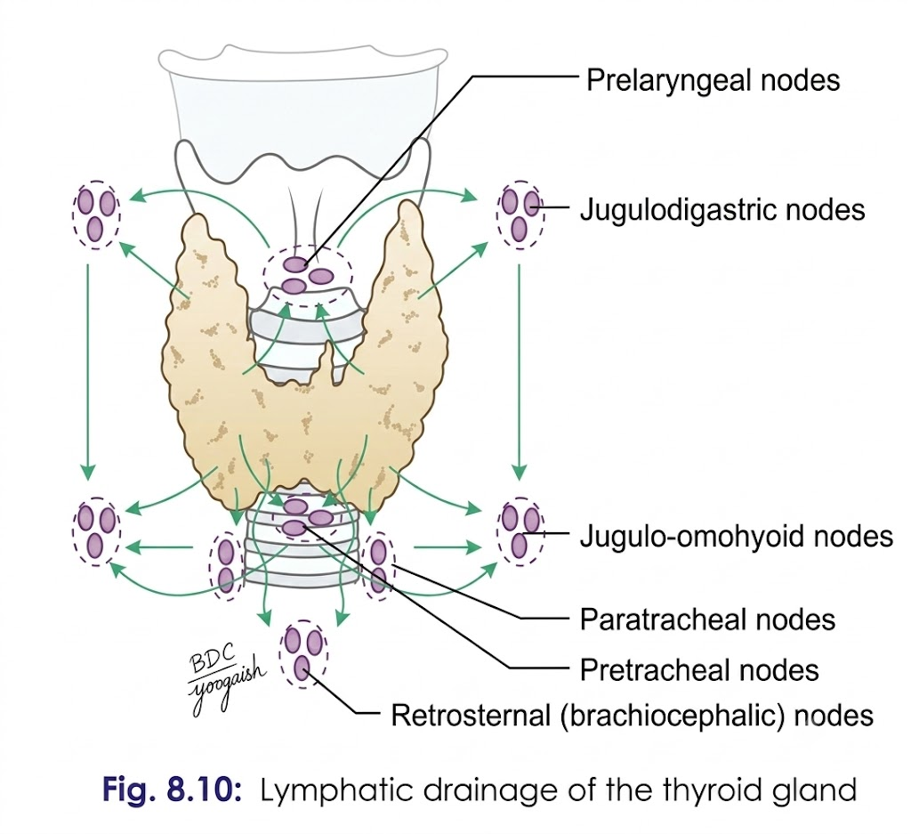

# THYROID GLAND 

## 1. Introduction

* Thyroid is an **H-shaped endocrine gland** situated in the lower part of the neck.
* It consists of:

  1. **Right and left lobes**
  2. **Isthmus**
  3. **Pyramidal lobe** — may arise from isthmus or either lobe.
* **Levator glandulae thyroideae** may connect pyramidal lobe to the hyoid bone.

---

## 2. Location and Extent ⭐

* Lies opposite **C5–C7 and T1 vertebrae**.
* Embraces the upper part of the trachea.
* Each lobe extends from **middle of thyroid cartilage → 4th/5th tracheal ring**.
* **Isthmus:** extends from **2nd → 4th tracheal rings**.
* Superior ascent is prevented by **thyrohyoid muscle**.
* Inferior descent is prevented by **ligament of Berry**.

### Dimensions

* Each lobe: **5 × 2.5 × 2.5 cm**
* Isthmus: **1.2 × 1.2 cm**
* Weight: approximately **25 g**
* Larger in females; increases in size during **menstruation and pregnancy**.

---

# 3. Capsules ⭐

> 
 
Thyroid has **two capsules**:

| Capsule           | Description                                                |
| ----------------- | ---------------------------------------------------------- |
| **True capsule**  | Peripheral condensation of connective tissue of gland      |
| **False capsule** | Derived from **pretracheal layer of deep cervical fascia** |

### False capsule

* Thin along posterior border.
* Thick on medial surface.
* Thickened part forms **suspensory ligament of Berry**, attaching thyroid lobes to **cricoid cartilage**.

**Important:** A **dense capillary plexus** lies deep to the true capsule.

---

# 4. Parts and Relations of Lobes ⭐

Each lobe is **conical** and has:

* **Apex**
* **Base**
* **3 surfaces:** lateral, medial, posterolateral
* **2 borders:** anterior and posterior

### Apex

* Directed upwards and slightly laterally.
* Lies between **inferior constrictor and sternothyroid**.
* Related to:

  * **Superior thyroid artery**
  * **External laryngeal nerve**

### Base

* At level of **4th/5th tracheal ring**.
* Related to:

  * **Inferior thyroid artery**
  * **Recurrent laryngeal nerve**

### Lateral/Surface

Covered by:

* Sternohyoid
* Superior belly of omohyoid
* Sternothyroid
* Anterior border of sternocleidomastoid

### Medial Surface — HIGH-YIELD ⭐

Related to:

**2 tubes**

* Trachea
* Oesophagus

**2 muscles**

* Inferior constrictor
* Cricothyroid

**2 nerves**

* External laryngeal
* Recurrent laryngeal

**2 cartilages**

* Thyroid cartilage
* Cricoid cartilage

### Posterolateral Surface

* Related to **carotid sheath**
* Overlaps the **common carotid artery**

### Anterior Border

* Related to anterior branch of **superior thyroid artery**

### Posterior Border ⭐

Related to:

* Inferior thyroid artery
* Anastomosis between superior and inferior thyroid arteries
* **Parathyroid glands**
* **Thoracic duct on left side**

---

# 5. Isthmus — Relations

Isthmus connects the **lower parts of the two lobes**.

### Anterior surface

Covered by:

* Sternohyoid and sternothyroid
* Anterior jugular veins
* Fascia and skin

### Posterior surface

* Related to **2nd–4th tracheal rings**

### Upper border

* Anterior branches of right and left **superior thyroid arteries**
* These arteries anastomose here.

### Lower border

* **Inferior thyroid veins** leave the gland.

---

# 6. Nerve Supply

* Mainly from **middle cervical ganglion**
* Partly from **superior and inferior cervical ganglia**
* These fibres are mainly **vasomotor/vasoconstrictor**.

---

# 8. Blood Supply
> 

---

# 9. Venous Drainage
> 

---

# 10. Lymphatic Drainage
> 

--- 

# 11. Clinical Anatomy ⭐⭐⭐

### 1. Palpation

* Thyroid swelling (**goitre**) is palpated **from behind**.

### 2. Thyroidectomy

* May be performed in hyperthyroidism.
* Thyroid is removed along with the **true capsule** to avoid haemorrhage from the dense capillary plexus deep to it.

### 3. Subtotal thyroidectomy

* Posterior parts of both lobes are left behind.
* This helps preserve:

  * **Parathyroid glands**
  * Their blood supply
* Prevents postoperative **myxoedema**.

### 4. Ligation of thyroid arteries ⭐

* **Superior thyroid artery:** ligated close to the gland → protects **external laryngeal nerve**.
* **Inferior thyroid artery:** stem is **not ligated**.
* Its glandular branches are ligated separately → preserves blood supply to **parathyroids**.

### 5. Compression by thyroid swelling

A thyroid tumour may compress:

| Structure                     | Effect               |
| ----------------------------- | -------------------- |
| **Trachea**                   | Dyspnoea             |
| **Oesophagus**                | Dysphagia            |
| **Recurrent laryngeal nerve** | Dysphonia/hoarseness |

### 6. Movement during swallowing ⭐

* Thyroid moves **upwards and downwards during swallowing**.
* This is because it is attached to the **cricoid cartilage by ligament of Berry**.

### 7. Hypothyroidism

* **Infants → Cretinism**
* **Adults → Myxoedema**

---

## 🧠 Last-minute recall

$$
\boxed{\text{Thyroid = Parts + Extent + Capsules + Relations + Isthmus + Nerve supply + Clinical}}
$$

**Most important relation to memorize:**

$$
\boxed{\text{Medial surface = 2T + 2M + 2N + 2C}}
$$

**2 Tubes:** Trachea, oesophagus
**2 Muscles:** Inferior constrictor, cricothyroid
**2 Nerves:** External laryngeal, recurrent laryngeal
**2 Cartilages:** Thyroid, cricoid
