# TONGUE

## 1. Parts of Tongue

The tongue is divided into:

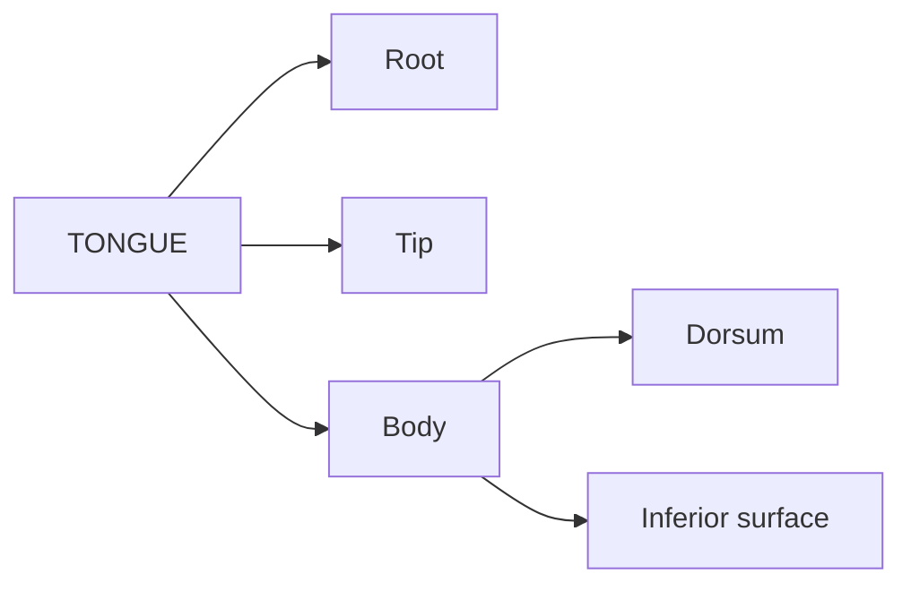

### A. Root

**Fixed part** of tongue.

| Attachment / Relation        | Structure                      |
| ---------------------------- | ------------------------------ |
| **Above**                    | Styloid process + soft palate  |
| **Below**                    | Mandible + hyoid bone          |
| **Between mandible & hyoid** | Geniohyoid + mylohyoid muscles |

**Key point:** → **Root = fixed part**

---

### B. Tip

* Forms the **anterior free end** of tongue.
* At rest → lies **behind upper incisor teeth**.

---

### C. Body

Has:

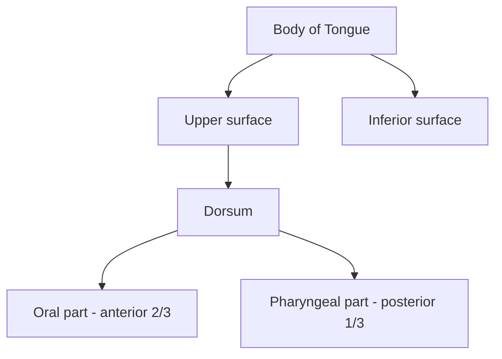

#### 1. Dorsum

* **Curved upper surface**
* **Convex in all directions**
* Divided into:

| Part                | Extent            | Main feature   |
| ------------------- | ----------------- | -------------- |
| **Oral part**       | Anterior **2/3**  | Papillary part |
| **Pharyngeal part** | Posterior **1/3** | Lymphoid part  |

They are separated by:

**Sulcus terminalis**
→ **V-shaped groove**

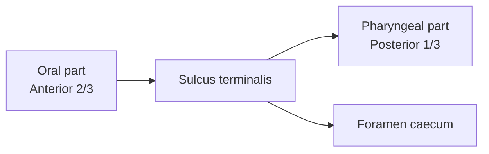

**Sulcus terminalis**

* V-shaped
* Two limbs meet at **foramen caecum**
* Limbs run **laterally and forwards**
* Extend up to **palatoglossal arches**

---

## 2. Oral Part — Anterior 2/3

**Also called:** Papillary part

### Position & Relations

* Lies on **floor of mouth**
* Margins are **free**
* Margins contact **gums and teeth**

### Dorsal surface

* Shows a **median furrow**
* Covered by **papillae**
* Therefore → **rough**

### Marginal feature

Just anterior to circumvallate papillae:

→ **4–5 vertical folds**

→ **Foliate papillae**

### Inferior surface

| Feature                    | Description                              |
| -------------------------- | ---------------------------------------- |
| Mucosa                     | **Smooth**                               |
| Median fold                | **Frenulum linguae**                     |
| On either side of frenulum | Prominence due to **deep lingual veins** |
| Lateral to veins           | **Plica fimbriata**                      |

**Plica fimbriata**
→ directed **forwards + medially** towards tip.

---

## 3. Pharyngeal Part — Posterior 1/3

**Also called:** Lymphoid part

* Lies **behind palatoglossal arches and sulcus terminalis**
* Posterior surface = **base of tongue**
* Forms **anterior wall of oropharynx**

### Mucosa

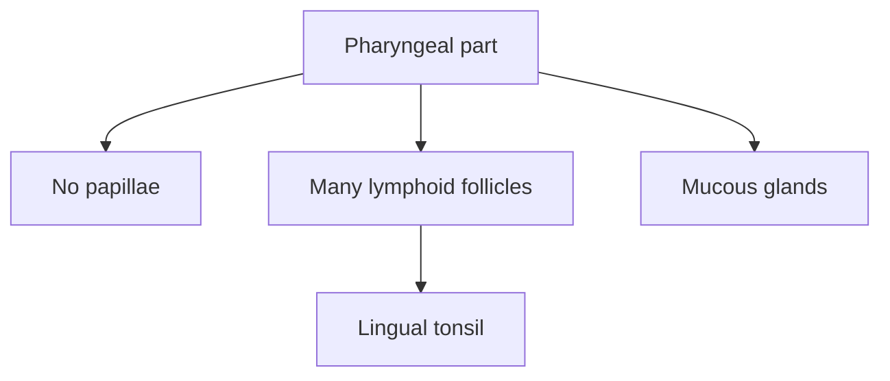

**High-yield:**

> **Posterior 1/3 → no papillae + lymphoid follicles → lingual tonsil**

---

> 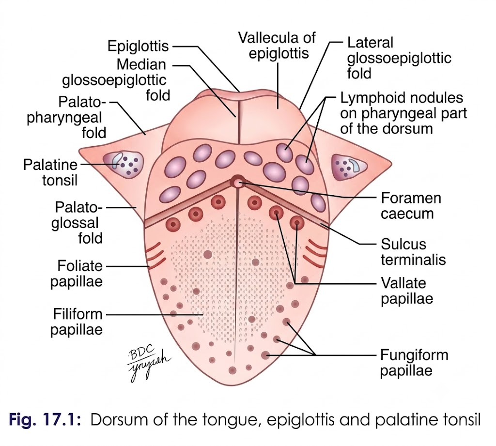

## 4. Posteriormost Part

Connected to **epiglottis** by **3 mucosal folds**:

1. **Median glossoepiglottic fold**
2. **Right lateral glossoepiglottic fold**
3. **Left lateral glossoepiglottic fold**

### Valleculae

On either side of the **median glossoepiglottic fold**:

→ **Vallecula**

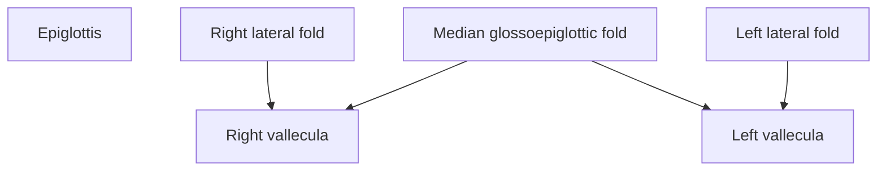

**Lateral glossoepiglottic folds** separate:

**Vallecula ↔ Piriform fossa**

---

### 🔥 Recall skeleton

If you're writing this in the exam, the **skeleton itself** should trigger the whole answer:

```text
PARTS OF TONGUE
│
├── 1. Root
│   ├── Fixed
│   └── Attachments
│
├── 2. Tip
│   └── Anterior free end
│
└── 3. Body
    │
    ├── Dorsum
    │   ├── Oral part → anterior 2/3
    │   ├── Pharyngeal part → posterior 1/3
    │   └── Sulcus terminalis
    │       └── Foramen caecum
    │
    ├── Oral part
    │   ├── Papillae
    │   ├── Foliate papillae
    │   ├── Frenulum linguae
    │   ├── Deep lingual veins
    │   └── Plica fimbriata
    │
    ├── Pharyngeal part
    │   ├── No papillae
    │   ├── Lymphoid follicles
    │   ├── Lingual tonsil
    │   └── Mucous glands
    │
    └── Posteriormost part
        ├── 3 glossoepiglottic folds
        └── Valleculae
```


# MUSCLES OF THE TONGUE

## 1. General Arrangement

A **median fibrous septum** divides the tongue into **right and left halves**.

Each half contains:

| Type              | Muscles                                                            |
| ----------------- | ------------------------------------------------------------------ |
| **Intrinsic — 4** | Superior longitudinal, Inferior longitudinal, Transverse, Vertical |
| **Extrinsic — 4** | Genioglossus, Hyoglossus, Styloglossus, Palatoglossus              |

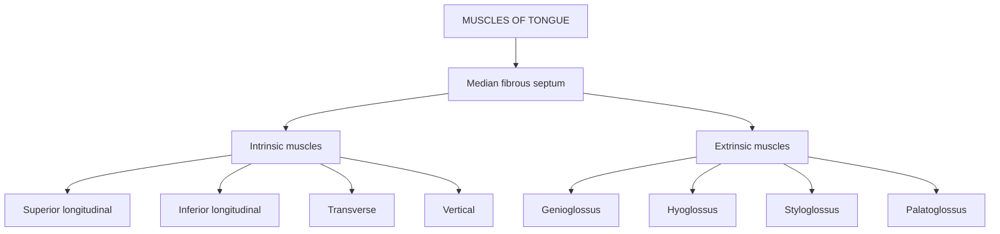

### ⭐ Basic distinction

**Intrinsic muscles → change SHAPE of tongue**

**Extrinsic muscles → change POSITION of tongue**

> 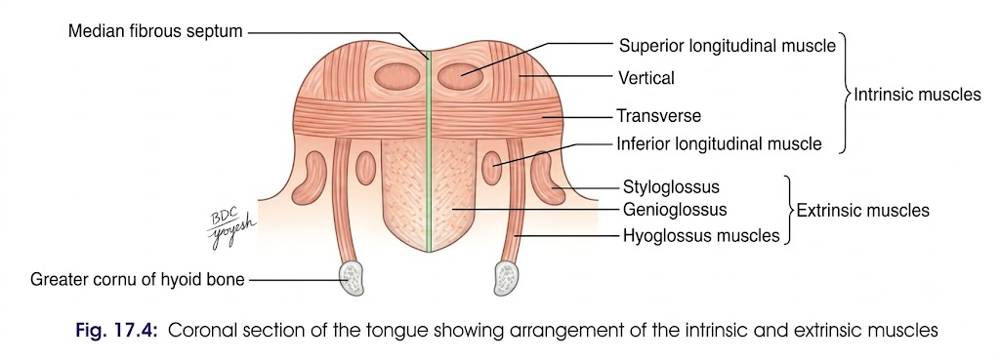

---

# 2. INTRINSIC MUSCLES

### General features

* Occupy mainly the **upper part of tongue**
* Attached to:

  * **Submucous fibrous layer**
  * **Median fibrous septum**
* **Main function → alter shape of tongue**

---

## A. Superior Longitudinal

**Origin**
→ Fibrous tissue deep to mucous membrane on dorsum + median lingual septum

**Course**
→ Runs longitudinally from **tip → root**

**Insertion**
→ Overlying mucous membrane

**Action**

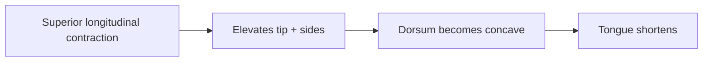

### 🔑 Remember

**Superior longitudinal → tip UP → dorsum CONCAVE**

---

## B. Inferior Longitudinal

**Origin**
→ Fibrous tissue beneath mucous membrane extending from **tip → root + hyoid**

**Insertion**
→ Mucous membrane of dorsum

**Position**
→ Between **genioglossus + hyoglossus**

**Action**

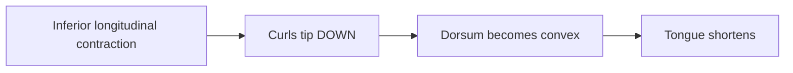

### 🔑 Remember

**Inferior longitudinal → tip DOWN → dorsum CONVEX**

---

## C. Transverse

**Arrangement**
→ Sheet on either side of midline

**Plane**
→ Deep to **superior longitudinal**
→ Superficial to **genioglossus**

**Origin**
→ Median fibrous lingual septum

**Insertion**
→ Submucous fibrous tissue at lateral margins

**Action**

[
\text{Contraction} \rightarrow \text{Tongue narrower + thicker}
]

### 🔑 Remember

**Transverse → narrows + thickens tongue**

---

## D. Vertical

**Location**
→ Borders of **anterior part** of tongue

**Action**

→ **Broadens** the tongue

### 🧠 Intrinsic muscles — ONE LOOK

| Muscle                    | Main action                          |
| ------------------------- | ------------------------------------ |
| **Superior longitudinal** | Tip ↑ + sides ↑ → dorsum **concave** |
| **Inferior longitudinal** | Tip ↓ → dorsum **convex**            |
| **Transverse**            | **Narrows + thickens**               |
| **Vertical**              | **Broadens**                         |

---

# 3. EXTRINSIC MUSCLES

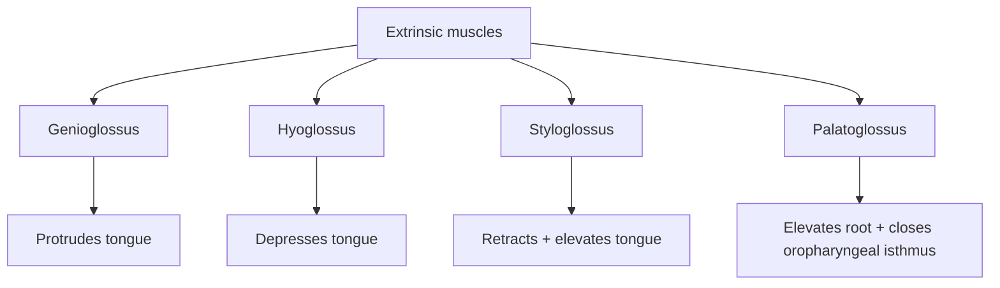

---

# A. GENIOGLOSSUS ⭐

### Type

**Fan-shaped, bulky muscle**

### Origin

→ **Upper genial tubercle of mandible**

### Insertion

| Fibres            | Insertion     |
| ----------------- | ------------- |
| **Upper fibres**  | Tip of tongue |
| **Middle fibres** | Dorsum        |
| **Lower fibres**  | Hyoid bone    |

### Actions

* **Protrudes** tongue
* **Depresses** tongue
* Pulls **posterior part of tongue forwards**
* Retracts tongue

### ⭐ Life-saving muscle

**Genioglossus prevents the tongue from falling backwards and obstructing the airway.**

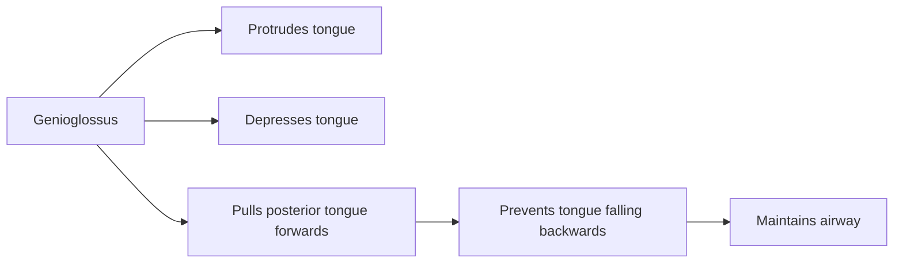

> **Clinical importance:** Genioglossus is therefore called the **"life-saving muscle of the tongue."**

---

# B. HYOGLOSSUS

### Origin

→ **Whole length of greater cornu + lateral part of hyoid**

### Insertion

→ Side of tongue between **styloglossus** and **inferior longitudinal**

### Actions

* **Depresses** tongue
* Makes dorsum **convex**
* **Retracts** protruded tongue

### 🔑 Remember

**HYOGLOSSUS → HYOid → tongue DOWN**

---

# C. STYLOGLOSSUS

### Origin

→ Tip + part of anterior surface of **styloid process**

### Insertion

→ Side of tongue

### Actions

* Pulls tongue **upwards**
* Pulls tongue **backwards**
* **Retracts** tongue

### 🔑 Remember

**StyloGLOSSUS → Styloid → tongue UP + BACK**

---

# D. PALATOGLOSSUS

### Origin

→ Oral surface of **palatine aponeurosis**

### Insertion

→ Descends in **palatoglossal arch** → side of tongue at junction of **oral + pharyngeal parts**

### Actions

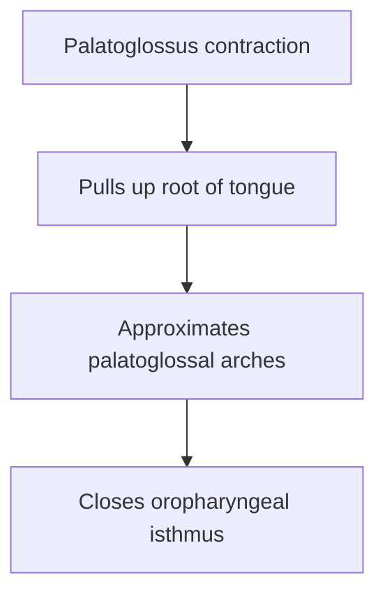

### 🔑 Remember

**Palatoglossus → ROOT UP + closes oropharyngeal isthmus**

---

# 🔥 EXAM-REVISION TABLE

| Muscle                    | Origin — key point         | Action — key point                 |
| ------------------------- | -------------------------- | ---------------------------------- |
| **Superior longitudinal** | Lingual septum/deep mucosa | **Tip ↑, concave dorsum**          |
| **Inferior longitudinal** | Fibrous tissue → hyoid     | **Tip ↓, convex dorsum**           |
| **Transverse**            | Lingual septum             | **Narrow + thicken**               |
| **Vertical**              | Anterior borders           | **Broadens**                       |
| **Genioglossus** ⭐        | Genial tubercle            | **Protrudes + depresses**          |
| **Hyoglossus**            | Hyoid                      | **Depresses + retracts**           |
| **Styloglossus**          | Styloid                    | **Elevates + retracts**            |
| **Palatoglossus**         | Palatine aponeurosis       | **Elevates root + closes isthmus** |

### 🧠 The big picture

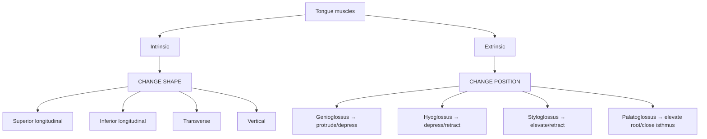

**General arrangement → Intrinsic muscles → 4 muscles → Extrinsic muscles → 4 muscles → actions → clinical importance of genioglossus.**
