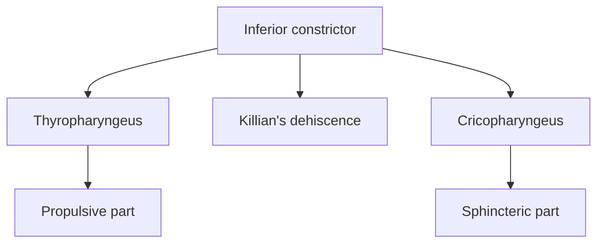
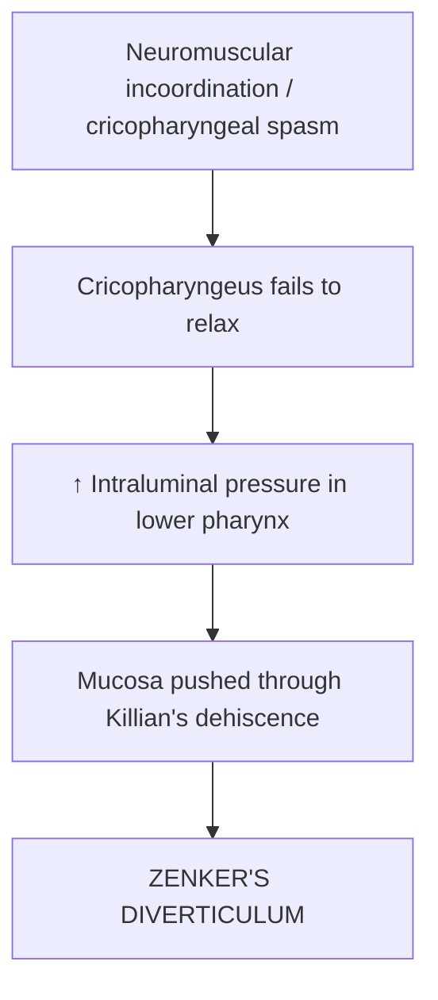

# KILLIAN'S DEHISCENCE & ZENKER'S DIVERTICULUM

## 1. Killian's Dehiscence

**Definition:**
**Killian's dehiscence** is a **weak area in the posterior wall of the pharynx** between the two parts of the **inferior constrictor muscle**.

### Location

$$
\boxed{\text{Thyropharyngeus}}
\longrightarrow
\boxed{\text{KILLIAN'S DEHISCENCE}}
\longrightarrow
\boxed{\text{Cricopharyngeus}}
$$

---

# 2. Zenker's Diverticulum

**Zenker's diverticulum** = **posterior outpouching of pharyngeal mucosa through Killian's dehiscence**, occurring **just above the cricopharyngeus**.

### Mechanism ⭐

### Why does incoordination occur?

| Muscle              | Function    | Nerve supply              |
| ------------------- | ----------- | ------------------------- |
| **Thyropharyngeus** | Propulsive  | Pharyngeal plexus         |
| **Cricopharyngeus** | Sphincteric | Recurrent laryngeal nerve |

$$
\boxed{\text{Failure of cricopharyngeus relaxation}}
\rightarrow
\boxed{\uparrow\text{ pressure}}
\rightarrow
\boxed{\text{Diverticulum}}
$$

---

# 3. Clinical Features

* **Dysphagia** → difficulty in swallowing
* **Regurgitation** of food
* **Cough**
* May be **asymptomatic**

---

# 4. Diagnosis

**1. Barium swallow radiography**

**2. Endoscopy**

---

## ⭐ Exam Flow

### 🧠 One-liner

$$
\boxed{\text{Zenker's diverticulum = pharyngeal mucosa herniating through Killian's dehiscence}}
$$
