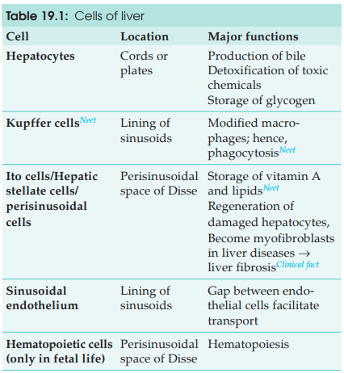
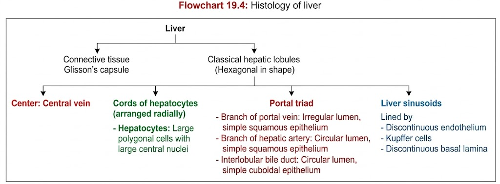
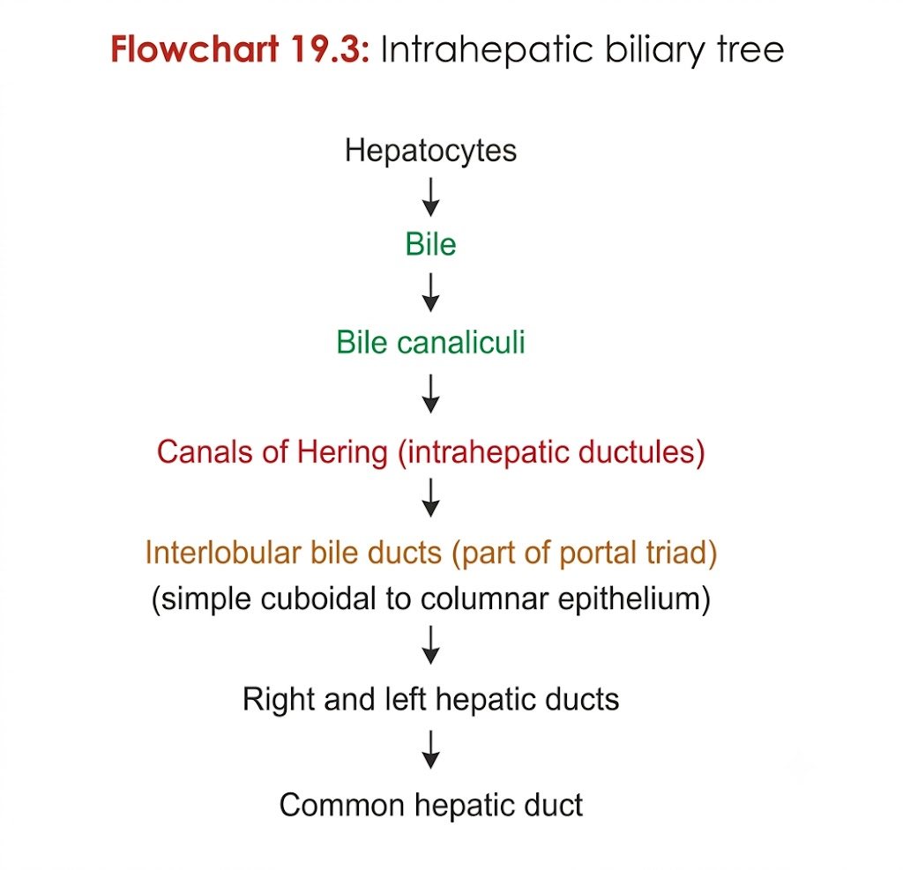

# Histology of Liver

- **Capsule:** Liver is covered by a thin connective tissue called **Glisson's capsule**.

- **Hepatic lobules:** Liver shows **classical hepatic lobules**, which are **hexagonal in shape**.

- **Central vein:** A **central vein** lies in the form of a space at the **center of the lobule**.

- **Cord of hepatocytes:** Hepatocytes are arranged **radially**, radiating **away from the central vein**.

- **Portal triad:** It consists of:
  - **Branch of portal vein:** **Irregular lumen** lined by **simple squamous epithelium**.
  - **Branch of hepatic artery:** **Circular lumen** lined by **simple squamous epithelium**.
  - **Interlobular bile duct:** **Circular lumen** lined by **simple cuboidal to columnar epithelium**.

- **Liver sinusoids:** They separate the **cords of hepatocytes** and are lined by:
  - **Discontinuous endothelium**
  - **Kupffer cells**
  - **Discontinuous basal lamina**

- **Hepatocytes:** Hepatocytes are **large polygonal cells** with a **large central nucleus** and **granular eosinophilic (pink) cytoplasm**.

- **Connective tissue septa:** Adjacent lobules are separated by **thin connective tissue septa**.
> 
> 
> 