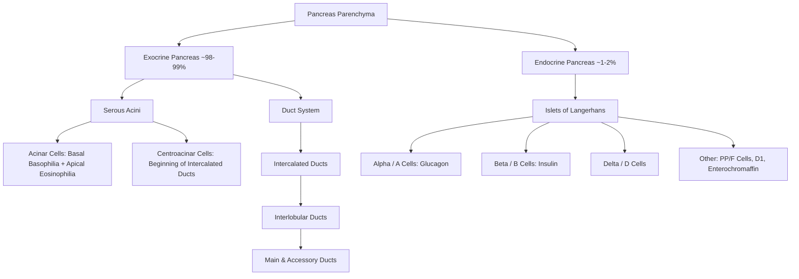
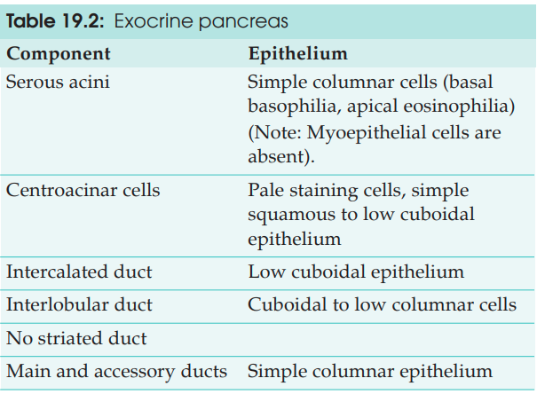
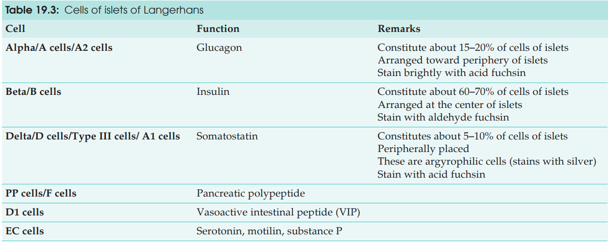
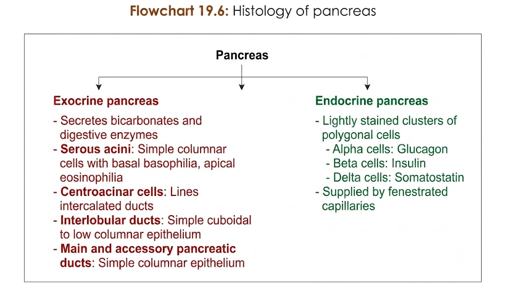

## HISTOLOGY OF PANCREAS

---

### 1. GENERAL ARCHITECTURE & CAPSULE

a. **Capsule:** Thin outer covering composed of **loose connective tissue**.
b. **Septa:** Extend from the capsule into the substance of the gland, dividing it into **ill-defined lobules**.
c. **Dual Organization:**

* **Exocrine Part ($\sim 98-99\%$):** Compound tubuloacinar serous gland producing digestive enzymes and $\text{HCO}_3^-$.
* **Endocrine Part ($\sim 1-2\%$):** Highly vascularized Islets of Langerhans secreting regulatory hormones directly into the blood.

---

### 2. EXOCRINE PANCREAS

#### A. Pancreatic Acini (Serous Acini)

a. **Shape & Lumen:** Round/oval in cross-section with a **very small/narrow lumen**.

b. **Acinar Cells (Simple Columnar):**

* **Shape:** Pyramid-shaped cells with broad base and narrow luminal apex; spherical basal nucleus.
* **Basal Zone (Basophilic):** Dark purple due to abundant **rough endoplasmic reticulum (RER)**.
* **Apical Zone (Eosinophilic):** Bright pink due to numerous **zymogen granules** and Golgi apparatus.

c. **Zymogen Granules:**
* Contain digestive proenzymes (*proteases, amylase, lipase, nucleases*).
* **$\uparrow$ in fasting states**; discharged via **exocytosis**.

d. **Centroacinar Cells:**
* Pale-staining cells with flattened nuclei sitting in the **center of the acinar lumen**.
* Represent invaginated starting points of **intercalated ducts**.
* Responsible for secreting **bicarbonate ions ($\text{HCO}_3^-$)** and water.

#### B. Pancreatic Duct System

| Duct Segment | Epithelial Lining | Key Features |
| --- | --- | --- |
| **Centroacinar Cells** | Simple squamous-like | • Invaginated inside acinar lumen • Pale cytoplasm |
| **Intercalated Ducts** *(Intralobular)* | Simple squamous to low cuboidal | • Add $\text{HCO}_3^-$ and $\text{H}_2\text{O}$ • **No striated ducts present in pancreas** |
| **Interlobular Ducts** | Cuboidal to low columnar | • Located in interlobular connective tissue septa |
| **Main & Accessory Ducts** | Simple columnar epithelium | • Empty secretions into 2nd part of duodenum |

* **Secretory Regulation:** Controlled by hormones (**Secretin** & **Cholecystokinin / CCK**) and autonomic nerves.

---

### 3. ENDOCRINE PANCREAS (ISLETS OF LANGERHANS)

a. **Population:** $\sim 1\text{ million}$ islets scattered throughout the parenchyma ($\approx 1-2\%$ total volume).
b. **H&E Staining Appearance:**

* Appear as rounded, **pale-staining clusters/islands of polygonal cells**.
* Richly supplied by a network of **fenestrated capillaries**.
* Contrast sharply with the surrounding dark-staining serous acini.
* *Individual cell types cannot be differentiated on routine H&E staining.*

#### Special Staining & Cellular Subtypes

| Cell Type | Mallory-Azan Staining | Major Secretory Function / Remarks |
| --- | --- | --- |
| **A / Alpha ($\alpha$) Cells** | **Red** | Secretes **Glucagon** ($\uparrow$ blood glucose) |
| **B / Beta ($\beta$) Cells** | **Brownish Orange** | Secretes **Insulin** ($\downarrow$ blood glucose) |
| **D / Delta ($\delta$) Cells** | **Blue** | Regulatory role (Somatostatin) |
| **Minor Cells** *(via IHC)* | — | **PP / F cells**, $\text{D}_1$ cells, Enterochromaffin cells |

---

### 4. KEY HISTOLOGICAL IDENTIFICATION POINTS

a. **Pure serous acini** showing distinct **bipolar staining** (*basal basophilia + apical eosinophilia*).
b. Presence of characteristic **centroacinar cells** in the core of acinar lumens.
c. **Pale-staining Islets of Langerhans** embedded within darkly stained exocrine tissue.
d. **Total absence of striated ducts** (differentiates pancreas from parotid gland).

