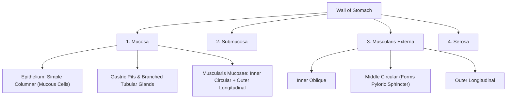
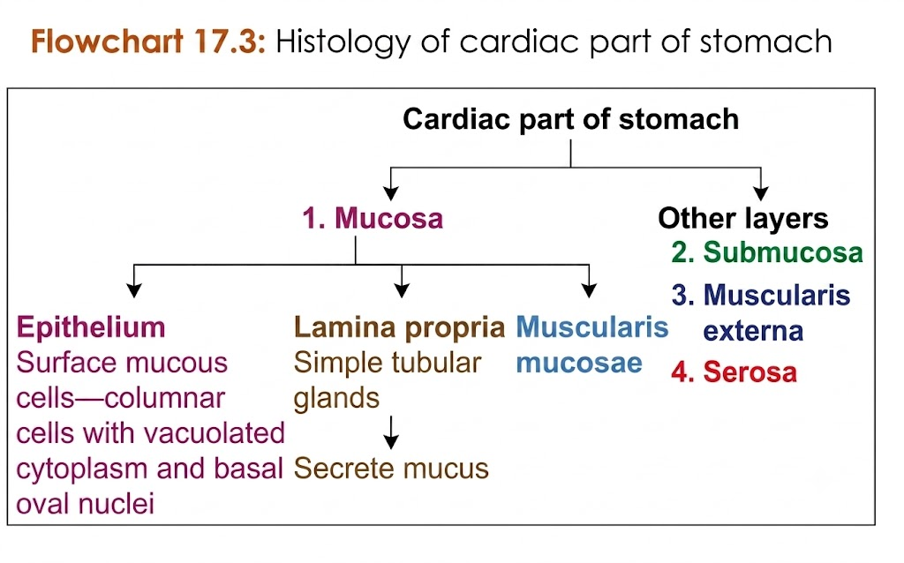
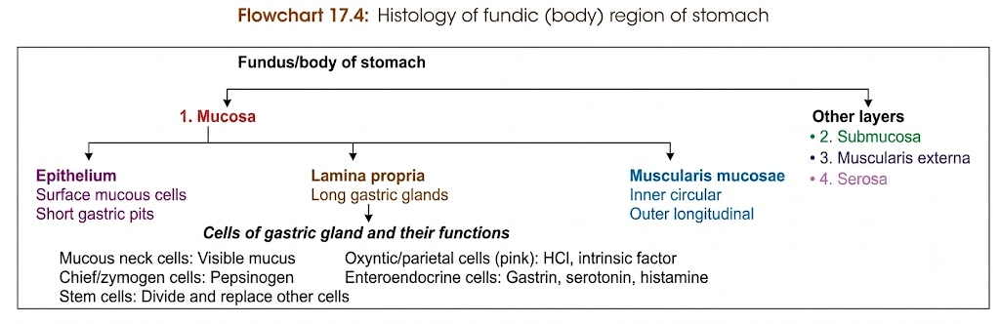
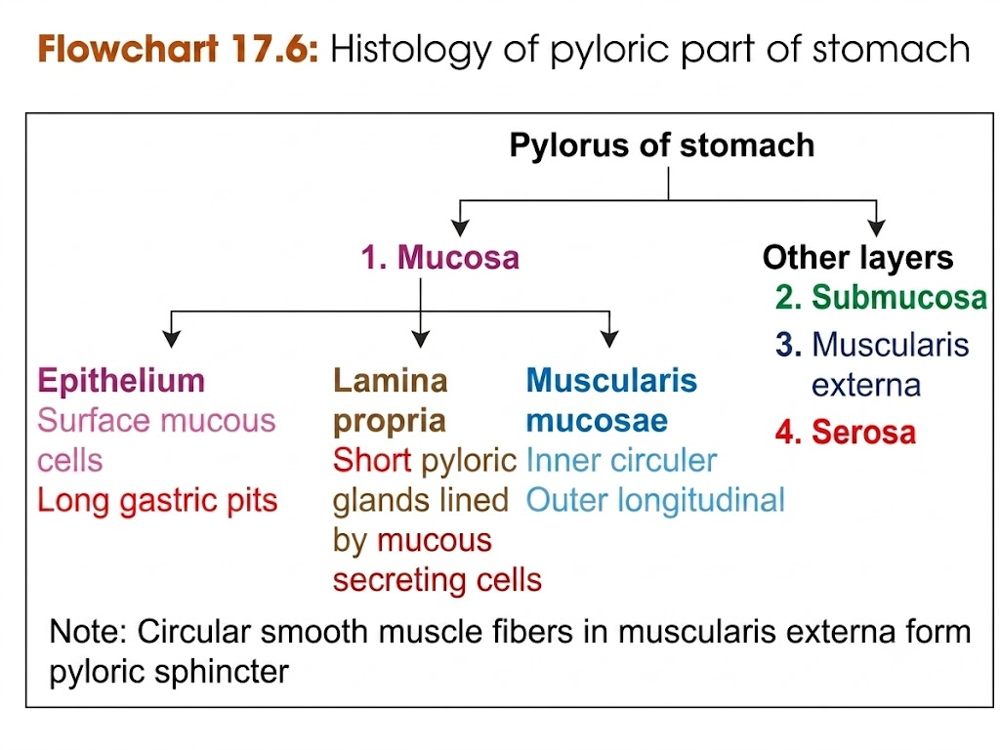
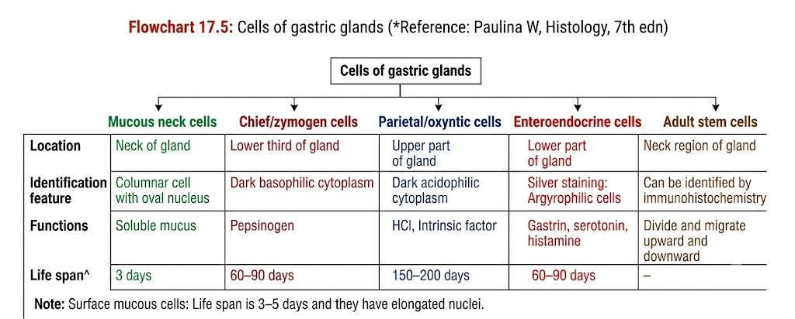

# $\text{HISTOLOGY OF STOMACH}$

---

## $\text{1. GENERAL LAYERS OF THE WALL}$

* $\mathbf{Mucosa:}$ $\text{Lined by surface mucous cells, containing gastric pits and glands.}$
* $\mathbf{Submucosa:}$ $\text{Dense irregular connective tissue layer bearing vessels and nerves.}$
* $\mathbf{Muscularis\ Externa:}$ $\text{Three smooth muscle coats (Inner oblique, Middle circular, Outer longitudinal).}$
* $\mathbf{Serosa:}$ $\text{Outermost layer of connective tissue lined by simple squamous mesothelium.}$

---

## $\text{2. DETAILED HISTOLOGY BY LAYERS}$

### $\text{A. Mucosa}$

* $\mathbf{Lining\ Epithelium:}$ $\text{Simple columnar cells with basal oval nuclei (secrete protective visible mucus).}$
* $\mathbf{Muscularis\ Mucosae:}$ $\text{Arranged into an \textbf{inner circular} and \textbf{outer longitudinal} smooth muscle layer.}$
* $\mathbf{Regional\ Variations\ of\ Pits\ \&\ Glands:}$

| $\text{Region}$ | $\text{Gastric Pits}$ | $\text{Gland Morphology}$ | $\text{Predominant Secretory Cells}$ |
| --- | --- | --- | --- |
| $\mathbf{Cardia}$ | $\text{Short}$ | $\text{Branched tubular}$ | $\text{Mucus-secreting cells}$ |
| $\mathbf{Fundus\ /\ Body}$ | $\text{Short}$ | $\text{Long, branched tubular}$ | $\bullet\ \mathbf{Oxyntic\ (Parietal)\ cells:}\ \text{Pink / Eosinophilic } (\text{HCl, Intrinsic Factor}) \\ \bullet\ \mathbf{Chief\ (Peptic)\ cells:}\ \text{Blue / Basophilic } (\text{Pepsinogen}) \\ \bullet\ \mathbf{Mucous\ neck\ cells:}\ \text{Mucus secretion} \\ \bullet\ \mathbf{Enteroendocrine\ cells:}\ \text{Histamine, Gastrin}$ |
| $\mathbf{Pylorus}$ | $\mathbf{Long}$ | $\text{Short, branched tubular}$ | $\text{Predominantly mucus-secreting cells}$ |

---

### $\text{B. Submucosa}$

* $\mathbf{Stroma:}$ $\text{Composed of \textbf{dense irregular connective tissue}.}$
* $\mathbf{Contents:}$ $\text{Rich vascular network, lymphatic channels, nerve fibers, and the \textbf{Meissner's (submucosal) plexus}.}$

---

### $\text{C. Muscularis Externa}$

* $\mathbf{Three\ Layers\ of\ Smooth\ Muscle:}$
* $\mathbf{Inner:}$ $\text{Oblique layer}$
* $\mathbf{Middle:}$ $\text{Circular layer (thickens markedly at pylorus to form the \textbf{Pyloric Sphincter})}$
* $\mathbf{Outer:}$ $\text{Longitudinal layer}$

---

### $\text{D. Serosa}$

* $\mathbf{Structure:}$ $\text{Thin layer of loose connective tissue covered by the \textbf{mesothelial lining} of the visceral peritoneum.}$

