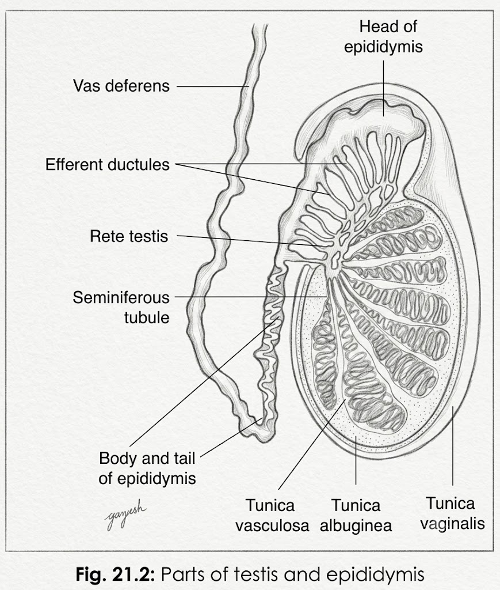

# Structure of Testis

• **Tunica albuginea:** Testis is surrounded by a **thick connective tissue capsule** called **tunica albuginea**.

• **Tunica vasculosa:** It is the **innermost, vascular connective tissue coat** lying just deep to the **tunica albuginea**.

• **Connective tissue septa & lobules:** Connective tissue septa arise from the capsule and divide the testis into **more than 250 incomplete lobules**.

• **Mediastinum testis:** A **thickened part of tunica albuginea** that gives passage to the **vessels and ducts of the testis**.

• **Seminiferous tubules:** Each lobule contains **1–4 highly coiled seminiferous tubules**.

• **Connective tissue stroma:** Each seminiferous tubule is surrounded by **connective tissue stroma**.

• **Leydig (interstitial) cells:** Lie in the **connective tissue stroma** between adjacent seminiferous tubules.

• **Straight tubules (Tubuli recti):** These are the **terminal straight parts** of seminiferous tubules, lying near the **mediastinum testis**.

• **Rete testis:** Straight tubules form a **network in the mediastinum** called the **rete testis**.

• **Efferent ductules:** Rete testis gives rise to **12–30 efferent ductules** at its upper end.

→ **Efferent ductules → Epididymis (highly coiled tubules) → Ductus deferens**
