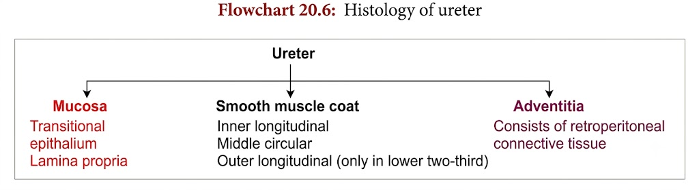

# Histology of Ureter
• **Ureter:** A **mucomuscular tube** that carries urine from the **renal pelvis → urinary bladder**.

• **Length:** **25–35 cm**

• **Lumen:** **Star-shaped**

• **Wall of ureter:** Has **3 layers**:
  – **Inner:** Mucous membrane layer  
  – **Middle:** Smooth muscle layer  
  – **Outer:** Adventitial (**fibrous coat**) layer  

## Mucous Membrane

• **Epithelial lining:** **Transitional epithelium** — about **4–5 cells thick**.

• **Lamina propria:** Made up of **connective tissue**.

• **Mucosal folds:** Numerous **longitudinal folds** are present due to **muscular contractions**.

→ Hence, the **lumen appears star-shaped**.
## Smooth Muscle Coat

• **Smooth muscles:** Arranged in **3 layers**:
  – **Inner:** Longitudinal  
  – **Middle:** Circular  
  – **Outer:** Longitudinal  

→ These layers are **not distinctly marked** from each other.

• **Outer longitudinal layer:** Present **only in the lower 2/3rd of the ureter**.

## Adventitia

• **Ureter:** Embedded in **retroperitoneal connective tissue**, which forms the **adventitia**.

• **Adventitia contains:**
  – **Adipose tissue**
  – **Blood vessels**
  – **Nerves**
  – **Lymphatics**
