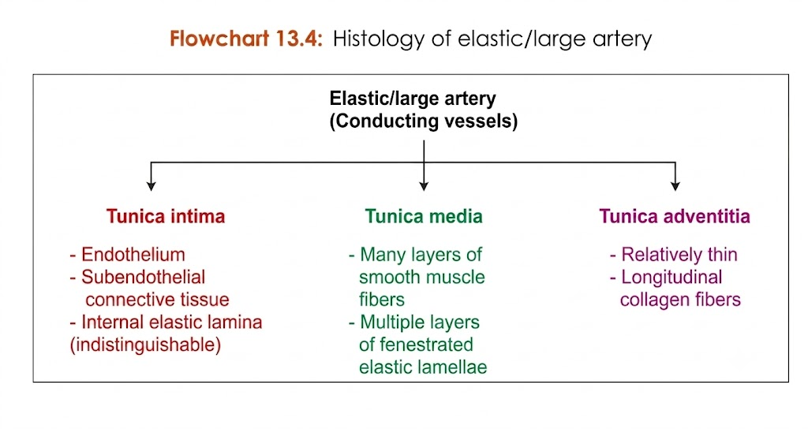

## **Elastic (large/conducting) artery**

* **Elastic (large/conducting) artery** consists of:

  * **Tunica intima**
  * **Tunica media**
  * **Tunica adventitia**

### **Tunica intima**

* Shows:

  * **Vascular endothelium** (**simple squamous epithelium**)
  * **Subendothelial connective tissue**
  * **Indistinguishable internal elastic lamella**

### **Tunica media**

* Shows many layers of **spindle-shaped vascular smooth muscle fibers**.
* These fibers are separated from each other by many **thick sheets of fenestrated elastic lamellae**.

### **Tunica adventitia**

* Is **relatively thin**.

### **Examples**

* **Aorta**
* **Brachiocephalic**
* **Common carotid and subclavian arteries**
* **Pulmonary trunk**
* **Pulmonary arteries**

> 