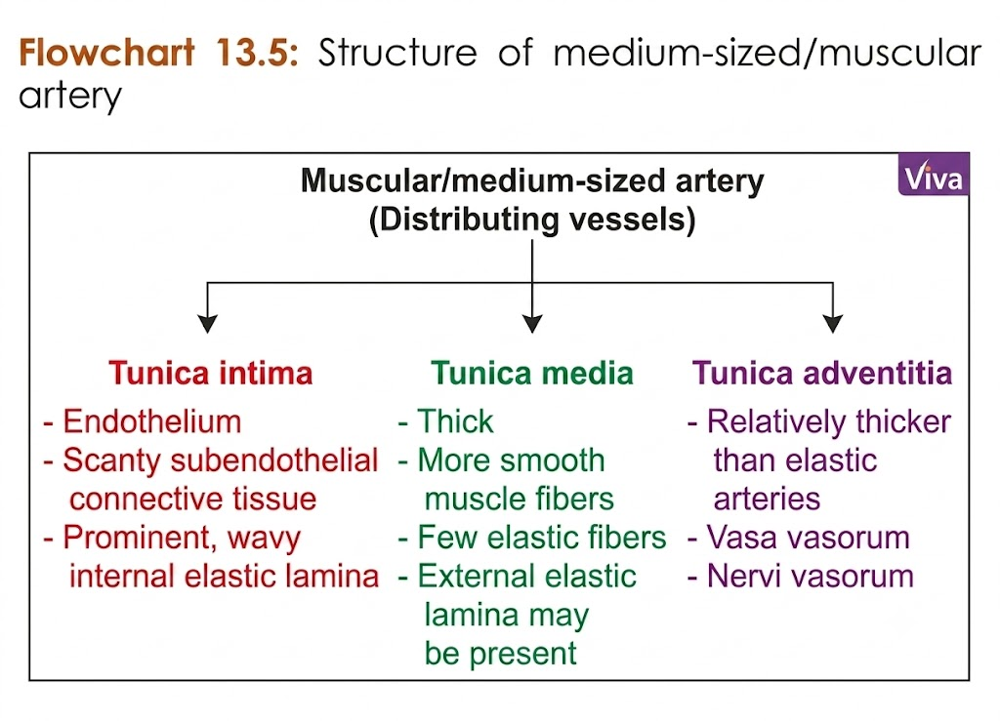

## **Muscular (medium-sized/distributing) artery**

* **Muscular (medium-sized/distributing) artery** consists of:

  * **Tunica intima**
  * **Tunica media**
  * **Tunica adventitia**

### **Tunica intima**

* Has:

  * **Endothelium** (**simple squamous epithelium**)
  * **Scanty subendothelial connective tissue**
  * **Prominent internal elastic lamina**

### **Tunica media**

* Shows **more layers of smooth muscle cells** and a **few elastic fibers**.

### **Tunica adventitia**

* Is **relatively thick**.

### **Examples**

* **Brachial artery**
* **Femoral artery**
* **Other arteries of limbs**

> 